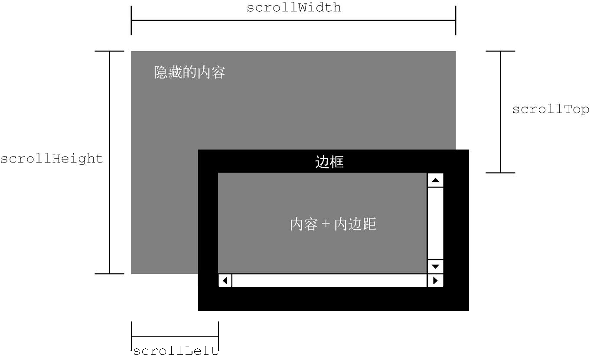
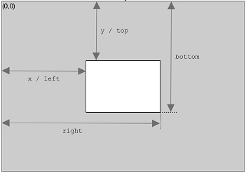

**目录：**

- [13. DOM2 和 DOM3](#13-dom2-和-dom3)
  - [13.1. DOM 的演进](#131-dom-的演进)
    - [13.1.1. XML 命名空间](#1311-xml-命名空间)
    - [13.1.2. 其他变化](#1312-其他变化)
  - [13.2. 样式](#132-样式)
    - [13.2.1. 存取元素样式](#1321-存取元素样式)
    - [13.2.2. 操作样式表](#1322-操作样式表)
    - [13.2.3. 元素尺寸](#1323-元素尺寸)
  - [13.3. 遍历](#133-遍历)
    - [13.3.1. NodeIterator](#1331-nodeiterator)
    - [13.3.2. TreeWalker](#1332-treewalker)
  - [13.4. 范围](#134-范围)
    - [13.4.1. DOM 范围](#1341-dom-范围)
    - [13.4.2. 简单选择](#1342-简单选择)
    - [13.4.3. 复杂选择](#1343-复杂选择)
    - [13.4.4. 操作范围](#1344-操作范围)
    - [13.4.5. 范围插入](#1345-范围插入)
    - [13.4.6. 范围折叠](#1346-范围折叠)
    - [13.4.7. 范围比较](#1347-范围比较)
    - [13.4.8. 范围其他 API](#1348-范围其他-api)
  - [13.5. MutationObserver 接口](#135-mutationobserver-接口)
    - [13.5.1. 基本用法](#1351-基本用法)
    - [13.5.2. MutationObserverInit 与观察范围](#1352-mutationobserverinit-与观察范围)
    - [13.5.3. 异步回调与记录队列](#1353-异步回调与记录队列)
    - [13.5.4. 性能，内存与垃圾回收](#1354-性能内存与垃圾回收)

# 13. DOM2 和 DOM3

本章内容

- DOM2 到 DOM3 的变化
- 操作样式的 DOM API
- DOM 遍历与范围
- MutationObserver 接口

DOM1（DOM Level 1）主要定义了 HTML 和 XML 文档的底层结构。DOM2（DOM Level 2）和 DOM3（DOM Level 3）在这些结构之上加入更多交互能力，提供了更高级的 XML 特性。实际上，DOM2 和 DOM3 是按照模块化的思路来制定标准的，每个模块之间有一定关联，但分别针对某个 DOM 子集。这些模式如下所示。

- DOM Core：在 DOM1 核心部分的基础上，为节点增加方法和属性。
- DOM Views：定义基于样式信息的不同视图。
- DOM Events：定义通过事件实现 DOM 文档交互。
- DOM Style：定义以编程方式访问和修改 CSS 样式的接口。
- DOM Traversal and Range：新增遍历 DOM 文档及选择文档内容的接口。
- DOM HTML：在 DOM1 HTML 部分的基础上，增加属性、方法和新接口。
- DOM Mutation Observers：定义基于 DOM 变化触发回调的接口。这个模块是 DOM4 级模块，用于取代 Mutation Events。

本章介绍除 DOM Events 和 DOM Mutation Observers 之外的其他所有模块，第 17 章会专门介绍事件，而 DOM Mutation Observers 第 14 章已经介绍过了。DOM3 还有 XPath 模块和 Load and Save 模块，将在第 22 章介绍。

注意 比较老旧的浏览器（如 IE8）对本章内容支持有限。如果你的项目要兼容这些低版本浏览器，在使用本章介绍的 API 之前先确认浏览器的支持情况。推荐参考 Can I Use 网站。

## 13.1. DOM 的演进

DOM2 和 DOM3 Core 模块的目标是扩展 DOM API，满足 XML 的所有需求并提供更好的错误处理和特性检测。很大程度上，这意味着支持 XML 命名空间的概念。DOM2 Core 没有新增任何类型，仅仅在 DOM1 Core 基础上增加了一些方法和属性。DOM3 Core 则除了增强原有类型，也新增了一些新类型。

类似地，DOM View 和 HTML 模块也丰富了 DOM 接口，定义了新的属性和方法。这两个模块很小，因此本章将在讨论 JavaScript 对象的基本变化时将它们与 Core 模块放在一起讨论。

注意 本章只讨论浏览器实现的 DOM API，不会提及未被浏览器实现的。

### 13.1.1. XML 命名空间

XML 命名空间可以实现在一个格式规范的文档中混用不同的 XML 语言，而不必担心元素命名冲突。严格来讲，XML 命名空间在 XHTML 中才支持，HTML 并不支持。因此，本节的示例使用 XHTML。

命名空间是使用 xmlns 指定的。XHTML 的命名空间是'http://www.w3.org/1999/xhtml'，应该包含在任何格式规范的XHTML 页面的`<html>`元素中，如下所示：

```html
<html xmlns="http://www.w3.org/1999/xhtml">
  <head>
    <title>Example XHTML page</title>
  </head>
  <body>
    Hello world!
  </body>
</html>
```

对这个例子来说，所有元素都默认属于 XHTML 命名空间。可以使用 xmlns 给命名空间创建一个前缀，格式为“xmlns: 前缀”，如下面的例子所示：

```html
<xhtml:html xmlns:xhtml="http://www.w3.org/1999/xhtml">
  <xhtml:head>
    <xhtml:title>Example XHTML page</xhtml:title>
  </xhtml:head>
  <xhtml:body>
    Hello world!
  </xhtml:body>
</xhtml:html>
```

这里为 XHTML 命名空间定义了一个前缀 xhtml，同时所有 XHTML 元素都必须加上这个前缀。为避免混淆，属性也可以加上命名空间前缀，比如：

```html
<xhtml:html xmlns:xhtml="http://www.w3.org/1999/xhtml">
  <xhtml:head>
    <xhtml:title>Example XHTML page</xhtml:title>
  </xhtml:head>
  <xhtml:body xhtml:class="home">
    Hello world!
  </xhtml:body>
</xhtml:html>
```

这里的 class 属性被加上了 xhtml 前缀。如果文档中只使用一种 XML 语言，那么命名空间前缀其实是多余的，只有一个文档混合使用多种 XML 语言时才有必要。比如下面这个文档就使用了 XHTML 和 SVG 两种语言：

```html
<html xmlns="http://www.w3.org/1999/xhtml">
  <head>
    <title>Example XHTML page</title>
  </head>
  <body>
    <svg
      xmlns="http://www.w3.org/2000/svg"
      version="1.1"
      viewBox="0 0 100 100"
      style="width:100%; height:100%"
    >
      <rect x="0" y="0" width="100" height="100" style="fill:red" />
    </svg>
  </body>
</html>
```

在这个例子中，通过给`<svg>`元素设置自己的命名空间，将其标识为当前文档的外来元素。这样一来，`<svg>`元素及其属性，包括它的所有后代都会被认为属于'https://www.w3.org/2000/svg'命名空间。虽然这个文档从技术角度讲是XHTML 文档，但由于使用了命名空间，其中包含的 SVG 代码也是有效的。

对于这样的文档，如果调用某个方法与节点交互，就会出现一个问题。比如，创建了一个新元素，那这个元素属于哪个命名空间？查询特定标签名时，结果中应该包含哪个命名空间下的元素？DOM2 Core 为解决这些问题，给大部分 DOM1 方法提供了特定于命名空间的版本。

1. **Node 的变化**

在 DOM2 中，Node 类型包含以下特定于命名空间的属性：

- localName，不包含命名空间前缀的节点名；
- namespaceURI，节点的命名空间 URL，如果未指定则为 null；
- prefix，命名空间前缀，如果未指定则为 null。

在节点使用命名空间前缀的情况下，nodeName 等于 prefix + ':' + localName。比如下面这个例子：

```html
<html xmlns="http://www.w3.org/1999/xhtml">
  <head>
    <title>Example XHTML page</title>
  </head>
  <body>
    <s:svg
      xmlns:s="http://www.w3.org/2000/svg"
      version="1.1"
      viewBox="0 0 100 100"
      style="width:100%; height:100%"
    >
      <s:rect x="0" y="0" width="100" height="100" style="fill:red" />
    </s:svg>
  </body>
</html>
```

其中的`<html>`元素的 localName 和 tagName 都是'html'，namespaceURL 是'http://www.w3.org/1999/xhtml'，而prefix 是 null。对于`<s:svg>`元素，localName 是'svg'，tagName 是's:svg'，namespaceURI 是'https://www.w3.org/2000/svg'，而prefix 是's'。

DOM3 进一步增加了如下与命名空间相关的方法：

- isDefaultNamespace(namespaceURI)，返回布尔值，表示 namespaceURI 是否为节点的默认命名空间；
- lookupNamespaceURI(prefix)，返回给定 prefix 的命名空间 URI；
- lookupPrefix(namespaceURI)，返回给定 namespaceURI 的前缀。

对前面的例子，可以执行以下代码：

```javascript
console.log(document.body.isDefaultNamespace('http://www.w3.org/1999/xhtml')); // true
// 假设svg 包含对<s:svg>元素的引用
console.log(svg.lookupPrefix('http://www.w3.org/2000/svg')); // 's'
console.log(svg.lookupNamespaceURI('s')); // 'http://www.w3.org/2000/svg'
```

这些方法主要用于通过元素查询前面和命名空间 URI，以确定元素与文档的关系。

2. **Document 的变化**

DOM2 在 Document 类型上新增了如下命名空间特定的方法：

- createElementNS(namespaceURI, tagName)，以给定的标签名 tagName 创建指定命名空间 namespaceURI 的一个新元素；
- createAttributeNS(namespaceURI, attributeName)，以给定的属性名 attributeName 创建指定命名空间 namespaceURI 的一个新属性；
- getElementsByTagNameNS(namespaceURI, tagName)，返回指定命名空间 namespaceURI 中所有标签名为 tagName 的元素的 NodeList。

使用这些方法都需要传入相应的命名空间 URI（不是命名空间前缀），如下面的例子所示：

```javascript
// 创建一个新SVG 元素
const svg = document.createElementNS('http://www.w3.org/2000/svg', 'svg');

// 创建一个任意命名空间的新属性
const att = document.createAttributeNS('http://www.somewhere.com', 'random');

// 获取所有XHTML 元素
const elems = document.getElementsByTagNameNS(
  'http://www.w3.org/1999/xhtml',
  '*',
);
```

这些命名空间特定的方法只在文档中包含两个或两个以上命名空间时才有用。

3. **Element 的变化**

DOM2 Core 对 Element 类型的更新主要集中在对属性的操作上。下面是新增的方法：

- getAttributeNS(namespaceURI, localName)，取得指定命名空间 namespaceURI 中名为 localName 的属性；
- getAttributeNodeNS(namespaceURI, localName)，取得指定命名空间 namespaceURI 中名为 localName 的属性节点；
- getElementsByTagNameNS(namespaceURI, tagName)，取得指定命名空间 namespaceURI 中标签名为 tagName 的元素的 NodeList；
- hasAttributeNS(namespaceURI, localName)，返回布尔值，表示元素中是否有命名空间 namespaceURI 下名为 localName 的属性（注意，DOM2 Core 也添加不带命名空间的 hasAttribute()方法）；
- removeAttributeNS(namespaceURI, localName)，删除指定命名空间 namespaceURI 中名为 localName 的属性；
- setAttributeNS(namespaceURI, qualifiedName, value)，设置指定命名空间 namespaceURI 中名为 qualifiedName 的属性为 value；
- setAttributeNodeNS(attNode)，为元素设置（添加）包含命名空间信息的属性节点 attNode。

这些方法与 DOM1 中对应的方法行为相同，除 setAttributeNodeNS()之外都只是多了一个命名空间参数。

4. **NamedNodeMap 的变化**

NamedNodeMap 也增加了以下处理命名空间的方法。因为 NamedNodeMap 主要表示属性，所以这些方法大都适用于属性：

- getNamedItemNS(namespaceURI, localName)，取得指定命名空间 namespaceURI 中名为 localName 的项；
- removeNamedItemNS(namespaceURI, localName)，删除指定命名空间 namespaceURI 中名为 localName 的项；
- setNamedItemNS(node)，为元素设置（添加）包含命名空间信息的节点。

这些方法很少使用，因为通常都是使用元素来访问属性。

### 13.1.2. 其他变化

除命名空间相关的变化，DOM2 Core 还对 DOM 的其他部分做了一些更新。这些变化与 XML 命名空间无关，主要关注 DOM API 的完整性与可靠性。

1. **DocumentType 的变化**

DocumentType 新增了 3 个属性：publicId、systemId 和 internalSubset。publicId、systemId 属性表示文档类型声明中有效但无法使用 DOM1 API 访问的数据。比如下面这个 HTML 文档类型声明：

```html
<!DOCTYPE html PUBLIC '-// W3C// DTD HTML 4.01// EN' 'http://www.w3.org/TR/html4/strict.dtd'>
```

其 publicId 是'-// W3C// DTD HTML 4.01// EN'，而 systemId 是'http://www.w3.org/TR/html4/strict.dtd'。支持DOM2 的浏览器应该可以运行以下 JavaScript 代码：

```javascript
console.log(document.doctype.publicId);
console.log(document.doctype.systemId);
```

通常在网页中很少需要访问这些信息。

internalSubset 用于访问文档类型声明中可能包含的额外定义，如下面的例子所示：

```html
<!DOCTYPE html PUBLIC '-// W3C// DTD XHTML 1.0 Strict// EN' 'http://www.w3.org/TR/xhtml1/DTD/xhtml1-strict.dtd' [<!ELEMENT name (#PCDATA)>
] >
```

对于以上声明，document.doctype.internalSubset 会返回'<!ELEMENT name (#PCDATA)>'。HTML 文档中几乎不会涉及文档类型的内部子集，XML 文档中稍微常用一些。

2. **Document 的变化**

Document 类型的更新中唯一跟命名空间无关的方法是 importNode()。这个方法的目的是从其他文档获取一个节点并导入到新文档，以便将其插入新文档。每个节点都有一个 ownerDocument 属性，表示所属文档。如果调用 appendChild()方法时传入节点的 ownerDocument 不是指向当前文档，则
会发生错误。而调用 importNode()导入其他文档的节点会返回一个新节点，这个新节点的 ownerDocument 属性是正确的。

importNode()方法跟 cloneNode()方法类似，同样接收两个参数：要复制的节点和表示是否同时复制子树的布尔值，返回结果是适合在当前文档中使用的新节点。下面看一个例子：

```javascript
// 导入节点及所有后代
const newNode = document.importNode(oldNode, true);
document.body.appendChild(newNode);
```

这个方法在 HTML 中使用得并不多，在 XML 文档中的使用会更多一些（第 22 章会深入讨论）。

DOM2 View 给 Document 类型增加了新属性 defaultView，是一个指向拥有当前文档的窗口（或窗格<frame>）的指针。这个规范中并没有明确视图何时可用，因此这是添加的唯一一个属性。defaultView 属性得到了除 IE8 及更早版本之外所有浏览器的支持。IE8 及更早版本支持等价的 parentWindow 属性，Opera 也支持这个属性。因此要确定拥有文档的窗口，可以使用以下代码：

```javascript
const parentWindow = document.defaultView || document.parentWindow;
```

除了上面这一个方法和一个属性，DOM2 Core 还针对 document.implementation 对象增加了两个新方法：createDocumentType()和 createDocument()。前者用于创建 DocumentType 类型的新节点，接收 3 个参数：文档类型名称、publicId 和 systemId。比如，以下代码可以创建一个新的 HTML4.01 严格型文档：

```javascript
const doctype = document.implementation.createDocumentType(
  'html',
  '-// W3C// DTD HTML 4.01// EN',
  'http://www.w3.org/TR/html4/strict.dtd',
);
```

已有文档的文档类型不可更改，因此 createDocumentType()只在创建新文档时才会用到，而创建新文档要使用 createDocument() 方法。createDocument() 接收 3 个参数： 文档元素的 namespaceURI、文档元素的标签名和文档类型。比如，下列代码可以创建一个空的 XML 文档：

```javascript
const doc = document.implementation.createDocument('', 'root', null);
```

这个空文档没有命名空间和文档类型，只指定了`<root>`作为文档元素。要创建一个 XHTML 文档，可以使用以下代码：

```javascript
const doctype = document.implementation.createDocumentType(
  'html',
  '-// W3C// DTD XHTML 1.0 Strict// EN',
  'http://www.w3.org/TR/xhtml1/DTD/xhtml1-strict.dtd',
);
const doc = document.implementation.createDocument(
  'http://www.w3.org/1999/xhtml',
  'html',
  doctype,
);
```

这里使用了适当的命名空间和文档类型创建一个新 XHTML 文档。这个文档只有一个文档元素`<html>`，其他一切都需要另行添加。

DOM2 HTML 模块也为 document.implamentation 对象添加了 createHTMLDocument()方法。使用这个方法可以创建一个完整的 HTML 文档，包含`<html>`、`<head>`、`<title>`和`<body>`元素。这个方法只接收一个参数，即新创建文档的标题（放到`<title>`元素中），返回一个新的 HTML 文档。比如：

```javascript
const htmldoc = document.implementation.createHTMLDocument('New Doc');
console.log(htmldoc.title);
// >> 'New Doc'

console.log(typeof htmldoc.body);
// >> 'object'
```

createHTMLDocument()方法创建的对象是 HTMLDocument 类型的实例，因此包括该类型所有相关的方法和属性，包括 title 和 body 属性。

3. **Node 的变化**

DOM3 新增了两个用于比较节点的方法：isSameNode()和 isEqualNode()。这两个方法都接收一个节点参数，如果这个节点与参考节点相同或相等，则返回 true。节点相同，意味着引用同一个对象；节点相等，意味着节点类型相同，拥有相等的属性（nodeName、nodeValue 等），而且 attributes 和 childNodes 也相等（即同样的位置包含相等的值）。来看一个例子：

```javascript
const div1 = document.createElement('div');
div1.setAttribute('class', 'box');
const div2 = document.createElement('div');
div2.setAttribute('class', 'box');
console.log(div1.isSameNode(div1));
// >> true

console.log(div1.isEqualNode(div2));
// >> true

console.log(div1.isSameNode(div2));
// >> false
```

这里创建了包含相同属性的两个`<div>`元素。这两个元素相等，但不相同。

DOM3 也增加了给 DOM 节点附加额外数据的方法。setUserData()方法接收 3 个参数：键、值、处理函数，用于给节点追加数据。可以像下面这样把数据添加到一个节点：

```javascript
document.body.setUserData('name', 'Nicholas', function () {});
```

然后，可以通过相同的键再取得这个信息，比如：

```javascript
const value = document.body.getUserData('name');
```

setUserData()的处理函数会在包含数据的节点被复制、删除、重命名或导入其他文档的时候执行，可以在这时候决定如何处理用户数据。处理函数接收 5 个参数：表示操作类型的数值（1 代表复制，2 代表导入，3 代表删除，4 代表重命名）、数据的键、数据的值、源节点和目标节点。删除节点时，源节点为 null；除复制外，目标节点都为 null。

```javascript
const div = document.createElement('div');

div.setUserData(
  'name',
  'Nicholas',
  function (operation, key, value, src, dest) {
    if (operation == 1) {
      dest.setUserData(key, value, function () {});
    }
  },
);

const newDiv = div.cloneNode(true);
console.log(newDiv.getUserData('name'));
// >> 'Nicholas'
```

这里先创建了一个`<div>`元素，然后给它添加了一些数据，包含用户的名字。在使用 cloneNode()复制这个元素时，就会调用处理函数，从而将同样的数据再附加给复制得到的目标节点。然后，在副本节点上调用 getUserData()能够取得附加到源节点上的数据。

4. **内嵌窗格的变化**

DOM2 HTML 给 HTMLIFrameElement（即`<iframe>`，内嵌窗格）类型新增了一个属性，叫 contentDocument。这个属性包含代表子内嵌窗格中内容的 document 对象的指针。下面的例子展示了如何使用这个属性：

```javascript
const iframe = document.getElementById('myIframe');
const iframeDoc = iframe.contentDocument;
```

contentDocument 属性是 Document 的实例，拥有所有文档属性和方法，因此可以像使用其他 HTML 文档一样使用它。还有一个属性 contentWindow，返回相应窗格的 window 对象，这个对象上有一个 document 属性。所有现代浏览器都支持 contentDocument 和 contentWindow 属性。

注意 跨源访问子内嵌窗格的 document 对象会受到安全限制。如果内嵌窗格中加载了不同域名（或子域名）的页面，或者该页面使用了不同协议，则访问其 document 对象会抛出错误。

## 13.2. 样式

HTML 中的样式有 3 种定义方式：外部样式表（通过`<link>`元素）、文档样式表（使用`<style>`元素）和元素特定样式（使用 style 属性）。DOM2 Style 为这 3 种应用样式的机制都提供了 API。

### 13.2.1. 存取元素样式

任何支持 style 属性的 HTML 元素在 JavaScript 中都会有一个对应的 style 属性。这个 style 属性是 CSSStyleDeclaration 类型的实例，其中包含通过 HTML style 属性为元素设置的所有样式信息，但不包含通过层叠机制从文档样式和外部样式中继承来的样式。HTML style 属性中的 CSS 属性在 JavaScript style 对象中都有对应的属性。因为 CSS 属性名使用连字符表示法（用连字符分隔两个单词，如 background-image），所以在 JavaScript 中这些属性必须转换为驼峰大小写形式（如 backgroundImage）。下表给出了几个常用的 CSS 属性与 style 对象中等价属性的对比。

| CSS 属性         | JavaScript 属性       |
| ---------------- | --------------------- |
| background-image | style.backgroundImage |
| color            | style.color           |
| display          | style.display         |
| font-family      | style.fontFamily      |

大多数属性名会这样直接转换过来。但有一个 CSS 属性名不能直接转换，它就是 float。因为 float 是 JavaScript 的保留字，所以不能用作属性名。DOM2 Style 规定它在 style 对象中对应的属性应该是 cssFloat。

任何时候，只要获得了有效 DOM 元素的引用，就可以通过 JavaScript 来设置样式。来看下面的例子：

```javascript
const myDiv = document.getElementById('myDiv');

setTimeout(() => {
  // 设置背景颜色
  myDiv.style.backgroundColor = 'red';

  // 修改大小
  myDiv.style.width = '100px';
  myDiv.style.height = '200px';

  // 设置边框
  myDiv.style.border = '1px solid black';
}, 2000);
```

像这样修改样式时，元素的外观会自动更新。

注意 在标准模式下，所有尺寸都必须包含单位。在混杂模式下，可以把 style.width 设置为'20'，相当于'20px'。如果是在标准模式下，把 style.width 设置为'20'会被忽略，因为没有单位。实践中，最好一直加上单位。

通过 style 属性设置的值也可以通过 style 对象获取。比如下面的 HTML：

```html
<div id="myDiv" style="background-color: blue; width: 10px; height: 25px"></div>
```

这个元素 style 属性的值可以像这样通过代码获取：

```javascript
console.log(myDiv.style.backgroundColor);
// >> 'blue'

console.log(myDiv.style.width);
// >> '10px'

console.log(myDiv.style.height);
// >> '25px'
```

如果元素上没有 style 属性，则 style 对象包含所有可能的 CSS 属性的空值。

1. **DOM 样式属性和方法**

DOM2 Style 规范也在 style 对象上定义了一些属性和方法。这些属性和方法提供了元素 style 属性的信息并支持修改，列举如下。

- cssText，包含 style 属性中的 CSS 代码。
- length，应用给元素的 CSS 属性数量。
- parentRule，表示 CSS 信息的 CSSRule 对象（下一节会讨论 CSSRule 类型）。
- getPropertyCSSValue(propertyName)，返回包含 CSS 属性 propertyName 值的 CSSValue 对象（已废弃）。
- getPropertyPriority(propertyName)，如果 CSS 属性 propertyName 使用了!important 则返回'important'，否则返回空字符串。
- getPropertyValue(propertyName)，返回属性 propertyName 的字符串值。
- item(index)，返回索引为 index 的 CSS 属性名。
- removeProperty(propertyName)，从样式中删除 CSS 属性 propertyName。
- setProperty(propertyName, value, priority)，设置 CSS 属性 propertyName 的值为 value，priority 是'important'或空字符串。

通过 cssText 属性可以存取样式的 CSS 代码。在读模式下，cssText 返回 style 属性 CSS 代码在浏览器内部的表示。在写模式下，给 cssText 赋值会重写整个 style 属性的值，意味着之前通过 style 属性设置的属性都会丢失。比如，如果一个元素通过 style 属性设置了边框，而赋给 cssText
属性的值不包含边框，则元素的边框会消失。下面的例子演示了 cssText 的使用：

```javascript
myDiv.style.cssText = 'width: 25px; height: 100px; background-color: green';
console.log(myDiv.style.cssText);
```

设置 cssText 是一次性修改元素多个样式最快捷的方式，因为所有变化会同时生效。

length 属性是跟 item()方法一起配套迭代 CSS 属性用的。style 其实是一个类数组对象，也可以用中括号代替 item()取得相应位置的 CSS 属性名，如下所示：

```javascript
for (let i = 0, len = myDiv.style.length; i < len; i++) {
  // 或者用myDiv.style.item(i)
  console.log(myDiv.style[i]);
}
```

或者更简洁的：

```javascript
[...myDiv.style].forEach((prop) => console.log(prop));
```

使用中括号或者 item()都可以取得相应位置的 CSS 属性名（'background-color'，不是'backgroundColor'）。这个属性名可以传给 getPropertyValue()以取得属性的值，如下面的例子所示：

```javascript
console.log(
  [...myDiv.style].map(
    (prop) => `${prop}: ${myDiv.style.getPropertyValue(prop)}`,
  ),
);
```

removeProperty()方法用于从元素样式中删除指定的 CSS 属性。使用这个方法删除属性意味着会应用该属性的默认（从其他样式表层叠继承的）样式。例如，可以像下面这样删除 style 属性中设置的 border 样式：

```javascript
myDiv.style.removeProperty('border');
```

在不确定给定 CSS 属性的默认值是什么的时候，可以使用这个方法。只要从 style 属性中删除，就可以使用默认值。

2. **计算样式**

style 对象中包含支持 style 属性的元素为这个属性设置的样式信息，但不包含从其他样式表层叠继承的同样影响该元素的样式信息。DOM2 Style 在 document.defaultView 上增加了 getComputedStyle()方法。这个方法接收两个参数：要取得计算样式的元素和伪元素字符串（如':after'）。如果不需要查询伪元素，则第二个参数可以传 null。getComputedStyle()方法返回一个 CSSStyleDeclaration 对象（与 style 属性的类型一样），包含元素的计算样式。假设有如下 HTML 页面：

```html
<!DOCTYPE html>
<html>
  <head>
    <title>Computed Styles Example</title>
    <style type="text/css">
      #myDiv {
        background-color: blue;
        width: 100px;
        height: 200px;
      }
    </style>
  </head>
  <body>
    <div
      id="myDiv"
      style="background-color: red; border: 1px solid black"
    ></div>
  </body>
</html>
```

这里的`<div>`元素从文档样式表（`<style>`元素）和自己的 style 属性获取了样式。此时，这个元素的 style 对象中包含 backgroundColor 和 border 属性，但不包含（通过样式表规则应用的）width 和 height 属性。下面的代码从这个元素获取了计算样式：

```javascript
const myDiv = document.getElementById('myDiv');
const computedStyle = document.defaultView.getComputedStyle(myDiv, null);
console.log(computedStyle.backgroundColor);
// >> 'red'

console.log(computedStyle.width);
// >> '100px'

console.log(computedStyle.height);
// >> '200px'

console.log(computedStyle.border);
// >> '1px solid black'（在某些浏览器中）
```

在取得这个元素的计算样式时，得到的背景颜色是'red'，宽度为'100px'，高度为'200px'。背景颜色不是'blue'，因为元素样式覆盖了它。border 属性不一定返回样式表中实际的 border 规则（某些浏览器会）。这种不一致性是因浏览器解释简写样式的方式造成的，比如 border 实际上会设置一组别的属性。在设置 border 时，实际上设置的是 4 条边的线条宽度、颜色和样式（border-left-width、border-top-color、border-bottom-style 等）。因此，即使 computedStyle.border 在所有浏览器中都不会返回值，computedStyle.borderLeftWidth 也一定会返回值。

注意 浏览器虽然会返回样式值，但返回值的格式不一定相同。比如，Firefox 和 Safari 会把所有颜色值转换为 RGB 格式（如红色会变成 rgb(255,0,0)），而 Opera 把所有颜色转换为十六进制表示法（如红色会变成#ff0000）。因此在使用 getComputedStyle()时一定要多测试几个浏览器。

关于计算样式要记住一点，在所有浏览器中计算样式都是只读的，不能修改 getComputedStyle()方法返回的对象。而且，计算样式还包含浏览器内部样式表中的信息。因此有默认值的 CSS 属性会出现在计算样式里。例如，visibility 属性在所有浏览器中都有默认值，但这个值因实现而不同。有些浏览器会把 visibility 的默认值设置为'visible'，而另一些将其设置为'inherit'。不能假设 CSS 属性的默认值在所有浏览器中都一样。如果需要元素具有特定的默认值，那么一定要在样式表中手动指定。

### 13.2.2. 操作样式表

CSSStyleSheet 类型表示 CSS 样式表，包括使用`<link>`元素和通过`<style>`元素定义的样式表。注意，这两个元素本身分别是 HTMLLinkElement 和 HTMLStyleElement。CSSStyleSheet 类型是一个通用样式表类型，可以表示以任何方式在 HTML 中定义的样式表。另外，元素特定的类型允许修改 HTML 属性，而 CSSStyleSheet 类型的实例则是一个只读对象（只有一个属性例外）。

CSSStyleSheet 类型继承 StyleSheet，后者可用作非 CSS 样式表的基类。以下是 CSSStyleSheet 从 StyleSheet 继承的属性。

- disabled，布尔值，表示样式表是否被禁用了（这个属性是可读写的，因此将它设置为 true 会禁用样式表）。
- href，如果是使用`<link>`包含的样式表，则返回样式表的 URL，否则返回 null。
- media，样式表支持的媒体类型集合，这个集合有一个 length 属性和一个 item()方法，跟所有 DOM 集合一样。同样跟所有 DOM 集合一样，也可以使用中括号访问集合中特定的项。如果样式表可用于所有媒体，则返回空列表。
- ownerNode，指向拥有当前样式表的节点，在 HTML 中要么是`<link>`元素要么是`<style>`元素（在 XML 中可以是处理指令）。如果当前样式表是通过@import 被包含在另一个样式表中，则这个属性值为 null。
- parentStyleSheet，如果当前样式表是通过@import 被包含在另一个样式表中，则这个属性指向导入它的样式表。
- title，ownerNode 的 title 属性。
- type，字符串，表示样式表的类型。对 CSS 样式表来说，就是'text/css'。上述属性里除了 disabled，其他属性都是只读的。除了上面继承的属性，CSSStyleSheet 类型还支持以下属性和方法。
- cssRules，当前样式表包含的样式规则的集合。
- ownerRule，如果样式表是使用@import 导入的，则指向导入规则；否则为 null。
- deleteRule(index)，在指定位置删除 cssRules 中的规则。
- insertRule(rule, index)，在指定位置向 cssRules 中插入规则。

document.styleSheets 表示文档中可用的样式表集合。这个集合的 length 属性保存着文档中样式表的数量，而每个样式表都可以使用中括号或 item()方法获取。来看这个例子：

```javascript
let sheet = null;

for (let i = 0, len = document.styleSheets.length; i < len; i++) {
  sheet = document.styleSheets[i];
  console.log(sheet.href);
}
```

document.styleSheets 返回的样式表可能会因浏览器而异。所有浏览器都会包含`<style>`元素和 rel 属性设置为'stylesheet'的`<link>`元素。IE、Opera、Chrome 也包含 rel 属性设置为'alternate stylesheet'的`<link>`元素。

通过`<link>`或`<style>`元素也可以直接获取 CSSStyleSheet 对象。DOM 在这两个元素上暴露了 sheet 属性，其中包含对应的 CSSStyleSheet 对象。

1. **CSS 规则**

CSSRule 类型表示样式表中的一条规则。这个类型也是一个通用基类，很多类型都继承它，但其中最常用的是表示样式信息的 CSSStyleRule（其他 CSS 规则还有@import、@font-face、@page 和@charset 等，不过这些规则很少需要使用脚本来操作）。以下是 CSSStyleRule 对象上可用的属性。

- cssText，返回整条规则的文本。这里的文本可能与样式表中实际的文本不一样，因为浏览器内部处理样式表的方式也不一样。Safari 始终会把所有字母都转换为小写。
- parentRule，如果这条规则被其他规则（如@media）包含，则指向包含规则，否则就是 null。
- parentStyleSheet，包含当前规则的样式表。
- selectorText，返回规则的选择符文本。这里的文本可能与样式表中实际的文本不一样，因为浏览器内部处理样式表的方式也不一样。这个属性在 Firefox、Safari、Chrome 和 IE 中是只读的，在 Opera 中是可以修改的。
- style，返回 CSSStyleDeclaration 对象，可以设置和获取当前规则中的样式。
- type，数值常量，表示规则类型。对于样式规则，它始终为 1。

在这些属性中，使用最多的是 cssText、selectorText 和 style。cssText 属性与 style.cssText 类似，不过并不完全一样。前者包含选择符文本和环绕样式声明的大括号，而后者则只包含样式声明（类似于元素上的 style.cssText）。此外，cssText 是只读的，而 style.cssText 可以被重写。

多数情况下，使用 style 属性就可以实现操作样式规则的任务了。这个对象可以像每个元素上的 style 对象一样，用来读取或修改规则的样式。比如下面这个 CSS 规则：

```css
div.box {
  background-color: blue;
  width: 100px;
  height: 200px;
}
```

假设这条规则位于页面中的第一个样式表中，而且是该样式表中唯一一条 CSS 规则，则下列代码可以获取它的所有信息：

```javascript
let sheet = document.styleSheets[0];
let rules = sheet.cssRules || sheet.rules; // 取得规则集合
let rule = rules[0]; // 取得第一条规则
console.log(rule.selectorText); // 'div.box'
console.log(rule.style.cssText); // 完整的CSS 代码
console.log(rule.style.backgroundColor); // 'blue'
console.log(rule.style.width); // '100px'
console.log(rule.style.height); // '200px'
```

使用这些接口，可以像确定元素 style 对象中包含的样式一样，确定一条样式规则的样式信息。与元素的场景一样，也可以修改规则中的样式，如下所示：

```javascript
let sheet = document.styleSheets[0];
let rules = sheet.cssRules || sheet.rules; // 取得规则集合
let rule = rules[0]; // 取得第一条规则
rule.style.backgroundColor = 'red';
```

注意，这样修改规则会影响到页面上所有应用了该规则的元素。如果页面上有两个`<div>`元素有'box'类，则这两个元素都会受到这个修改的影响。

2. **创建规则**

DOM 规定，可以使用 insertRule()方法向样式表中添加新规则。这个方法接收两个参数：规则的文本和表示插入位置的索引值。下面是一个例子：

```javascript
sheet.insertRule('body { background-color: silver }', 0); // 使用DOM 方法
```

这个例子插入了一条改变文档背景颜色的规则。这条规则是作为样式表的第一条规则（位置 0）插入的，顺序对规则层叠是很重要的。

虽然可以这样添加规则，但随着要维护的规则增多，很快就会变得非常麻烦。这时候，更好的方式是使用第 14 章介绍的动态样式加载技术。

3. **删除规则**

支持从样式表中删除规则的 DOM 方法是 deleteRule()，它接收一个参数：要删除规则的索引。要删除样式表中的第一条规则，可以这样做：

```javascript
sheet.deleteRule(0); // 使用DOM 方法
```

与添加规则一样，删除规则并不是 Web 开发中常见的做法。考虑到可能影响 CSS 层叠的效果，删除规则时要慎重。

### 13.2.3. 元素尺寸

本节介绍的属性和方法并不是 DOM2 Style 规范中定义的，但与 HTML 元素的样式有关。DOM 一直缺乏页面中元素实际尺寸的规定。IE 率先增加了一些属性，向开发者暴露元素的尺寸信息。这些属性现在已经得到所有主流浏览器支持。

1. **偏移尺寸**

第一组属性涉及 **偏移尺寸(offset dimensions)**，包含元素在屏幕上占用的所有视觉空间。元素在页面上的视觉空间由其高度和宽度决定，包括所有内边距、滚动条和边框（但不包含外边距）。以下 4 个属性用于取得元素的偏移尺寸。

- offsetHeight，元素在垂直方向上占用的像素尺寸，包括它的高度、水平滚动条高度（如果可见）和上、下边框的高度。
- offsetLeft，元素左边框外侧距离包含元素左边框内侧的像素数。
- offsetTop，元素上边框外侧距离包含元素上边框内侧的像素数。
- offsetWidth，元素在水平方向上占用的像素尺寸，包括它的宽度、垂直滚动条宽度（如果可见）和左、右边框的宽度。

其中，offsetLeft 和 offsetTop 是相对于包含元素的，包含元素保存在 offsetParent 属性中。offsetParent 不一定是 parentNode。比如，`<td>`元素的 offsetParent 是作为其祖先的`<table>`元素，因为`<table>`是节点层级中第一个提供尺寸的元素。下图展示了这些属性代表的不同尺寸。


要确定一个元素在页面中的偏移量，可以把它的 offsetLeft 和 offsetTop 属性分别与 offsetParent 的相同属性相加，一直加到根元素。下面是一个例子：

```javascript
const getElementLeft = function (element) {
  let actualLeft = element.offsetLeft;
  let current = element.offsetParent;

  while (current !== null) {
    actualLeft += current.offsetLeft;
    current = current.offsetParent;
  }

  return actualLeft;
};

const getElementTop = function (element) {
  let actualTop = element.offsetTop;
  let current = element.offsetParent;

  while (current !== null) {
    actualTop += current.offsetTop;
    current = current.offsetParent;
  }

  return actualTop;
};
```

这两个函数使用 offsetParent 在 DOM 树中逐级上溯，将每一级的偏移属性相加，最终得到元素的实际偏移量。对于使用 CSS 布局的简单页面，这两个函数是很精确的。而对于使用表格和内嵌窗格的页面布局，它们返回的值会因浏览器不同而有所差异，因为浏览器实现这些元素的方式不同。一般来说，包含在`<div>`元素中所有元素都以`<body>`为其 offsetParent，因此 getElementleft()和 getElementTop()返回的值与 offsetLeft 和 offsetTop 返回的值相同。

注意 所有这些偏移尺寸属性都是只读的，每次访问都会重新计算。因此，应该尽量减少查询它们的次数。比如把查询的值保存在局量中，就可以避免影响性能。

2. **客户端尺寸**

元素的 **客户端尺寸(client dimensions)** 包含元素内容及其内边距所占用的空间。客户端尺寸只有两个相关属性：clientWidth 和 clientHeight。其中，clientWidth 是内容区宽度加左、右内边距宽度，clientHeight 是内容区高度加上、下内边距高度。下图形象地展示了这两个属性。


客户端尺寸实际上就是元素内部的空间，因此不包含滚动条占用的空间。这两个属性最常用于确定浏览器视口尺寸，即检测 document.documentElement 的 clientWidth 和 clientHeight。这两个属性表示视口（`<html>`或`<body>`元素）的尺寸。

注意 与偏移尺寸一样，客户端尺寸也是只读的，而且每次访问都会重新计算。

3. **滚动尺寸**

最后一组尺寸是 **滚动尺寸(scroll dimensions)**，提供了元素内容滚动距离的信息。有些元素，比如`<html>`无须任何代码就可以自动滚动，而其他元素则需要使用 CSS 的 overflow 属性令其滚动。滚动尺寸相关的属性有如下 4 个。

- scrollHeight，没有滚动条出现时，元素内容的总高度。
- scrollLeft，内容区左侧隐藏的像素数，设置这个属性可以改变元素的滚动位置。
- scrollTop，内容区顶部隐藏的像素数，设置这个属性可以改变元素的滚动位置。
- scrollWidth，没有滚动条出现时，元素内容的总宽度。

下图展示了这些属性的含义。



scrollWidth 和 scrollHeight 可以用来确定给定元素内容的实际尺寸。例如，`<html>`元素是浏览器中滚动视口的元素。因此，document.documentElement.scrollHeight 就是整个页面垂直方向的总高度。

scrollWidth 和 scrollHeight 与 clientWidth 和 clientHeight 之间的关系在不需要滚动的文档上是分不清的。如果文档尺寸超过视口尺寸，则在所有主流浏览器中这两对属性都不相等，scrollWidth 和 scollHeight 等于文档内容的宽度，而 clientWidth 和 clientHeight 等于视口的大小。

scrollLeft 和 scrollTop 属性可以用于确定当前元素滚动的位置，或者用于设置它们的滚动位置。元素在未滚动时，这两个属性都等于 0。如果元素在垂直方向上滚动，则 scrollTop 会大于 0，表示元素顶部不可见区域的高度。如果元素在水平方向上滚动，则 scrollLeft 会大于 0，表示元素左侧不可见区域的宽度。因为这两个属性也是可写的，所以把它们都设置为 0 就可以重置元素的滚动位置。

下面这个函数检测元素是不是位于顶部，如果不是则把它滚动回顶部：

```javascript
const scrollToTop = (element) {
  if (element.scrollTop != 0) {
    element.scrollTop = 0;
  }
}
```

这个函数使用 scrollTop 获取并设置值。

4. **确定元素尺寸**

浏览器在每个元素上都暴露了 getBoundingClientRect()方法，返回一个 DOMRect 对象，包含 6 个属性：left、top、right、bottom、height 和 width。这些属性给出了元素在页面中相对于视口的位置。下图展示了这些属性的含义。



## 13.3. 遍历

DOM2 Traversal and Range 模块定义了两个类型用于辅助顺序遍历 DOM 结构。这两个类型——NodeIterator 和 TreeWalker——从某个起点开始执行对 DOM 结构的深度优先遍历。

如前所述，DOM 遍历是对 DOM 结构的深度优先遍历，至少允许朝两个方向移动（取决于类型）。遍历以给定节点为根，不能在 DOM 中向上超越这个根节点。来看下面的 HTML：

```html
<!DOCTYPE html>
<html>
  <head>
    <title>Example</title>
  </head>
  <body>
    <p>
      <b>Hello</b>
      world!
    </p>
  </body>
</html>
```

这段代码构成的 DOM 树如下图所示。


其中的任何节点都可以成为遍历的根节点。比如，假设以`<body>`元素作为遍历的根节点，那么接下来是`<p>`元素、`<b>`元素和两个文本节点（都是`<body>`元素的后代）。但这个遍历不会到达`<html>`元素、`<head>`元素，或者其他不属于`<body>`元素子树的元素。而以 document 为根节点的遍历，则可以访问到文档中的所有节点。下图展示了以 document 为根节点的深度优先遍历。


从 document 开始，然后循序移动，第一个节点是 document，最后一个节点是包含" world!"的文本节点。到达文档末尾最后那个文本节点后，遍历会在 DOM 树中反向回溯。此时，第一个访问的节点就是包含" world!"的文本节点，而最后一个是 document 节点本身。NodeIterator 和 TreeWalker 都以这种方式进行遍历。

### 13.3.1. NodeIterator

NodeIterator 类型是两个类型中比较简单的，可以通过 document.createNodeIterator()方法创建其实例。这个方法接收以下 4 个参数。

- root，作为遍历根节点的节点。
- whatToShow，数值代码，表示应该访问哪些节点。
- filter，NodeFilter 对象或函数，表示是否接收或跳过特定节点。
- entityReferenceExpansion，布尔值，表示是否扩展实体引用。这个参数在 HTML 文档中没有效果，因为实体引用永远不扩展。

whatToShow 参数是一个位掩码，通过应用一个或多个过滤器来指定访问哪些节点。这个参数对应的常量是在 NodeFilter 类型中定义的。

- NodeFilter.SHOW_ALL，所有节点。
- NodeFilter.SHOW_ELEMENT，元素节点。
- NodeFilter.SHOW_ATTRIBUTE，属性节点。由于 DOM 的结构，因此实际上用不上。
- NodeFilter.SHOW_TEXT，文本节点。
- NodeFilter.SHOW_CDATA_SECTION，CData 区块节点。不是在 HTML 页面中使用的。
- NodeFilter.SHOW_ENTITY_REFERENCE，实体引用节点。不是在 HTML 页面中使用的。
- NodeFilter.SHOW_ENTITY，实体节点。不是在 HTML 页面中使用的。
- NodeFilter.SHOW_PROCESSING_INSTRUCTION，处理指令节点。不是在 HTML 页面中使用的。
- NodeFilter.SHOW_COMMENT，注释节点。
- NodeFilter.SHOW_DOCUMENT，文档节点。
- NodeFilter.SHOW_DOCUMENT_TYPE，文档类型节点。
- NodeFilter.SHOW_DOCUMENT_FRAGMENT，文档片段节点。不是在 HTML 页面中使用的。
- NodeFilter.SHOW_NOTATION，记号节点。不是在 HTML 页面中使用的。

这些值除了 NodeFilter.SHOW_ALL 之外，都可以组合使用。比如，可以像下面这样使用按位或操作组合多个选项：

```javascript
const whatToShow = NodeFilter.SHOW_ELEMENT | NodeFilter.SHOW_TEXT;
```

createNodeIterator()方法的 filter 参数可以用来指定自定义 NodeFilter 对象，或者一个作为节点过滤器的函数。NodeFilter 对象只有一个方法 acceptNode()，如果给定节点应该访问就返回 NodeFilter.FILTER_ACCEPT，否则返回 NodeFilter.FILTER_SKIP。因为 NodeFilter 是一个抽象类型，所以不可能创建它的实例。只要创建一个包含 acceptNode()的对象，然后把它传给 createNodeIterator()就可以了。以下代码定义了只接收`<p>`元素的节点过滤器对象：

```javascript
const filter = {
  acceptNode(node) {
    return node.tagName.toLowerCase() == 'p'
      ? NodeFilter.FILTER_ACCEPT
      : NodeFilter.FILTER_SKIP;
  },
};

const iterator = document.createNodeIterator(
  root,
  NodeFilter.SHOW_ELEMENT,
  filter,
  false,
);
```

filter 参数还可以是一个函数，与 acceptNode()的形式一样，如下面的例子所示：

```javascript
const filter = function (node) {
  return node.tagName.toLowerCase() == 'p'
    ? NodeFilter.FILTER_ACCEPT
    : NodeFilter.FILTER_SKIP;
};

const iterator = document.createNodeIterator(
  root,
  NodeFilter.SHOW_ELEMENT,
  filter,
  false,
);
```

要创建一个简单的遍历所有节点的 NodeIterator，可以使用以下代码：

```javascript
const iterator = document.createNodeIterator(
  document,
  NodeFilter.SHOW_ALL,
  null,
  false,
);
```

NodeIterator 的两个主要方法是 nextNode()和 previousNode()。nextNode()方法在 DOM 子树中以深度优先方式进前一步，而 previousNode()则是在遍历中后退一步。创建 NodeIterator 对象的时候，会有一个内部指针指向根节点，因此第一次调用 nextNode()返回的是根节点。当遍历到达 DOM 树最后一个节点时，nextNode()返回 null。previousNode()方法也是类似的。当遍历到达 DOM 树最后一个节点时，调用 previousNode()返回遍历的根节点后，再次调用也会返回 null。

以下面的 HTML 片段为例：

```html
<div id="div1">
  <p>
    <b>Hello</b>
    world!
  </p>
  <ul>
    <li>List item 1</li>
    <li>List item 2</li>
    <li>List item 3</li>
  </ul>
</div>
```

假设想要遍历<div>元素内部的所有元素，那么可以使用如下代码：

```js
const div = document.getElementById('div1');
const iterator = document.createNodeIterator(
  div,
  NodeFilter.SHOW_ELEMENT,
  null,
  false,
);
let node = iterator.nextNode();

while (node !== null) {
  // 输出标签名
  console.log(node.tagName);
  node = iterator.nextNode();
}
```

这个例子中第一次调用 nextNode()返回`<div>`元素。因为 nextNode()在遍历到达 DOM 子树末尾时返回 null，所以这里通过 while 循环检测每次调用 nextNode()的返回值是不是 null。以上代码执行后会输出以下标签名：

```javascript
'DIV';
'P';
'B';
'UL';
'LI';
'LI';
'LI';
```

如果只想遍历`<li>`元素，可以传入一个过滤器，比如：

```javascript
const div = document.getElementById('div1');
const filter = function (node) {
  return node.tagName.toLowerCase() == 'li'
    ? NodeFilter.FILTER_ACCEPT
    : NodeFilter.FILTER_SKIP;
};
const iterator = document.createNodeIterator(
  div,
  NodeFilter.SHOW_ELEMENT,
  filter,
  false,
);
let node = iterator.nextNode();

while (node !== null) {
  // 输出标签名
  console.log(node.tagName);
  node = iterator.nextNode();
}
```

在这个例子中，遍历只会输出`<li>`元素的标签。

nextNode()和 previousNode()方法共同维护 NodeIterator 对 DOM 结构的内部指针，因此修改 DOM 结构也会体现在遍历中。

### 13.3.2. TreeWalker

TreeWalker 是 NodeIterator 的高级版。除了包含同样的 nextNode()、previousNode()方法，TreeWalker 还添加了如下在 DOM 结构中向不同方向遍历的方法。

- parentNode()，遍历到当前节点的父节点。
- firstChild()，遍历到当前节点的第一个子节点。
- lastChild()，遍历到当前节点的最后一个子节点。
- nextSibling()，遍历到当前节点的下一个同胞节点。
- previousSibling()，遍历到当前节点的上一个同胞节点。

TreeWalker 对象要调用 document.createTreeWalker() 方法来创建， 这个方法接收与 document.createNodeIterator()同样的参数：作为遍历起点的根节点、要查看的节点类型、节点过滤器和一个表示是否扩展实体引用的布尔值。因为两者很类似，所以 TreeWalker 通常可以取代 NodeIterator，比如：

```javascript
const div = document.getElementById('div1');
const filter = function (node) {
  return node.tagName.toLowerCase() == 'li'
    ? NodeFilter.FILTER_ACCEPT
    : NodeFilter.FILTER_SKIP;
};
const walker = document.createTreeWalker(
  div,
  NodeFilter.SHOW_ELEMENT,
  filter,
  false,
);
let node = iterator.nextNode();

while (node !== null) {
  // 输出标签名
  console.log(node.tagName);
  node = iterator.nextNode();
}
```

不同的是，节点过滤器（filter）除了可以返回 NodeFilter.FILTER_ACCEPT 和 NodeFilter.FILTER_SKIP，还可以返回 NodeFilter.FILTER_REJECT。在使用 NodeIterator 时，NodeFilter.FILTER_SKIP 和 NodeFilter.FILTER_REJECT 是一样的。但在使用 TreeWalker 时，NodeFilter.FILTER_SKIP 表示跳过节点，访问子树中的下一个节点，而 NodeFilter.FILTER_REJECT 则表示跳过该节点以及该节点的整个子树。例如，如果把前面示例中的过滤器函数改为返回 NodeFilter.FILTER_REJECT（而不是 NodeFilter.FILTER_SKIP），则会导致遍历立即返回，不会访问任何节点。这是因为第一个返回的元素是`<div>`，其中标签名不是"li"，因此过滤函数返回 NodeFilter.FILTER_REJECT，表示要跳过整个子树。因为`<div>`本身就是遍历的根节点，所以遍历会就此结束。

当然，TreeWalker 真正的威力是可以在 DOM 结构中四处游走。如果不使用过滤器，单纯使用 TreeWalker 的漫游能力同样可以在 DOM 树中访问`<li>`元素，比如：

```javascript
const div = document.getElementById('div1');
const walker = document.createTreeWalker(
  div,
  NodeFilter.SHOW_ELEMENT,
  null,
  false,
);

// 前往<p>
walker.firstChild();

// 前往<ul>
walker.nextSibling();

// 前往第一个<li>
let node = walker.firstChild();
while (node !== null) {
  console.log(node.tagName);
  node = walker.nextSibling();
}
```

因为我们知道`<li>`元素在文档结构中的位置，所以可以直接定位过去。先使用 firstChild()前往`<p>`元素，再通过 nextSibling()前往`<ul>`元素，然后使用 firstChild()到达第一个`<li>`元素。注意，此时的 TreeWalker 只返回元素（这是因为传给 createTreeWalker()的第二个参数）。最后就可以使用 nextSibling()访问每个`<li>`元素，直到再也没有元素，此时方法返回 null。

TreeWalker 类型也有一个名为 currentNode 的属性，表示遍历过程中上一次返回的节点（无论使用的是哪个遍历方法）。可以通过修改这个属性来影响接下来遍历的起点，如下面的例子所示：

```js
const node = walker.nextNode();

// true
console.log(node === walker.currentNode);

// 修改起点
walker.currentNode = document.body;
```

相比于 NodeIterator，TreeWalker 类型为遍历 DOM 提供了更大的灵活性。

## 13.4. 范围

为了支持对页面更细致的控制，DOM2 Traversal and Range 模块定义了范围接口。范围可用于在文档中选择内容，而不用考虑节点之间的界限。（选择在后台发生，用户是看不到的。）范围在常规 DOM 操作的粒度不够时可以发挥作用。

### 13.4.1. DOM 范围

DOM2 在 Document 类型上定义了一个 createRange()方法，暴露在 document 对象上。使用这个方法可以创建一个 DOM 范围对象，如下所示：

```javascript
const range = document.createRange();
```

与节点类似，这个新创建的范围对象是与创建它的文档关联的，不能在其他文档中使用。然后可以使用这个范围在后台选择文档特定的部分。创建范围并指定它的位置之后，可以对范围的内容执行一些操作，从而实现对底层 DOM 树更精细的控制。

每个范围都是 Range 类型的实例，拥有相应的属性和方法。下面的属性提供了与范围在文档中位置相关的信息。

- startContainer，范围起点所在的节点（选区中第一个子节点的父节点）。
- startOffset，范围起点在 startContainer 中的偏移量。如果 startContainer 是文本节点、注释节点或 CData 区块节点，则 startOffset 指范围起点之前跳过的字符数；否则，表示范围中第一个节点的索引。
- endContainer，范围终点所在的节点（选区中最后一个子节点的父节点）。
- endOffset，范围起点在 startContainer 中的偏移量（与 startOffset 中偏移量的含义相同）。
- commonAncestorContainer，文档中以 startContainer 和 endContainer 为后代的最深的节点。这些属性会在范围被放到文档中特定位置时获得相应的值。

### 13.4.2. 简单选择

通过范围选择文档中某个部分最简单的方式，就是使用 selectNode()或 selectNodeContents()方法。这两个方法都接收一个节点作为参数，并将该节点的信息添加到调用它的范围。selectNode()方法选择整个节点，包括其后代节点，而 selectNodeContents()只选择节点的后代。假设有如下 HTML：

```html
<!DOCTYPE html>
<html>
  <body>
    <p id="p1">
      <b>Hello</b>
      world!
    </p>
  </body>
</html>
```

以下 JavaScript 代码可以访问并创建相应的范围：

```javascript
const range1 = document.createRange();
const p1 = document.getElementById('p1');
range1.selectNode(p1);
const range2 = document.createRange();
range2.selectNodeContents(p1);
```

例子中的这 2 个范围包含文档的不同部分。range1 包含 `<p>` 元素及其后代，而 range2 包含 `<b>` 元素，文本节点 `'hello'` 和文本节点 `' world!'`，如下图所示。


调用 selectNode()时，startContainer、endContainer 和 commonAncestorContainer 都等于传入节点的父节点。在这个例子中，这几个属性都等于 document.body。startOffset 属性等于传入节点在其父节点 childNodes 集合中的索引（在这个例子中，startOffset 等于 1，因为 DOM 的合规实现把空格当成文本节点），而 endOffset 等于 startOffset 加 1（因为只选择了一个节点）。

在调用 selectNodeContents()时，startContainer、endContainer 和 commonAncestorContainer 属性就是传入的节点，在这个例子中是`<p>`元素。startOffset 属性始终为 0，因为范围从传入节点的第一个子节点开始，而 endOffset 等于传入节点的子节点数量（node.childNodes.length），在这个例子中等于 2。

在像上面这样选定节点或节点后代之后，还可以在范围上调用相应的方法，实现对范围中选区的更精细控制。

- setStartBefore(refNode)，把范围的起点设置到 refNode 之前，从而让 refNode 成为选区的第一个子节点。startContainer 属性被设置为 refNode.parentNode，而 startOffset 属性被设置为 refNode 在其父节点 childNodes 集合中的索引。
- setStartAfter(refNode)，把范围的起点设置到 refNode 之后，从而将 refNode 排除在选区之外，让其下一个同胞节点成为选区的第一个子节点。startContainer 属性被设置为 refNode.parentNode，startOffset 属性被设置为 refNode 在其父节点 childNodes 集合中的索引加 1。
- setEndBefore(refNode)，把范围的终点设置到 refNode 之前，从而将 refNode 排除在选区之外、让其上一个同胞节点成为选区的最后一个子节点。endContainer 属性被设置为 refNode.parentNode，endOffset 属性被设置为 refNode 在其父节点 childNodes 集合中的索引。
- setEndAfter(refNode)，把范围的终点设置到 refNode 之后，从而让 refNode 成为选区的最后一个子节点。endContainer 属性被设置为 refNode.parentNode，endOffset 属性被设置为 refNode 在其父节点 childNodes 集合中的索引加 1。

调用这些方法时，所有属性都会自动重新赋值。不过，为了实现复杂的选区，也可以直接修改这些属性的值。

### 13.4.3. 复杂选择

要创建复杂的范围，需要使用 setStart()和 setEnd()方法。这两个方法都接收两个参数：参照节点和偏移量。对 setStart()来说，参照节点会成为 startContainer，而偏移量会赋值给 startOffset。对 setEnd()而言，参照节点会成为 endContainer，而偏移量会赋值给 endOffset。

使用这两个方法，可以模拟 selectNode()和 selectNodeContents()的行为。比如：

```javascript
const range1 = document.createRange();
const range2 = document.createRange();
const p1 = document.getElementById('p1');
let p1Index = -1;
let i;
const len;

for (i = 0, len = p1.parentNode.childNodes.length; i < len; i++) {
  if (p1.parentNode.childNodes[i] === p1) {
    p1Index = i;
    break;
  }
}

range1.setStart(p1.parentNode, p1Index);
range1.setEnd(p1.parentNode, p1Index + 1);
range2.setStart(p1, 0);
range2.setEnd(p1, p1.childNodes.length);
```

注意，要选择节点（使用 range1），必须先确定给定节点（p1）在其父节点 childNodes 集合中的索引。而要选择节点的内容（使用 range2），则不需要这样计算，因为可以直接给 setStart()和 setEnd()传默认值。虽然可以模拟 selectNode()和 selectNodeContents()，但 setStart()和 setEnd()真正的威力还是选择节点中的某个部分。

假设我们想通过范围从前面示例中选择从"Hello"中的"llo"到" world!"中的"o"的部分。很简单，第一步是取得所有相关节点的引用，如下面的代码所示：

```javascript
const p1 = document.getElementById('p1');
const helloNode = p1.firstChild.firstChild;
const worldNode = p1.lastChild;
```

文本"Hello"其实是`<p>`的孙子节点，因为它是`<b>`的子节点。为此可以使用 p1.firstChild 取得`<b>`，而使用 p1.firstChild.firstChild 取得"Hello"这个文本节点。文本节点" world!"是`<p>`的第二个（也是最后一个）子节点，因此可以使用 p1.lastChild 来取得它。然后，再创建范围，指定其边界，如下所示：

```javascript
const range = document.createRange();
range.setStart(helloNode, 2);
range.setEnd(worldNode, 3);
```

因为选区起点在"Hello"中的字母"e"之后，所以要给 setStart()传入 helloNode 和偏移量 2（"e"后面的位置，"H"的位置是 0）。要设置选区终点，则要给 setEnd()传入 worldNode 和偏移量 3，即不属于选区的第一个字符的位置，也就是"r"的位置 3（位置 0 是一个空格）。下图展示了范围对应的选区。


因为 helloNode 和 worldNode 是文本节点，所以它们会成为范围的 startContainer 和 endContainer，这样 startOffset 和 endOffset 实际上表示每个节点中文本字符的位置，而不是子节点的位置（传入元素节点时的情形）。而 commonAncestorContainer 是`<p>`元素，即包含这两个节点的第一个祖先节点。

当然，只选择文档中的某个部分并不是特别有用，除非可以对选中部分执行操作。

### 13.4.4. 操作范围

创建范围之后，浏览器会在内部创建一个文档片段节点，用于包含范围选区中的节点。为操作范围的内容，选区中的内容必须格式完好。在前面的例子中，因为范围的起点和终点都在文本节点内部，并不是完好的 DOM 结构，所以无法在 DOM 中表示。不过，范围能够确定缺失的开始和结束标签，从而可以重构出有效的 DOM 结构，以便后续操作。

仍以前面例子中的范围来说，范围发现选区中缺少一个开始的`<b>`标签，于是会在后台动态补上这

个标签，同时还需要补上封闭"He"的结束标签`</b>`，结果会把 DOM 修改为这样：

```html
<p>
  <b>He</b>
  <b>llo</b>
  world!
</p>
```

而且，" world!"文本节点会被拆分成两个文本节点，一个包含" wo"，另一个包含"rld!"。最终的 DOM 树，以及范围对应的文档片段如下图所示。


这样创建了范围之后，就可以使用很多方法来操作范围的内容。（注意，范围对应文档片段中的所有节点，都是文档中相应节点的指针。）

第一个方法最容易理解和使用：deleteContents()。顾名思义，这个方法会从文档中删除范围包含的节点。下面是一个例子：

```javascript
const p1 = document.getElementById('p1');
const helloNode = p1.firstChild.firstChild;
const worldNode = p1.lastChild;
const range = document.createRange();
range.setStart(helloNode, 2);
range.setEnd(worldNode, 3);
range.deleteContents();
```

执行上面的代码之后，页面中的 HTML 会变成这样：

```html
<p>
  <b>He</b>
  rld!
</p>
```

因为前面介绍的范围选择过程通过修改底层 DOM 结构保证了结构完好，所以即使删除范围之后，剩下的 DOM 结构照样是完好的。

另一个方法 extractContents()跟 deleteContents()类似，也会从文档中移除范围选区。但不同的是，extractContents()方法返回范围对应的文档片段。这样，就可以把范围选中的内容插入文档中其他地方。来看一个例子：

```javascript
const p1 = document.getElementById('p1');
const helloNode = p1.firstChild.firstChild;
const worldNode = p1.lastChild;
const range = document.createRange();
range.setStart(helloNode, 2);
range.setEnd(worldNode, 3);
const fragment = range.extractContents();
p1.parentNode.appendChild(fragment);
```

这个例子提取了范围的文档片段，然后把它添加到文档`<body>`元素的最后。（别忘了，在把文档片段传给 appendChild()时，只会添加片段的子树，不包含片段自身。）结果就会得到如下 HTML：

```javascript
<p><b>He</b>rld!</p>
<b>llo</b> wo
```

如果不想把范围从文档中移除，也可以使用 cloneContents()创建一个副本，然后把这个副本插入到文档其他地方。比如：

```javascript
const p1 = document.getElementById('p1');
const helloNode = p1.firstChild.firstChild;
const worldNode = p1.lastChild;
const range = document.createRange();
range.setStart(helloNode, 2);
range.setEnd(worldNode, 3);
const fragment = range.cloneContents();
p1.parentNode.appendChild(fragment);
```

这个方法跟 extractContents()很相似，因为它们都返回文档片段。主要区别是 cloneContents()返回的文档片段包含范围中节点的副本，而非实际的节点。执行上面操作之后，HTML 页面会变成这样：

```html
<p>
  <b>Hello</b>
  world!
</p>
<b>llo</b>
wo
```

此时关键是要知道，为保持结构完好而拆分节点的操作，只有在调用前述方法时才会发生。在 DOM 被修改之前，原始 HTML 会一直保持不变。

### 13.4.5. 范围插入

上一节介绍了移除和复制范围的内容，本节来看一看怎么向范围中插入内容。使用 insertNode()方法可以在范围选区的开始位置插入一个节点。例如，假设我们想在前面例子中的 HTML 中插入如下 HTML：

```html
<span style="color: red">Inserted text</span>
```

可以使用下列代码：

```javascript
const p1 = document.getElementById('p1');
const helloNode = p1.firstChild.firstChild;
const worldNode = p1.lastChild;
const range = document.createRange();
range.setStart(helloNode, 2);
range.setEnd(worldNode, 3);
const span = document.createElement('span');
span.style.color = 'red';
span.appendChild(document.createTextNode('Inserted text'));
range.insertNode(span);
```

运行上面的代码会得到如下 HTML 代码：

```html
<p id="p1">
  <b>
    He
    <span style="color: red">Inserted text</span>
    llo
  </b>
  world
</p>
```

注意，`<span>`正好插入到"Hello"中的"llo"之前，也就是范围选区的前面。同时，也要注意原始的 HTML 并没有添加或删除`<b>`元素，因为这里并没有使用之前提到的方法。使用这个技术可以插入有用的信息，比如在外部链接旁边插入一个小图标。

除了向范围中插入内容，还可以使用 surroundContents()方法插入包含范围的内容。这个方法接收一个参数，即包含范围内容的节点。调用这个方法时，后台会执行如下操作：

1. 提取出范围的内容；
2. 在原始文档中范围之前所在的位置插入给定的节点；
3. 将范围对应文档片段的内容添加到给定节点。

这种功能适合在网页中高亮显示某些关键词，比如：

```javascript
const p1 = document.getElementById('p1'),
  helloNode = p1.firstChild.firstChild,
  worldNode = p1.lastChild,
  range = document.createRange();
range.selectNode(helloNode);
const span = document.createElement('span');
span.style.backgroundColor = 'yellow';
range.surroundContents(span);
```

执行以上代码会以黄色背景高亮显示范围选择的文本。得到的 HTML 如下所示：

```html
<p>
  <b><span style="background-color:yellow">Hello</span></b>
  world!
</p>
```

为了插入`<span>`元素，范围中必须包含完整的 DOM 结构。如果范围中包含部分选择的非文节点，这个操作会失败并报错。另外，如果给定的节点是 Document、DocumentType 或 DocumentFragment 类型，也会导致抛出错误。

### 13.4.6. 范围折叠

如果范围并没有选择文档的任何部分，则称为 **折叠(collapsed)**。折叠范围有点类似文本框：如果文本框中有文本，那么可以用鼠标选中以高亮显示全部文本。这时候，如果再单击鼠标，则选区会被移除，光标会落在某两个字符中间。而在折叠范围时，位置会被设置为范围与文档交界的地方，可能是范围选区的开始处，也可能是结尾处。下图展示了范围折叠时会发生什么。


折叠范围可以使用 collapse()方法，这个方法接收一个参数：布尔值，表示折叠到范围哪一端。true 表示折叠到起点，false 表示折叠到终点。要确定范围是否已经被折叠，可以检测范围的 collapsed 属性：

```javascript
// 折叠到起点
range.collapse(true);

// 输出true
console.log(range.collapsed);
```

测试范围是否被折叠，能够帮助确定范围中的两个节点是否相邻。例如有以下 HTML 代码：

```html
<p id="p1">Paragraph 1</p>
<p id="p2">Paragraph 2</p>
```

如果事先并不知道标记的结构（比如自动生成的标记），则可以像下面这样创建一个范围：

```javascript
const p1 = document.getElementById("p1");
const 2 = document.getElementById("p2");
const range = document.createRange();
range.setStartAfter(p1);
range.setStartBefore(p2);

// true
console.log(range.collapsed);
```

在这种情况下，创建的范围是折叠的，因为 p1 后面和 p2 前面没有任何内容。

### 13.4.7. 范围比较

如果有多个范围，则可以使用 compareBoundaryPoints()方法确定范围之间是否存在公共的边界（起点或终点）。这个方法接收两个参数：要比较的范围和一个常量值，表示比较的方式。这个常量参数包括：

- Range.START_TO_START（0），比较两个范围的起点；
- Range.START_TO_END（1），比较第一个范围的起点和第二个范围的终点；
- Range.END_TO_END（2），比较两个范围的终点；
- Range.END_TO_START（3），比较第一个范围的终点和第二个范围的起点。

compareBoundaryPoints()方法在第一个范围的边界点位于第二个范围的边界点之前时返回-1，在两个范围的边界点相等时返回 0，在第一个范围的边界点位于第二个范围的边界点之后时返回 1。来看下面的例子：

```javascript
const range1 = document.createRange();
const range2 = document.createRange();
const p1 = document.getElementById('p1');
range1.selectNodeContents(p1);
range2.selectNodeContents(p1);
range2.setEndBefore(p1.lastChild);

console.log(range1.compareBoundaryPoints(Range.START_TO_START, range2));
// >> 0

console.log(range1.compareBoundaryPoints(Range.END_TO_END, range2));
// >> 1
```

在这段代码中，两个范围的起点是相等的，因为它们都是 selectNodeContents()默认返回的值。因此，比较二者起点的方法返回 0。不过，因为 range2 的终点被使用 setEndBefore()修改了，所以导致 range1 的终点位于 range2 的终点之后，结果这个方法返回了 1。


### 13.4.8. 范围其他 API

调用范围的 cloneRange()方法可以复制范围。这个方法会创建调用它的范围的副本：

```javascript
const newRange = range.cloneRange();
```

新范围包含与原始范围一样的属性，修改其边界点不会影响原始范围。

在使用完范围之后，最好调用 detach()方法把范围从创建它的文档中剥离。调用 detach()之后，就可以放心解除对范围的引用，以便垃圾回收程序释放它所占用的内存。下面是一个例子：

```javascript
// 从文档中剥离范围
range.detach();

// 解除引用
range = null;
```

这两步是最合理的结束使用范围的方式。剥离之后的范围就不能再使用了。

## 13.5. MutationObserver 接口

不久前添加到 DOM 规范中的 MutationObserver 接口，可以在 DOM 被修改时异步执行回调。使用 MutationObserver 可以观察整个文档、DOM 树的一部分，或某个元素。此外还可以观察元素属性、子节点、文本，或者前三者任意组合的变化。

注意 新引进 MutationObserver 接口是为了取代废弃的 MutationEvent。

### 13.5.1. 基本用法

MutationObserver 的实例要通过调用 MutationObserver 构造函数并传入一个回调函数来创建：

```javascript
let observer = new MutationObserver(() => console.log('DOM 改动了！'));
```

1. **observe()** 方法

新创建的 MutationObserver 实例不会关联 DOM 的任何部分。要把这个 observer 与 DOM 关联起来，需要使用 observe()方法。这个方法接收两个必需的参数：要观察其变化的 DOM 节点，以及一个 MutationObserverInit 对象。

MutationObserverInit 对象用于控制观察哪些方面的变化，是一个键/值对形式配置选项的字典。例如，下面的代码会创建一个观察者（observer）并配置它观察`<body>`元素上的属性变化：

```javascript
let observer = new MutationObserver(() => console.log('<body> 属性改变了'));
observer.observe(document.body, {attributes: true});
```

执行以上代码后，`<body>`元素上任何属性发生变化都会被这个 MutationObserver 实例发现，然后就会异步执行注册的回调函数。`<body>`元素后代的修改或其他非属性修改都不会触发回调进入任务队列。可以通过以下代码来验证：

```javascript
let observer = new MutationObserver(() =>
  console.log('<body> attributes changed'),
);
observer.observe(document.body, {attributes: true});
setTimeout(() => (document.body.className = 'foo'), 2000);
console.log('Changed body class');
// Changed body class
// 2秒后
// <body> attributes changed
```

2. **回调与 MutationRecord**

每个回调都会收到一个 MutationRecord 实例的数组。MutationRecord 实例包含的信息包括发生了什么变化，以及 DOM 的哪一部分受到了影响。因为回调执行之前可能同时发生多个满足观察条件的事件，所以每次执行回调都会传入一个包含按顺序入队的 MutationRecord 实例的数组。

下面展示了反映一个属性变化的 MutationRecord 实例的数组：

```javascript
let observer = new MutationObserver((mutationRecords) =>
  console.log(mutationRecords),
);
observer.observe(document.body, {attributes: true});
document.body.setAttribute('foo', 'bar');
// [
//  {
// addedNodes: NodeList [],
// attributeName: 'foo',
// attributeNamespace: null,
// nextSibling: null,
// oldValue: null,
// previousSibling: null
// removedNodes: NodeList [],
// target: body
// type: 'attributes'
//  }
// ]
```

下面是一次涉及命名空间的类似变化：

```javascript
let observer = new MutationObserver((mutationRecords) =>
  console.log(mutationRecords),
);
observer.observe(document.body, {attributes: true});
document.body.setAttributeNS('baz', 'foo', 'bar');
// [
// {
// addedNodes: NodeList [],
// attributeName: 'foo',
// attributeNamespace: 'baz',
// nextSibling: null,
// oldValue: null,
// previousSibling: null
// removedNodes: NodeList [],
// target: body
// type: 'attributes'
// }
// ]
```

连续修改会生成多个 MutationRecord 实例，下次回调执行时就会收到包含所有这些实例的数组，顺序为变化事件发生的顺序：

```javascript
let observer = new MutationObserver((mutationRecords) =>
  console.log(mutationRecords),
);
observer.observe(document.body, {attributes: true});
document.body.className = 'foo';
document.body.className = 'bar';
document.body.className = 'baz';
// [MutationRecord, MutationRecord, MutationRecord]
```

下表列出了 MutationRecord 实例的属性。

| 属 性              | 说 明                                                                                                                                                                        |
| ------------------ | ---------------------------------------------------------------------------------------------------------------------------------------------------------------------------- | ----------------------------------- |
| target             | 被修改影响的目标节点                                                                                                                                                         |
| type               | 字符串，表示变化的类型：'attributes'、'characterData'或'childList'                                                                                                           |
| oldValue           | 如果在 MutationObserverInit 对象中启用（attributeOldValue 或 characterData OldValue 为 true），'attributes'或'characterData'的变化事件会设置这个属性为被替代的值 'childList' | 类型的变化始终将这个属性设置为 null |
| attributeName      | 对于'attributes'类型的变化，这里保存被修改属性的名字其他变化事件会将这个属性设置为 null                                                                                      |
| attributeNamespace | 对于使用了命名空间的'attributes'类型的变化，这里保存被修改属性的名字 其他变化事件会将这个属性设置为 null                                                                     |
| addedNodes         | 对于'childList'类型的变化，返回包含变化中添加节点的 NodeList 默认为空 NodeList                                                                                               |
| removedNodes       | 对于'childList'类型的变化，返回包含变化中删除节点的 NodeList 默认为空 NodeList                                                                                               |
| previousSibling    | 对于'childList'类型的变化，返回变化节点的前一个同胞 Node 默认为 null                                                                                                         |
| nextSibling        | 对于'childList'类型的变化，返回变化节点的后一个同胞 Node 默认为 null                                                                                                         |

传给回调函数的第二个参数是观察变化的 MutationObserver 的实例，演示如下：

```javascript
let observer = new MutationObserver((mutationRecords, mutationObserver) =>
  console.log(mutationRecords, mutationObserver),
);
observer.observe(document.body, {attributes: true});
document.body.className = 'foo';
// [MutationRecord], MutationObserver
```

3. **disconnect()方法**

默认情况下，只要被观察的元素不被垃圾回收，MutationObserver 的回调就会响应 DOM 变化事件，从而被执行。要提前终止执行回调，可以调用 disconnect()方法。下面的例子演示了同步调用 disconnect()之后，不仅会停止此后变化事件的回调，也会抛弃已经加入任务队列要异步执行的回调：

```javascript
let observer = new MutationObserver(() =>
  console.log('<body> attributes changed'),
);
observer.observe(document.body, {attributes: true});
document.body.className = 'foo';
observer.disconnect();
document.body.className = 'bar';
//（没有日志输出）
```

要想让已经加入任务队列的回调执行，可以使用 setTimeout()让已经入列的回调执行完毕再调用 disconnect()：

```javascript
let observer = new MutationObserver(() =>
  console.log('<body> attributes changed'),
);
observer.observe(document.body, {attributes: true});
document.body.className = 'foo';
setTimeout(() => {
  observer.disconnect();
  document.body.className = 'bar';
}, 0);
// <body> attributes changed
```

4. **复用 MutationObserver**

多次调用 observe()方法，可以复用一个 MutationObserver 对象观察多个不同的目标节点。此时，MutationRecord 的 target 属性可以标识发生变化事件的目标节点。下面的示例演示了这个过程：

```javascript
let observer = new MutationObserver((mutationRecords) =>
  console.log(mutationRecords.map((x) => x.target)),
);
// 向页面主体添加两个子节点
let childA = document.createElement('div'),
  childB = document.createElement('span');
document.body.appendChild(childA);
document.body.appendChild(childB);
// 观察两个子节点
observer.observe(childA, {attributes: true});
observer.observe(childB, {attributes: true});
// 修改两个子节点的属性
childA.setAttribute('foo', 'bar');
childB.setAttribute('foo', 'bar');
// [<div>, <span>]
```

disconnect()方法是一个“一刀切”的方案，调用它会停止观察所有目标：

```javascript
let observer = new MutationObserver((mutationRecords) =>
  console.log(mutationRecords.map((x) => x.target)),
);
// 向页面主体添加两个子节点
let childA = document.createElement('div'),
  childB = document.createElement('span');
document.body.appendChild(childA);
document.body.appendChild(childB);
// 观察两个子节点
observer.observe(childA, {attributes: true});
observer.observe(childB, {attributes: true});
observer.disconnect();
// 修改两个子节点的属性
childA.setAttribute('foo', 'bar');
childB.setAttribute('foo', 'bar');
// （没有日志输出）
```

5. **重用 MutationObserver**

调用 disconnect()并不会结束 MutationObserver 的生命。还可以重新使用这个观察者，再将它关联到新的目标节点。下面的示例在两个连续的异步块中先断开然后又恢复了观察者与`<body>`元素的关联：

```javascript
let observer = new MutationObserver(() => console.log('<body> attributes
changed'));
observer.observe(document.body, { attributes: true });
// 这行代码会触发变化事件
document.body.setAttribute('foo', 'bar');
setTimeout(() => {
observer.disconnect();
// 这行代码不会触发变化事件
document.body.setAttribute('bar', 'baz');
}, 0);
setTimeout(() => {
// Reattach
observer.observe(document.body, { attributes: true });
// 这行代码会触发变化事件
document.body.setAttribute('baz', 'qux');
}, 0);
// <body> attributes changed
// <body> attributes changed
```

### 13.5.2. MutationObserverInit 与观察范围

MutationObserverInit 对象用于控制对目标节点的观察范围。粗略地讲，观察者可以观察的事件包括属性变化、文本变化和子节点变化。

下表列出了 MutationObserverInit 对象的属性。

| 属 性                                                                   | 说 明                                                                                                                                              |
| ----------------------------------------------------------------------- | -------------------------------------------------------------------------------------------------------------------------------------------------- |
| subtree                                                                 | 布尔值，表示除了目标节点，是否观察目标节点的子树（后代）如果是 false，则只观察目标节点的变化；如果是 true，则观察目标节点及其整个子树 默认为 false |
| attributes                                                              | 布尔值，表示是否观察目标节点的属性变化 默认为 false                                                                                                |
| attributeFilter                                                         | 字符串数组，表示要观察哪些属性的变化 把这个值设置为 true 也会将 attributes 的值转换为 true 默认为观察所有属性                                      |
| attributeOldValue                                                       | 布尔值，表示 MutationRecord 是否记录变化之前的属性值 把这个值设置为 true 也会将 attributes 的值转换为 true                                         |
| 默认为 false                                                            |
| characterData                                                           | 布尔值，表示修改字符数据是否触发变化事件 默认为 false                                                                                              |
| characterDataOldValue                                                   | 布尔值，表示 MutationRecord 是否记录变化之前的字符数据 把这个值设置为 true 也会将 characterData 的值转换为 true 默认为 false                       |
| childList 布尔值，表示修改目标节点的子节点是否触发变化事件 默认为 false |

注意 在调用 observe()时，MutationObserverInit 对象中的 attribute、characterData 和 childList 属性必须至少有一项为 true（无论是直接设置这几个属性，还是通过设置 attributeOldValue 等属性间接导致它们的值转换为 true）。否则会抛出错误，因为没有任何变化事件可能触发回调。

1. **观察属性**

MutationObserver 可以观察节点属性的添加、移除和修改。要为属性变化注册回调，需要在 MutationObserverInit 对象中将 attributes 属性设置为 true，如下所示：

```javascript
let observer = new MutationObserver((mutationRecords) =>
  console.log(mutationRecords),
);
observer.observe(document.body, {attributes: true});
// 添加属性
document.body.setAttribute('foo', 'bar');
// 修改属性
document.body.setAttribute('foo', 'baz');
// 移除属性
document.body.removeAttribute('foo');
// 以上变化都被记录下来了
// [MutationRecord, MutationRecord, MutationRecord]
```

把 attributes 设置为 true 的默认行为是观察所有属性，但不会在 MutationRecord 对象中记录原来的属性值。如果想观察某个或某几个属性，可以使用 attributeFilter 属性来设置白名单，即一个属性名字符串数组：

```javascript
let observer = new MutationObserver((mutationRecords) =>
  console.log(mutationRecords),
);
observer.observe(document.body, {attributeFilter: ['foo']});
// 添加白名单属性
document.body.setAttribute('foo', 'bar');
// 添加被排除的属性
document.body.setAttribute('baz', 'qux');
// 只有foo 属性的变化被记录了
// [MutationRecord]
```

如果想在变化记录中保存属性原来的值，可以将 attributeOldValue 属性设置为 true：

```javascript
let observer = new MutationObserver((mutationRecords) =>
  console.log(mutationRecords.map((x) => x.oldValue)),
);
observer.observe(document.body, {attributeOldValue: true});
document.body.setAttribute('foo', 'bar');
document.body.setAttribute('foo', 'baz');
document.body.setAttribute('foo', 'qux');
// 每次变化都保留了上一次的值
// [null, 'bar', 'baz']
```

2. **观察字符数据**

MutationObserver 可以观察文本节点（如 Text、Comment 或 ProcessingInstruction 节点）中字符的添加、删除和修改。要为字符数据注册回调，需要在 MutationObserverInit 对象中将 characterData 属性设置为 true，如下所示：

```javascript
let observer = new MutationObserver((mutationRecords) =>
  console.log(mutationRecords),
);
// 创建要观察的文本节点
document.body.firstChild.textContent = 'foo';
observer.observe(document.body.firstChild, {characterData: true});
// 赋值为相同的字符串
document.body.firstChild.textContent = 'foo';
// 赋值为新字符串
document.body.firstChild.textContent = 'bar';
// 通过节点设置函数赋值
document.body.firstChild.textContent = 'baz';
// 以上变化都被记录下来了
// [MutationRecord, MutationRecord, MutationRecord]
```

将 characterData 属性设置为 true 的默认行为不会在 MutationRecord 对象中记录原来的字符数据。如果想在变化记录中保存原来的字符数据，可以将 characterDataOldValue 属性设置为 true：

```javascript
let observer = new MutationObserver((mutationRecords) =>
  console.log(mutationRecords.map((x) => x.oldValue)),
);
document.body.innerText = 'foo';
observer.observe(document.body.firstChild, {characterDataOldValue: true});
document.body.innerText = 'foo';
document.body.innerText = 'bar';
document.body.firstChild.textContent = 'baz';
// 每次变化都保留了上一次的值
// ['foo', 'foo', 'bar']
```

3. **观察子节点**

MutationObserver 可以观察目标节点子节点的添加和移除。要观察子节点，需要在 MutationObserverInit 对象中将 childList 属性设置为 true。下面的例子演示了添加子节点：

```javascript
let observer = new MutationObserver((mutationRecords) =>
  console.log(mutationRecords),
);
observer.observe(document.body, {childList: true});
document.body.appendChild(document.createElement('div'));
// [
// {
// addedNodes: NodeList [div]
// attributeName: null
// attributeNamespace: null
// nextSibling: null
// oldValue: null
// previousSibling: script
// removedNodes: NodeList []
// target: body
// type: 'childList'
// },
// {
// addedNodes: NodeList [text]
// attributeName: null
// attributeNamespace: null
// nextSibling: null
// oldValue: null
// previousSibling: div
// removedNodes: NodeList []
// target: body
// type: 'childList'
// }
// ]
```

下面的例子演示了移除子节点：

```javascript
const div = document.createElement('div');
document.body.qppendChild(div);
let observer = new MutationObserver((mutationRecords) =>
  console.log(mutationRecords),
);
observer.observe(document.body, {childList: true});
document.body.removeChild(document.body.firstChild);
// [
// {
// addedNodes: NodeList []
// attributeName: null
// attributeNamespace: null
// nextSibling: null
// oldValue: null
// previousSibling: null
// removedNodes: NodeList [div]
// target: body
// type: 'childList'
// },
// {
// addedNodes: NodeList [text]
// attributeName: null
// attributeNamespace: null
// nextSibling: null
// oldValue: null
// previousSibling: div
// removedNodes: NodeList []
// target: body
// type: 'childList'
// }
// ]
```

对子节点 **重新排序**（尽管调用一个方法即可实现）会报告两次变化事件，因为从技术上会涉及先移除和再添加：

```javascript
// 清空主体
document.body.innerHTML = '';
let observer = new MutationObserver((mutationRecords) =>
  console.log(mutationRecords),
);
// 创建两个初始子节点
document.body.appendChild(document.createElement('div'));
document.body.appendChild(document.createElement('span'));
observer.observe(document.body, {childList: true});
// 交换子节点顺序
document.body.insertBefore(document.body.lastChild, document.body.firstChild);
// 发生了两次变化：第一次是节点被移除，第二次是节点被添加
// [
// {
// addedNodes: NodeList[],
// attributeName: null,
// attributeNamespace: null,
// oldValue: null,
// nextSibling: null,
// previousSibling: div,
// removedNodes: NodeList[span],
// target: body,
// type: childList,
// },
// {
// addedNodes: NodeList[span],
// attributeName: null,
// attributeNamespace: null,
// oldValue: null,
// nextSibling: div,
// previousSibling: null,
// removedNodes: NodeList[],
// target: body,
// type: 'childList',
// }
// ]
```

4. **观察子树**

默认情况下，MutationObserver 将观察的范围限定为一个元素及其子节点的变化。可以把观察的范围扩展到这个元素的子树（所有后代节点），这需要在 MutationObserverInit 对象中将 subtree 属性设置为 true。

下面的代码展示了观察元素及其后代节点属性的变化：

```javascript
// 清空主体
document.body.innerHTML = '';
let observer = new MutationObserver((mutationRecords) =>
  console.log(mutationRecords),
);
// 创建一个后代
document.body.appendChild(document.createElement('div'));
// 观察<body>元素及其子树
observer.observe(document.body, {attributes: true, subtree: true});
// 修改<body>元素的子树
document.body.firstChild.setAttribute('foo', 'bar');
// 记录了子树变化的事件
// [
// {
// addedNodes: NodeList[],
// attributeName: 'foo',
// attributeNamespace: null,
// oldValue: null,
// nextSibling: null,
// previousSibling: null,
// removedNodes: NodeList[],
// target: div,
// type: 'attributes',
// }
// ]
```

有意思的是，被观察子树中的节点被移出子树之后仍然能够触发变化事件。这意味着在子树中的节点离开该子树后，即使严格来讲该节点已经脱离了原来的子树，但它仍然会触发变化事件。

下面的代码演示了这种情况：

```javascript
// 清空主体
document.body.innerHTML = '';
let observer = new MutationObserver((mutationRecords) =>
  console.log(mutationRecords),
);
let subtreeRoot = document.createElement('div'),
  subtreeLeaf = document.createElement('span');
// 创建包含两层的子树
document.body.appendChild(subtreeRoot);
subtreeRoot.appendChild(subtreeLeaf);
// 观察子树
observer.observe(subtreeRoot, {attributes: true, subtree: true});
// 把节点转移到其他子树
document.body.insertBefore(subtreeLeaf, subtreeRoot);
subtreeLeaf.setAttribute('foo', 'bar');
// 移出的节点仍然触发变化事件
// [MutationRecord]
```

### 13.5.3. 异步回调与记录队列

MutationObserver 接口是出于性能考虑而设计的，其核心是异步回调与记录队列模型。为了在大量变化事件发生时不影响性能，每次变化的信息（由观察者实例决定）会保存在 MutationRecord 实例中，然后添加到 **记录队列**。这个队列对每个 MutationObserver 实例都是唯一的，是所有 DOM 变化事件的有序列表。

1. **记录队列**

每次 MutationRecord 被添加到 MutationObserver 的记录队列时，仅当之前没有已排期的微任务回调时（队列中微任务长度为 0），才会将观察者注册的回调（在初始化 MutationObserver 时传入）作为微任务调度到任务队列上。这样可以保证记录队列的内容不会被回调处理两次。

不过在回调的微任务异步执行期间，有可能又会发生更多变化事件。因此被调用的回调会接收到一个 MutationRecord 实例的数组，顺序为它们进入记录队列的顺序。回调要负责处理这个数组的每一个实例，因为函数退出之后这些实现就不存在了。回调执行后，这些 MutationRecord 就用不着了，因此记录队列会被清空，其内容会被丢弃。

2. **takeRecords()方法**

调用 MutationObserver 实例的 takeRecords()方法可以清空记录队列，取出并返回其中的所有 MutationRecord 实例。看这个例子：

```javascript
let observer = new MutationObserver((mutationRecords) =>
  console.log(mutationRecords),
);
observer.observe(document.body, {attributes: true});
document.body.className = 'foo';
document.body.className = 'bar';
document.body.className = 'baz';
console.log(observer.takeRecords());
console.log(observer.takeRecords());
// [MutationRecord, MutationRecord, MutationRecord]
// []
```

这在希望断开与观察目标的联系，但又希望处理由于调用 disconnect()而被抛弃的记录队列中的 MutationRecord 实例时比较有用。

### 13.5.4. 性能，内存与垃圾回收

DOM Level 2 规范中描述的 MutationEvent 定义了一组会在各种 DOM 变化时触发的事件。由于浏览器事件的实现机制，这个接口出现了严重的性能问题。因此，DOM Level 3 规定废弃了这些事件。MutationObserver 接口就是为替代这些事件而设计的更实用、性能更好的方案。

将变化回调委托给微任务来执行可以保证事件同步触发，同时避免随之而来的混乱。为 MutationObserver 而实现的记录队列，可以保证即使变化事件被爆发式地触发，也不会显著地拖慢浏览器。无论如何，使用 MutationObserver 仍然 **不是没有代价** 的。因此理解什么时候避免出现这种情况就很重要了。

1. **MutationObserver 的引用**

MutationObserver 实例与目标节点之间的引用关系是非对称的。MutationObserver 拥有对要观察的目标节点的弱引用。因为是弱引用，所以不会妨碍垃圾回收程序回收目标节点。

然而，目标节点却拥有对 MutationObserver 的强引用。如果目标节点从 DOM 中被移除，随后被垃圾回收，则关联的 MutationObserver 也会被垃圾回收。

2. **MutationRecord 的引用**

记录队列中的每个 MutationRecord 实例至少包含对已有 DOM 节点的一个引用。如果变化是 childList 类型，则会包含多个节点的引用。记录队列和回调处理的默认行为是耗尽这个队列，处理每个 MutationRecord，然后让它们超出作用域并被垃圾回收。

有时候可能需要保存某个观察者的完整变化记录。保存这些 MutationRecord 实例，也就会保存它们引用的节点，因而会妨碍这些节点被回收。如果需要尽快地释放内存，建议从每个 MutationRecord 中抽取出最有用的信息，然后保存到一个新对象中，最后抛弃 MutationRecord。
