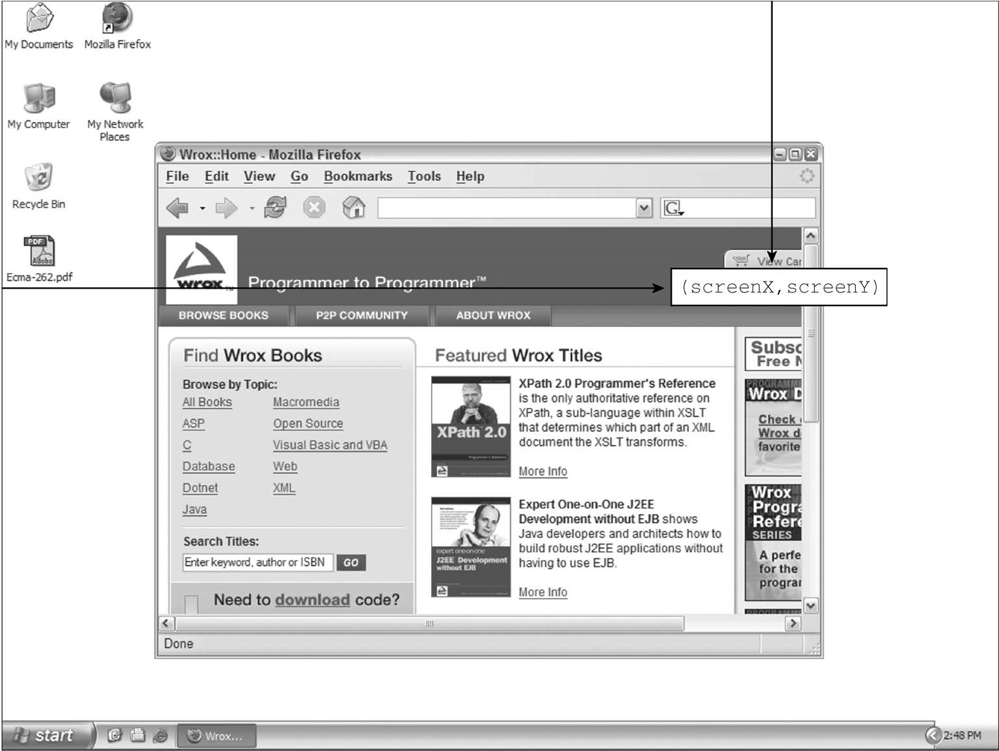
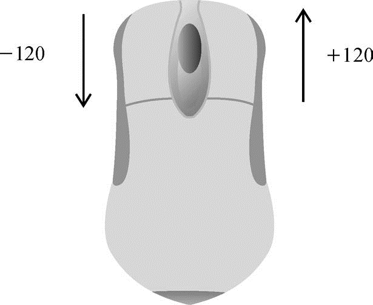
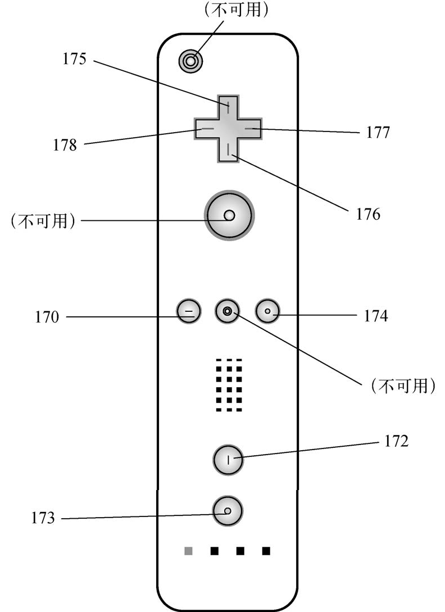
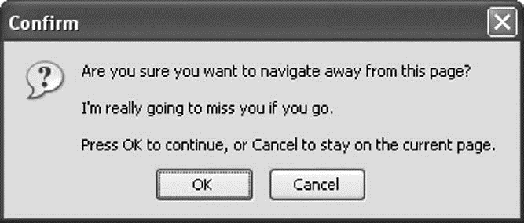
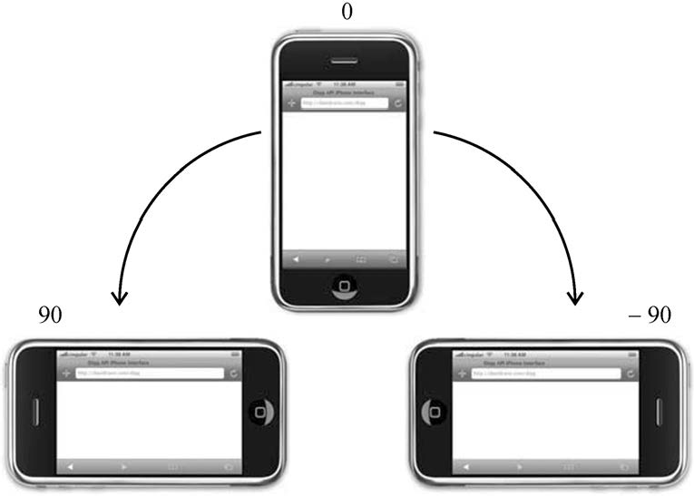
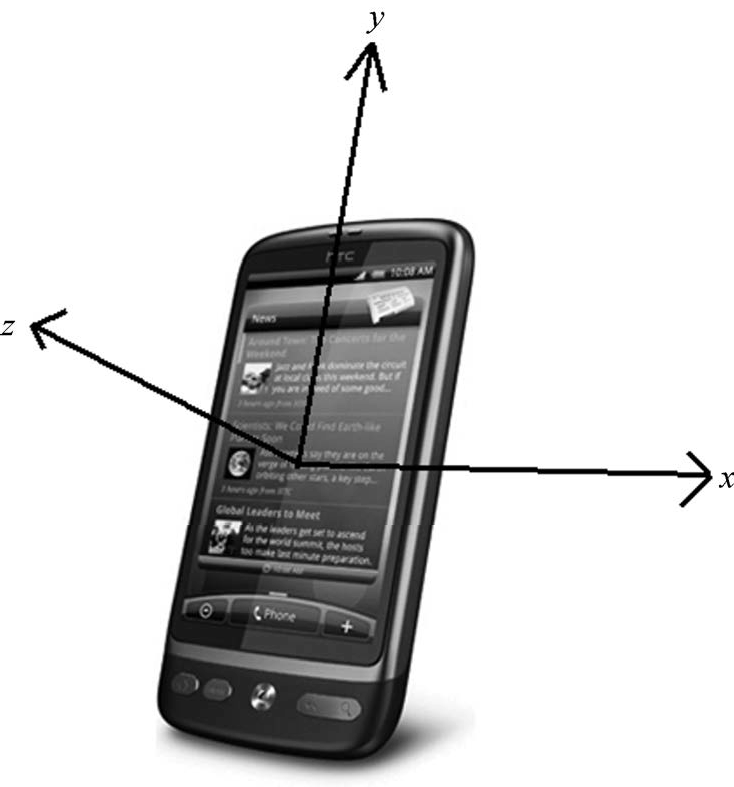
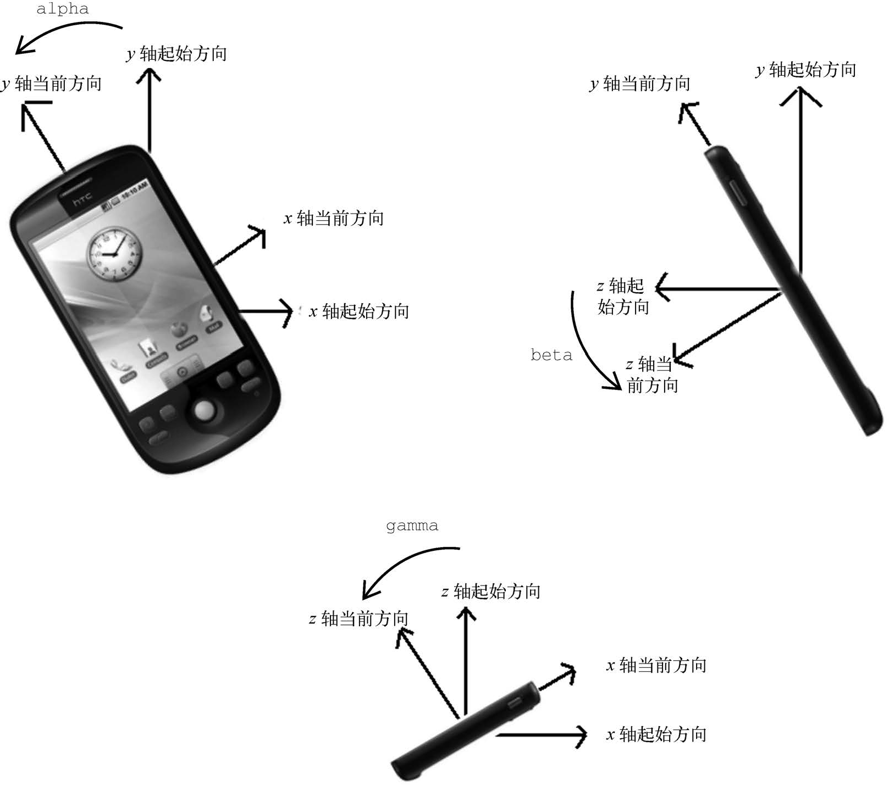

**目录：**

- [17. 事件](#17-事件)
  - [17.1. 事件流](#171-事件流)
    - [17.1.1. 事件冒泡](#1711-事件冒泡)
    - [17.1.2. 事件捕获](#1712-事件捕获)
    - [17.1.3. DOM 事件流](#1713-dom-事件流)
  - [17.2. 事件处理程序](#172-事件处理程序)
    - [17.2.1. HTML 事件处理程序](#1721-html-事件处理程序)
    - [17.2.2. DOM0 事件处理程序](#1722-dom0-事件处理程序)
    - [17.2.3. DOM2 事件处理程序](#1723-dom2-事件处理程序)
    - [17.2.4. IE 事件处理程序](#1724-ie-事件处理程序)
    - [17.2.5. 跨浏览器事件处理程序](#1725-跨浏览器事件处理程序)
  - [17.3. 事件对象](#173-事件对象)
    - [17.3.1. DOM 事件对象](#1731-dom-事件对象)
    - [17.3.2. IE 事件对象](#1732-ie-事件对象)
    - [17.3.3. 跨浏览器事件对象](#1733-跨浏览器事件对象)
  - [17.4. 事件类型](#174-事件类型)
    - [17.4.1. 用户界面事件](#1741-用户界面事件)
    - [17.4.2. 焦点事件](#1742-焦点事件)
    - [17.4.3. 鼠标和滚轮事件](#1743-鼠标和滚轮事件)
    - [17.4.4. 键盘与输入事件](#1744-键盘与输入事件)
    - [17.4.5. 合成事件](#1745-合成事件)
    - [17.4.6. HTML5 事件](#1746-html5-事件)
    - [17.4.7. 设备事件](#1747-设备事件)
    - [17.4.8. 触摸及手势事件](#1748-触摸及手势事件)
  - [17.5. 内存与性能](#175-内存与性能)
    - [17.5.1. 事件委托](#1751-事件委托)
    - [17.5.2. 删除事件处理程序](#1752-删除事件处理程序)
  - [17.6. 模拟事件](#176-模拟事件)
    - [17.6.1. DOM 事件模拟](#1761-dom-事件模拟)
    - [17.6.2. IE 事件模拟](#1762-ie-事件模拟)

# 17. 事件

本章内容

- 理解事件流
- 使用事件处理程序
- 了解不同类型的事件

JavaScript 与 HTML 的交互是通过事件实现的，事件代表文档或浏览器窗口中某个有意义的时刻。可以使用仅在事件发生时执行的监听器（也叫处理程序）订阅事件。在传统软件工程领域，这个模型叫“观察者模式”，其能够做到页面行为（在 JavaScript 中定义）与页面展示（在 HTML 和 CSS 中定义）的分离。

事件最早是在 IE3 和 Netscape Navigator 2 中出现的，当时的用意是把某些表单处理工作从服务器转移到浏览器上来。到了 IE4 和 Netscape Navigator 3 发布的时候，这两家浏览器都提供了类似但又不同的 API，而且持续了好几代。DOM2 开始尝试以符合逻辑的方式来标准化 DOM 事件 API。目前所有现代浏览器都实现了 DOM2 Events 的核心部分。IE8 是最后一个使用专有事件系统的主流浏览器。

浏览器的事件系统非常复杂。即使所有主流浏览器都实现了 DOM2 Events，规范也没有涵盖所有的事件类型。BOM 也支持事件，这些事件与 DOM 事件之间的关系由于长期以来缺乏文档，经常容易被混淆（HTML5 已经致力于明确这些关系）。而 DOM3 新增的事件 API 又让这些问题进一步复杂化了。根据具体的需求不同，使用事件可能会相对简单，也可能会非常复杂。但无论如何，理解其中的核心概念还是最重要的。

为简洁考虑，本章约定使用以下代码进行 DOM 元素的查询：

```javascript
// EXAMPLE: $('#btn')
var $ = document.querySelector.bind(document);
```

## 17.1. 事件流

在第四代 Web 浏览器（IE4 和 Netscape Communicator 4）开始开发时，开发团队碰到了一个有意思的问题：页面哪个部分拥有特定的事件呢？要理解这个问题，可以在一张纸上画几个同心圆。把手指放到圆心上，则手指不仅是在一个圆圈里，而且是在所有的圆圈里。两家浏览器的开发团队都是以同样的方式看待浏览器事件的。当你点击一个按钮时，实际上不光点击了这个按钮，还点击了它的容器以及整个页面。

事件流描述了页面接收事件的顺序。结果非常有意思，IE 和 Netscape 开发团队提出了几乎完全相反的事件流方案。IE 将支持事件冒泡流，而 Netscape Communicator 将支持事件捕获流。

### 17.1.1. 事件冒泡

IE 事件流被称为 **事件冒泡**，这是因为事件被定义为从最具体的元素（文档树中最深的节点）开始触发，然后向上传播至没有那么具体的元素（文档）。比如有如下 HTML 页面：

```html
<!DOCTYPE html>
<html>
  <head>
    <title>Event Bubbling Example</title>
  </head>
  <body>
    <div id="myDiv">Click Me</div>
  </body>
</html>
```

在点击页面中的`<div>`元素后，click 事件会以如下顺序发生：

(1) `<div>`
(2) `<body>`
(3) `<html>`
(4) document

也就是说，`<div>`元素，即被点击的元素，最先触发 click 事件。然后，click 事件沿 DOM 树一路向上，在经过的每个节点上依次触发，直至到达 document 对象。下图形象地展示了这个过程。


所有现代浏览器都支持事件冒泡，只是在实现方式上会有一些变化。IE5.5 及早期版本会跳过`<html>`元素（从`<body>`直接到 document）。现代浏览器中的事件会一直冒泡到 window 对象。

### 17.1.2. 事件捕获

Netscape Communicator 团队提出了另一种名为 **事件捕获** 的事件流。事件捕获的意思是最不具体的节点应该最先收到事件，而最具体的节点应该最后收到事件。事件捕获实际上是为了在事件到达最终目标前拦截事件。如果前面的例子使用事件捕获，则点击`<div>`元素会以下列顺序触发 click 事件：

(1) document
(2) `<html>`
(3) `<body>`
(4) `<div>`

在事件捕获中，click 事件首先由 document 元素捕获，然后沿 DOM 树依次向下传播，直至到达实际的目标元素`<div>`。这个过程如下图所示。


虽然这是 Netscape Communicator 唯一的事件流模型，但事件捕获得到了所有现代浏览器的支持。实际上，所有浏览器都是从 window 对象开始捕获事件，而 DOM2 Events 规范规定的是从 document 开始。

由于旧版本浏览器不支持，因此实际当中几乎不会使用事件捕获。通常建议使用事件冒泡，特殊情况下可以使用事件捕获。

### 17.1.3. DOM 事件流

DOM2 Events 规范规定事件流分为 3 个阶段：事件捕获、到达目标和事件冒泡。事件捕获最先发生，为提前拦截事件提供了可能。然后，实际的目标元素接收到事件。最后一个阶段是冒泡，最迟要在这个阶段响应事件。仍以前面那个简单的 HTML 为例，点击`<div>`元素会以如下图所示的顺序触发事件。


在 DOM 事件流中，实际的目标（`<div>`元素）在捕获阶段不会接收到事件。这是因为捕获阶段从 document 到`<html>`再到`<body>`就结束了。下一阶段，即会在`<div>`元素上触发事件的“到达目标”阶段，通常在事件处理时被认为是冒泡阶段的一部分（稍后讨论）。然后，冒泡阶段开始，事件反向传播至文档。

大多数支持 DOM 事件流的浏览器实现了一个小小的拓展。虽然 DOM2 Events 规范明确捕获阶段不命中事件目标，但现代浏览器都会在捕获阶段在事件目标上触发事件。最终结果是在事件目标上有两个机会来处理事件。

下面的例子演示了实际的 DOM 事件流。

这是 html 模板，非常简单，只有一个按钮：

```html
<!DOCTYPE html>
<html>
  <head>
    <title>DOM Event Stream Demo</title>
  </head>
  <body>
    <button id="btn">Click Me!</button>
    <script src="main.js"></script>
  </body>
</html>
```

这是 main.js：

```javascript
const nodes = [];
let curNode = $('#btn');

while(curNode){
  nodes.push(curNode);
  curNode = curNode.parentNode;
}

nodes.forEach((node) => {
  const nodeName = node.nodeName.toLowerCase();

  node.addEventListener('click', (event) => {
    console.log(event.eventPhase, 'trap', nodeName);
  }, true);

  node.addEventListener('click', (event) => {
    console.log(event.eventPhase, 'bubble', nodeName);
  }, false);
});

window.addEventListener(
  'click',
  (event) => console.log(event.eventPhase, 'trap', 'window'),
  true,
);

window.addEventListener(
  'click',
  (event) => console.log(event.eventPhase, 'bubble', 'window'),
  false,
);

/*
1 'trap' 'window'
1 'trap' '#document'
1 'trap' 'html'
1 'trap' 'body'
2 'trap' 'button'
2 'bubble' 'button'
3 'bubble' 'body'
3 'bubble' 'html'
3 'bubble' '#document'
3 'bubble' 'window'
*/
```

通过这个例子，我们可以清晰地看到事件到达目标实际上在事件捕获阶段和事件冒泡阶段各有一次，但是这2次的eventPhase都算作2。我们还注意到事件传播到了 window。从整体上看，整个事件流是非常对称的。

注意 所有现代浏览器都支持 DOM 事件流，只有 IE8 及更早版本不支持。

## 17.2. 事件处理程序

事件意味着用户或浏览器执行的某种动作。比如，单击（click）、加载（load）、鼠标悬停（mouseover）。为响应事件而调用的函数被称为 **事件处理程序**（或 **事件监听器**）。事件处理程序的名字以"on"开头，因此 click 事件的处理程序叫作 onclick，而 load 事件的处理程序叫作 onload。有很多方式可以指定事件处理程序。

### 17.2.1. HTML 事件处理程序

特定元素支持的每个事件都可以使用事件处理程序的名字以 HTML 属性的形式来指定。此时属性的值必须是能够执行的 JavaScript 代码。例如，要在按钮被点击时执行某些 JavaScript 代码，可以使用以下 HTML 属性：

```html
<input type="button" value="Click Me" onclick="console.log('Clicked')" />
```

点击这个按钮后，控制台会输出一条消息。这种交互能力是通过为 onclick 属性指定 JavaScript 代码值来实现的。注意，因为属性的值是 JavaScript 代码，所以不能在未经转义的情况下使用 HTML 语法字符，比如和号（&）、双引号（"）、小于号（<）和大于号（>）。此时，为了避免使用 HTML 实体，可以使用单引号代替双引号。如果确实需要使用双引号，则要把代码改成下面这样：

```html
<input type="button" value="Click Me" onclick='console.log("Clicked")' />
```

在 HTML 中定义的事件处理程序可以包含精确的动作指令，也可以调用在页面其他地方定义的脚本，比如：

```html
<script>
  const showMessage = function showMessage() {
    console.log('Hello world!');
  };
</script>
<input type="button" value="Click Me" onclick="showMessage()" />
```

在这个例子中，单击按钮会调用 showMessage()函数。showMessage()函数是在单独的`<script>`元素中定义的，而且也可以在外部文件中定义。作为事件处理程序执行的代码可以访问全局作用域中的一切。

以这种方式指定的事件处理程序有一些特殊的地方。首先，会创建一个函数来封装属性的值。这个函数有一个特殊的局部变量 event，其中保存的就是 event 对象（本章后面会讨论）：

```html
<!-- 输出 'click' -->
<input type="button" value="Click Me" onclick="console.log(event.type)" />
```

有了这个对象，就不用开发者另外定义其他变量，也不用从包装函数的参数列表中去取了。

在这个函数中，this 值相当于事件的目标元素，如下面的例子所示：

```html
<!-- 输出 'Click Me' -->
<input type="button" value="Click Me" onclick="console.log(this.value)" />
```

这个动态创建的包装函数还有一个特别有意思的地方，就是其作用域链被扩展了。在这个函数中，document 和元素自身的成员都可以被当成局部变量来访问。这是通过使用 with 实现的：

```javascript
function() {
  with(document) {
    with(this) {
      // 属性值
    }
  }
}
```

这意味着事件处理程序可以更方便地访问自己的属性。下面的代码与前面的示例功能一样：

```html
<!-- 输出 'Click Me' -->
<input type="button" value="Click Me" onclick="console.log(value)" />
```

如果这个元素是一个表单输入框，则作用域链中还会包含表单元素，事件处理程序对应的函数等价于如下这样：

```javascript
function() {
  with(document) {
    with(this.form) {
      with(this) {
        // 属性值
      }
    }
  }
}
```

本质上，经过这样的扩展，事件处理程序的代码就可以不必引用表单元素，而直接访问同一表单中的其他成员了。下面的例子就展示了这种成员访问模式：

```html
<form method="post">
  <input type="text" name="username" value="" />
  <input
    type="button"
    value="Echo Username"
    onclick="console.log(username.value)"
  />
</form>
```

点击这个例子中的按钮会显示出文本框中包含的文本。注意，事件处理程序中的代码直接引用了 username。

在 HTML 中指定事件处理程序有一些问题。第一个问题是时机问题。有可能 HTML 元素已经显示在页面上，用户都与其交互了，而事件处理程序的代码还无法执行。比如在前面的例子中，如果 showMessage()函数是在页面后面，在按钮中代码的后面定义的，那么当用户在 showMessage()函数被定义之前点击按钮时，就会发生错误。为此，大多数 HTML 事件处理程序会封装在 try/catch 块中，以便在这种情况下静默失败，如下面的例子所示：

```html
<input
  type="button"
  value="Click Me"
  onclick="try{showMessage();}catch(error) {}"
/>
```

这样，如果在 showMessage()函数被定义之前点击了按钮，就不会发生 JavaScript 错误了，这是因为错误在浏览器收到之前已经被拦截了。

另一个问题是对事件处理程序作用域链的扩展在不同浏览器中可能导致不同的结果。不同 JavaScript 引擎中标识符解析的规则存在差异，因此访问无限定的对象成员可能导致错误。

使用 HTML 指定事件处理程序的最后一个问题是 HTML 与 JavaScript 强耦合。如果需要修改事件处理程序，则必须在两个地方，即 HTML 和 JavaScript 中，修改代码。这也是很多开发者不使用 HTML 事件处理程序，而使用 JavaScript 指定事件处理程序的主要原因。

### 17.2.2. DOM0 事件处理程序

在 JavaScript 中指定事件处理程序的传统方式是把一个函数赋值给（DOM 元素的）一个事件处理程序属性。这也是在第四代 Web 浏览器中开始支持的事件处理程序赋值方法，直到现在所有现代浏览器仍然都支持此方法，主要原因是简单。要使用 JavaScript 指定事件处理程序，必须先取得要操作对象的引用。

每个元素（包括 window 和 document）都有通常小写的事件处理程序属性，比如 onclick。只要把这个属性赋值为一个函数即可：

```javascript
$('#myBtn').onclick = function onclick() {
  console.log('Clicked');
};
```

这里先从文档中取得按钮，然后给它的 onclick 事件处理程序赋值一个函数。注意，前面的代码在运行之后才会给事件处理程序赋值。因此如果在页面中上面的代码出现在按钮之后，则有可能出现用户点击按钮没有反应的情况。

像这样使用 DOM0 方式为事件处理程序赋值时，所赋函数被视为元素的方法。因此，事件处理程序会在元素的作用域中运行，即 this 等于元素。下面的例子演示了使用 this 引用元素本身：

```javascript
$('#myBtn').onclick = function onclick() {
  console.log(this.id);
  // >> 'myBtn'
};
```

点击按钮，这段代码会显示元素的 ID。这个 ID 是通过 this.id 获取的。不仅仅是 id，在事件处理程序里通过 this 可以访问元素的任何属性和方法。以这种方式添加事件处理程序是注册在事件流的冒泡阶段的。

通过将事件处理程序属性的值设置为 null，可以移除通过 DOM0 方式添加的事件处理程序，如下面的例子所示：

```javascript
// 移除事件处理程序
$('#myBtn').onclick = null;
```

把事件处理程序设置为 null，再点击按钮就不会执行任何操作了。

注意 如果事件处理程序是在 HTML 中指定的，则 onclick 属性的值是一个包装相应 HTML 事件处理程序属性值的函数。这些事件处理程序也可以通过在 JavaScript 中将相应属性设置为 null 来移除。

### 17.2.3. DOM2 事件处理程序

DOM2 Events 为事件处理程序的赋值和移除定义了两个方法：addEventListener()和 removeEventListener()。这两个方法暴露在所有 DOM 节点上，它们接收 3 个参数：事件名、事件处理函数和一个布尔值，true 表示在捕获阶段调用事件处理程序，false（默认值）表示在冒泡阶段调用事件处理程序。

仍以给按钮添加 click 事件处理程序为例，可以这样写：

```javascript
const handler = function handler() {
  console.log(this.id);
};

$('#myBtn').addEventListener('click', handler, false);
```

以上代码为按钮添加了会在事件冒泡阶段触发的 onclick 事件处理程序（因为最后一个参数值为 false）。与 DOM0 方式类似，这个事件处理程序同样在被附加到的元素的作用域中运行。使用 DOM2 方式的主要优势是可以为同一个事件添加多个事件处理程序。来看下面的例子：

```javascript
const btn = $('#myBtn');

const handler0 = function handler0() {
  console.log(handler0.name);
};

const handler1 = function handler1() {
  console.log(handler1.name);
};

btn.addEventListener('click', handler0, false);
btn.addEventListener('click', handler1, false);
```

这里给按钮添加了两个事件处理程序。多个事件处理程序以添加顺序来触发，因此前面的代码会先显示 'handler0'，然后显示 'handler1'。

通过 addEventListener()添加的事件处理程序只能使用 removeEventListener()并传入与添加时同样的参数来移除。这意味着使用 addEventListener()添加的匿名函数无法移除，如下面的例子所示：

```javascript
const btn = $('#myBtn');

btn.addEventListener(
  'click',
  () => {
    console.log(this.id);
  },
  false,
);

// 其他代码
btn.removeEventListener(
  'click',
  function () {
    // 没有效果！
    console.log(this.id);
  },
  false,
);
```

这个例子通过 addEventListener()添加了一个匿名函数作为事件处理程序。然后，又以看起来相同的参数调用了 removeEventListener()。但实际上，第二个参数与传给 addEventListener()的完全不是一回事。传给 removeEventListener()的事件处理函数必须与传给 addEventListener()的是同一个，如下面的例子所示：

```javascript
const btn = $('#myBtn');

const handler = function handler() {
  console.log(this.id);
};

btn.addEventListener('click', handler, false);

// 有效果！
btn.removeEventListener('click', handler, false);
```

这个例子有效，因为调用 addEventListener()和 removeEventListener()时传入的是同一个函数。

大多数情况下，事件处理程序会被添加到事件流的冒泡阶段，主要原因是跨浏览器兼容性好。把事件处理程序注册到捕获阶段通常用于在事件到达其指定目标之前拦截事件。如果不需要拦截，则不要使用事件捕获。

### 17.2.4. IE 事件处理程序

IE 实现了与 DOM 类似的方法，即 attachEvent()和 detachEvent()。这两个方法接收两个同样的参数：事件处理程序的名字和事件处理函数。因为 IE8 及更早版本只支持事件冒泡，所以使用 attachEvent()添加的事件处理程序会添加到冒泡阶段。

要使用 attachEvent()给按钮添加 click 事件处理程序，可以使用以下代码：

```javascript
$('#myBtn').attachEvent('onclick', function () {
  console.log('Clicked');
});
```

注意，attachEvent()的第一个参数是 'onclick'，而不是 DOM 的 addEventListener()方法的 'click'。

在 IE 中使用 attachEvent()与使用 DOM0 方式的主要区别是事件处理程序的作用域。使用 DOM0 方式时，事件处理程序中的 this 值等于目标元素。而使用 attachEvent()时，事件处理程序是在全局作用域中运行的，因此 this 等于 window。来看下面使用 attachEvent()的例子：

```javascript
$('#myBtn').attachEvent('onclick', function () {
  console.log(this === window);
  // >> true
});
```

理解这些差异对编写跨浏览器代码是非常重要的。

与使用 addEventListener()一样，使用 attachEvent()方法也可以给一个元素添加多个事件处理程序。比如下面的例子：

```javascript
var btn = $('#myBtn');

btn.attachEvent('onclick', function () {
  console.log('Clicked');
});

btn.attachEvent('onclick', function () {
  console.log('Hello world!');
});
```

这里调用了两次 attachEvent()，分别给同一个按钮添加了两个不同的事件处理程序。不过，与 DOM 方法不同，这里的事件处理程序会以添加它们的顺序反向触发。换句话说，在点击例子中的按钮后，控制台中会先打印出"Hello world!"，然后再打印出"Clicked"。

使用 attachEvent()添加的事件处理程序将使用 detachEvent()来移除，只要提供相同的参数。与使用 DOM 方法类似，作为事件处理程序添加的匿名函数也无法移除。但只要传给 detachEvent()方法相同的函数引用，就可以移除。下面的例子演示了附加和剥离事件：

```javascript
var btn = $('#myBtn');

var handler = function handler() {
  console.log('Clicked');
};

btn.attachEvent('onclick', handler);

// 其他代码
btn.detachEvent('onclick', handler);
```

这里先把事件处理程序保存到变量 handler，之后又将其传给 detachEvent()来移除事件处理程序。

### 17.2.5. 跨浏览器事件处理程序

为了以跨浏览器兼容的方式处理事件，很多开发者会选择使用一个 JavaScript 库，其中抽象了不同浏览器的差异。有些开发者也可能会自己编写代码，以便使用最合适的事件处理手段。自己编写跨浏览器事件处理代码也很简单，主要依赖能力检测。要确保事件处理代码具有最大兼容性，只需要让代码在冒泡阶段运行即可。

为此，需要先创建一个 addHandler()方法。这个方法的任务是根据需要分别使用 DOM0 方式、DOM2 方式或 IE 方式来添加事件处理程序。这个方法会在 EventUtil 对象（本章示例使用的对象）上添加一个方法，以实现跨浏览器事件处理。添加的这个 addHandler()方法接收 3 个参数：目标元素、事件名和事件处理函数。

有了 addHandler()，还要写一个也接收同样的 3 个参数的 removeHandler()。这个方法的任务是移除之前添加的事件处理程序，不管是通过何种方式添加的，默认为 DOM0 方式。

以下就是包含这两个方法的 EventUtil 对象：

```javascript
var EventUtil = {
  addHandler: function (element, type, handler) {
    if (element.addEventListener) {
      element.addEventListener(type, handler, false);
    } else if (element.attachEvent) {
      element.attachEvent('on' + type, handler);
    } else {
      element['on' + type] = handler;
    }
  },

  removeHandler: function (element, type, handler) {
    if (element.removeEventListener) {
      element.removeEventListener(type, handler, false);
    } else if (element.detachEvent) {
      element.detachEvent('on' + type, handler);
    } else {
      element['on' + type] = null;
    }
  },
};
```

两个方法都是首先检测传入元素上是否存在 DOM2 方式。如果有 DOM2 方式，就使用该方式，传入事件类型和事件处理函数，以及表示冒泡阶段的第三个参数 false。否则，如果存在 IE 方式，则使用该方式。注意这时候必须在事件类型前加上"on"，才能保证在 IE8 及更早版本中有效。最后是使用 DOM0 方式（在现代浏览器中不会到这一步）。注意使用 DOM0 方式时使用了中括号计算属性名，并将事件处理程序或 null 赋给了这个属性。

可以像下面这样使用 EventUtil 对象：

```javascript
const btn = $('#myBtn');

const handler = function () {
  console.log('Clicked');
};

EventUtil.addHandler(btn, 'click', handler);

// 其他代码
EventUtil.removeHandler(btn, 'click', handler);
```

这里的 addHandler()和 removeHandler()方法并没有解决所有跨浏览器一致性问题，比如 IE 的作用域问题、多个事件处理程序执行顺序问题等。不过，这两个方法已经实现了跨浏览器添加和移除事件处理程序。另外也要注意，DOM0 只支持给一个事件添加一个处理程序。好在 DOM0 浏览器已经很少有人使用了，所以影响应该不大。

## 17.3. 事件对象

在 DOM 中发生事件时，所有相关信息都会被收集并存储在一个名为 event 的对象中。这个对象包含了一些基本信息，比如导致事件的元素、发生的事件类型，以及可能与特定事件相关的任何其他数据。例如，鼠标操作导致的事件会生成鼠标位置信息，而键盘操作导致的事件会生成与被按下的键有关的信息。所有浏览器都支持这个 event 对象，尽管支持方式不同。

### 17.3.1. DOM 事件对象

在 DOM 合规的浏览器中，event 对象是传给事件处理程序的唯一参数。不管以哪种方式（DOM0 或 DOM2）指定事件处理程序，都会传入这个 event 对象。下面的例子展示了在两种方式下都可以使用事件对象：

```javascript
const btn = $('#myBtn');

btn.onclick = function onclick(event) {
  console.log(event.type);
  // >> 'click'
};

btn.addEventListener(
  'click',
  (event) => {
    console.log(event.type);
    // >> 'click'
  },
  false,
);
```

这个例子中的两个事件处理程序都会在控制台打出 event.type 属性包含的事件类型。这个属性中始终包含被触发事件的类型，如 'click'（与传给 addEventListener()和 removeEventListener()方法的事件名一致）。

在通过 HTML 属性指定的事件处理程序中，同样可以使用变量 event 引用事件对象。下面的例子中演示了如何使用这个变量：

```html
<input type="button" value="Click Me" onclick="console.log(event.type)" />
```

以这种方式提供 event 对象，可以让 HTML 属性中的代码实现与 JavaScript 函数同样的功能。

如前所述，事件对象包含与特定事件相关的属性和方法。不同的事件生成的事件对象也会包含不同的属性和方法。不过，所有事件对象都会包含下表列出的这些公共属性和方法。

| 属性/方法                  | 类 型        | 读/写 | 说 明                                                                                             |
| -------------------------- | ------------ | ----- | ------------------------------------------------------------------------------------------------- |
| bubbles                    | 布尔值       | 只读  | 表示事件是否冒泡                                                                                  |
| cancelable                 | 布尔值       | 只读  | 表示是否可以取消事件的默认行为                                                                    |
| currentTarget              | 元素         | 只读  | 当前事件处理程序所在的元素                                                                        |
| defaultPrevented           | 布尔值       | 只读  | true 表示已经调用 preventDefault()方法（DOM3 Events 中新增）                                      |
| detail                     | 整数         | 只读  | 事件相关的其他信息                                                                                |
| eventPhase                 | 整数         | 只读  | 表示调用事件处理程序的阶段：1 代表捕获阶段，2 代表到达目标，3 代表冒泡阶段                        |
| preventDefault()           | 函数         | 只读  | 用于取消事件的默认行为。只有 cancelable 为 true 才可以调用这个方法                                |
| stopImmediatePropagation() | 函数         | 只读  | 用于取消所有后续事件捕获或事件冒泡，并阻止调用任何后续事件处理程序（DOM3 Events 中新增）          |
| stopPropagation()          | 函数         | 只读  | 用于取消所有后续事件捕获或事件冒泡。只有 bubbles 为 true 才可以调用这个方法                       |
| target                     | 元素         | 只读  | 事件目标                                                                                          |
| isTrusted                  | 布尔值       | 只读  | true 表示事件是由浏览器生成的。false 表示事件是开发者通过 JavaScript 创建的（DOM3 Events 中新增） |
| type                       | 字符串       | 只读  | 被触发的事件类型                                                                                  |
| view                       | AbstractView | 只读  | 与事件相关的抽象视图。等于事件所发生的 window 对象                                                |

在事件处理程序内部，this 对象始终等于 currentTarget 的值，而 target 只包含事件的实际目标。如果事件处理程序直接添加在了意图的目标，则 this、currentTarget 和 target 的值是一样的。下面的例子展示了这两个属性都等于 this 的情形：

```javascript
$('#myBtn').onclick = function onclick(event) {
  console.log(event.currentTarget === this);
  // >> true

  console.log(event.target === this);
  // >> true
};
```

上面的代码检测了 currentTarget 和 target 的值是否等于 this。因为 click 事件的目标是按钮，所以这 3 个值是相等的。如果这个事件处理程序是添加到按钮的父节点（如 document.body）上，那么它们的值就不一样了。比如下面的例子在 document.body 上添加了单击处理程序：

```javascript
document.body.onclick = function onclick(event) {
  console.log(event.currentTarget === document.body);
  // >> true

  console.log(this === document.body);
  // >> true

  console.log(event.target === document.getElementById('myBtn'));
  // >> true
};
```

这种情况下点击按钮，this 和 currentTarget 都等于 document.body，这是因为它是注册事件处理程序的元素。而 target 属性等于按钮本身，这是因为那才是 click 事件真正的目标。由于按钮本身并没有注册事件处理程序，因此 click 事件冒泡到 document.body，从而触发了在它上面注册的处理程序。

type 属性在一个处理程序处理多个事件时很有用。比如下面的处理程序中就使用了 event.type：

```javascript
const btn = $('#myBtn');

const handler = function handler(event) {
  switch (event.type) {
    case 'click':
      console.log('Clicked');
      break;
    case 'mouseover':
      event.target.style.backgroundColor = 'red';
      break;
    case 'mouseout':
      event.target.style.backgroundColor = '';
      break;
  }
};

btn.onclick = handler;
btn.onmouseover = handler;
btn.onmouseout = handler;
```

在这个例子中，函数 handler 被用于处理 3 种不同的事件：click、mouseover 和 mouseout。当按钮被点击时，应该在控制台打印一条消息，如前面的例子所示。而把鼠标放到按钮上，会导致按钮背景变成红色，接着把鼠标从按钮上移开，背景颜色应该又恢复成默认值。这个函数使用 event.type 属性确定了事件类型，从而可以做出不同的响应。

preventDefault()方法用于阻止特定事件的默认动作。比如，链接的默认行为就是在被单击时导航到 href 属性指定的 URL。如果想阻止这个导航行为，可以在 onclick 事件处理程序中取消，如下面的例子所示：

```javascript
$('#myLink').onclick = function onclick(event) {
  event.preventDefault();
};
```

任何可以通过 preventDefault()取消默认行为的事件，其事件对象的 cancelable 属性都会设置为 true。

stopPropagation()方法用于立即阻止事件流在 DOM 结构中传播，取消后续的事件捕获或冒泡。例如，直接添加到按钮的事件处理程序中调用 stopPropagation()，可以阻止 document.body 上注册的事件处理程序执行。比如：

```javascript
$('#myBtn').onclick = function onclick(event) {
  console.log('Clicked');
  event.stopPropagation();
};

document.body.onclick = function onclick(event) {
  console.log('Body clicked');
};
```

如果这个例子中不调用 stopPropagation()，那么点击按钮就会打印两条消息。但这里由于 click 事件不会传播到 document.body，因此 onclick 事件处理程序永远不会执行。

eventPhase 属性可用于确定事件流当前所处的阶段。如果事件处理程序在捕获阶段被调用，则 eventPhase 等于 1；如果事件处理程序在目标上被调用，则 eventPhase 等于 2；如果事件处理程序在冒泡阶段被调用，则 eventPhase 等于 3。不过要注意的是，虽然“到达目标”是在冒泡阶段发生的，但其 eventPhase 仍然等于 2。下面的例子展示了 eventPhase 在不同阶段的值：

```javascript
const handler = function handler(event) {
  console.log(event.eventPhase, event.currentTarget.nodeName);
};

$('#myBtn').onclick = handler;
document.body.addEventListener('click', handler, true);
document.body.onclick = handler;
// >> 1, 'BODY'
// >> 2, 'BUTTON'
// >> 3, 'BODY'
```

在这个例子中，点击按钮首先会触发注册在捕获阶段的 document.body 上的事件处理程序，显示 eventPhase 为 1。接着，会触发按钮本身的事件处理程序（尽管是注册在冒泡阶段），此时显示 eventPhase 等于 2。最后触发的是注册在冒泡阶段的 document.body 上的事件处理程序，显示 eventPhase 为 3。而当 eventPhase 等于 2 时，this、target 和 currentTarget 三者相等。

注意 event 对象只在事件处理程序执行期间存在，一旦执行完毕，就会被销毁。

### 17.3.2. IE 事件对象

与 DOM 事件对象不同， IE 事件对象可以基于事件处理程序被指定的方式以不同方式来访问。如果事件处理程序是使用 DOM0 方式指定的，则 event 对象只是 window 对象的一个属性，如下所示：

```javascript
$('#myBtn').onclick = function onclick() {
  const event = window.event;
  console.log(event.type);
  // >> 'event'
};
```

这里，window.event 中保存着 event 对象，其 event.type 属性保存着事件类型（IE 的这个属性的值与 DOM 事件对象中一样）。不过，如果事件处理程序是使用 attachEvent()指定的，则 event 对象会作为唯一的参数传给处理函数，如下所示：

```javascript
$('#myBtn').attachEvent('onclick', function (event) {
  console.log(event.type);
  // >> 'click'
});
```

使用 attachEvent()时，event 对象仍然是 window 对象的属性（像 DOM0 方式那样），只是出于方便也将其作为参数传入。

如果是使用 HTML 属性方式指定的事件处理程序，则 event 对象同样可以通过变量 event 访问（与 DOM 模型一样）。下面是在 HTML 事件属性中使用 event.type 的例子：

```html
<input type="button" value="Click Me" onclick="console.log(event.type)" />
```

IE 事件对象也包含与导致其创建的特定事件相关的属性和方法，其中很多都与相关的 DOM 属性和方法对应。与 DOM 事件对象一样，基于触发的事件类型不同，event 对象中包含的属性和方法也不一样。不过，所有 IE 事件对象都会包含下表所列的公共属性和方法。

| 属性/方法    | 类 型  | 读/写 | 说 明                                                                                |
| ------------ | ------ | ----- | ------------------------------------------------------------------------------------ |
| cancelBubble | 布尔值 | 读/写 | 默认为 false，设置为 true 可以取消冒泡（与 DOM 的 stopPropagation()方法相同）        |
| returnValue  | 布尔值 | 读/写 | 默认为 true，设置为 false 可以取消事件默认行为（与 DOM 的 preventDefault()方法相同） |
| srcElement   | 元素   | 只读  | 事件目标（与 DOM 的 target 属性相同）                                                |
| type         | 字符串 | 只读  | 触发的事件类型                                                                       |

由于事件处理程序的作用域取决于指定它的方式，因此 this 值并不总是等于事件目标。为此，更好的方式是使用事件对象的 srcElement 属性代替 this。下面的例子表明，不同事件对象上的 srcElement 属性中保存的都是事件目标：

```javascript
var btn = $('#myBtn');
btn.onclick = function onclick() {
  console.log(window.event.srcElement === this);
  // >> true
};

btn.attachEvent('onclick', function (event) {
  console.log(event.srcElement === this);
  // >> false
});
```

在第一个以 DOM0 方式指定的事件处理程序中，srcElement 属性等于 this，而在第二个事件处理程序中（运行在全局作用域下），两个值就不相等了。

returnValue 属性等价于 DOM 的 preventDefault()方法，都是用于取消给定事件默认的行为。只不过在这里要把 returnValue 设置为 false 才是阻止默认动作。下面是一个设置该属性的例子：

```javascript
$('#myLink').onclick = function onclick() {
  window.event.returnValue = false;
};
```

在这个例子中，returnValue 在 onclick 事件处理程序中被设置为 false，阻止了链接的默认行为。与 DOM 不同，没有办法通过 JavaScript 确定事件是否可以被取消。

cancelBubble 属性与 DOMstopPropagation()方法用途一样，都可以阻止事件冒泡。因为 IE8 及更早版本不支持捕获阶段，所以只会取消冒泡。stopPropagation()则既取消捕获也取消冒泡。下面是一个取消冒泡的例子：

```javascript
$('#myBtn').onclick = function onclick() {
  console.log('Clicked');
  window.event.cancelBubble = true;
};

document.body.onclick = function onclick() {
  console.log('Body clicked');
};
```

通过在按钮的 onclick 事件处理程序中将 cancelBubble 设置为 true，可以阻止事件冒泡到 document.body，也就阻止了调用注册在它上面的事件处理程序。于是，点击按钮只会输出一条消息。

### 17.3.3. 跨浏览器事件对象

虽然 DOM 和 IE 的事件对象并不相同，但它们有足够的相似性可以实现跨浏览器方案。DOM 事件对象中包含 IE 事件对象的所有信息和能力，只是形式不同。这些共性可让两种事件模型之间的映射成为可能。本章前面的 EventUtil 对象可以像下面这样再添加一些方法：

```javascript
var EventUtil = {
  addHandler: function (element, type, handler) {
    // 为节省版面，删除了之前的代码
  },

  getEvent: function (event) {
    return event ? event : window.event;
  },

  getTarget: function (event) {
    return event.target || event.srcElement;
  },

  preventDefault: function (event) {
    if (event.preventDefault) {
      event.preventDefault();
    } else {
      event.returnValue = false;
    }
  },

  removeHandler: function (element, type, handler) {
    // 为节省版面，删除了之前的代码
  },

  stopPropagation: function (event) {
    if (event.stopPropagation) {
      event.stopPropagation();
    } else {
      event.cancelBubble = true;
    }
  },
};
```

这里一共给 EventUtil 增加了 4 个新方法。首先是 getEvent()，其返回对 event 对象的引用。IE 中事件对象的位置不同，而使用这个方法可以不用管事件处理程序是如何指定的，都可以获取到 event 对象。使用这个方法的前提是，事件处理程序必须接收 event 对象，并把它传给这个方法。下面是使用 EventUtil 中这个方法统一获取 event 对象的一个例子：

```javascript
$('#myBtn').onclick = function onclick(event) {
  event = EventUtil.getEvent(event);
};
```

在 DOM 合规的浏览器中，event 对象会直接传入并返回。而在 IE 中，event 对象可能并没有被定义（因为使用了 attachEvent()），因此返回 window.event。这样就可以确保无论使用什么浏览器，都可以获取到事件对象。

第二个方法是 getTarget()，其返回事件目标。在这个方法中，首先检测 event 对象是否存在 target 属性。如果存在就返回这个值；否则，就返回 event.srcElement 属性。下面是使用这个方法的示例：

```javascript
$('#myBtn').onclick = function onclick(event) {
  event = EventUtil.getEvent(event);
  const target = EventUtil.getTarget(event);
};
```

第三个方法是 preventDefault()，其用于阻止事件的默认行为。在传入的 event 对象上，如果有 preventDefault()方法，就调用这个方法；否则，就将 event.returnValue 设置为 false。下面是使用这个方法的例子：

```javascript
$('#myLink').onclick = function onclick(event) {
  event = EventUtil.getEvent(event);
  EventUtil.preventDefault(event);
};
```

以上代码能在所有主流浏览器中阻止单击链接后跳转到其他页面。这里首先通过 EventUtil.getEvent()获取事件对象，然后又把它传给了 EventUtil.preventDefault()以阻止默认行为。

第四个方法 stopPropagation()以类似的方式运行。同样先检测用于停止事件流的 DOM 方法，如果没有再使用 cancelBubble 属性。下面是使用这个通用 stopPropagation()方法的示例：

```javascript
$('#myBtn').onclick = function onclick(event) {
  console.log('Clicked');
  event = EventUtil.getEvent(event);
  EventUtil.stopPropagation(event);
};

document.body.onclick = function onclick(event) {
  console.log('Body clicked');
};
```

同样，先通过 EventUtil.getEvent()获取事件对象，然后又把它传给了 EventUtil.stopPropagation()。不过，这个方法在浏览器上可能会停止事件冒泡，也可能会既停止事件冒泡也停止事件捕获。

## 17.4. 事件类型

Web 浏览器中可以发生很多种事件。如前所述，所发生事件的类型决定了事件对象中会保存什么信息。DOM3 Events 定义了如下事件类型。

- 用户界面事件（UIEvent）：涉及与 BOM 交互的通用浏览器事件。
- 焦点事件（FocusEvent）：在元素获得和失去焦点时触发。
- 鼠标事件（MouseEvent）：使用鼠标在页面上执行某些操作时触发。
- 滚轮事件（WheelEvent）：使用鼠标滚轮（或类似设备）时触发。
- 输入事件（InputEvent）：向文档中输入文本时触发。
- 键盘事件（KeyboardEvent）：使用键盘在页面上执行某些操作时触发。
- 合成事件（CompositionEvent）：在使用某种 IME（Input Method Editor，输入法编辑器）输入字符时触发。

除了这些事件类型之外，HTML5 还定义了另一组事件，而浏览器通常在 DOM 和 BOM 上实现专有事件。这些专有事件基本上都是根据开发者需求而不是按照规范增加的，因此不同浏览器的实现可能不同。

DOM3 Events 在 DOM2 Events 基础上重新定义了事件，并增加了新的事件类型。所有主流浏览器都支持 DOM2 Events 和 DOM3 Events。

### 17.4.1. 用户界面事件

用户界面事件或 UI 事件不一定跟用户操作有关。这类事件在 DOM 规范出现之前就已经以某种形式存在了，保留它们是为了向后兼容。UI 事件主要有以下几种。

- DOMActivate：元素被用户通过鼠标或键盘操作激活时触发（比 click 或 keydown 更通用）。这个事件在 DOM3 Events 中已经废弃。因为浏览器实现之间存在差异，所以不要使用它。
- load：在 window 上当页面加载完成后触发，在窗套（`<frameset>`）上当所有窗格（`<frame>`）都加载完成后触发，在``元素上当图片加载完成后触发，在`<object>`元素上当相应对象加载完成后触发。
- unload：在 window 上当页面完全卸载后触发，在窗套上当所有窗格都卸载完成后触发，在`<object>`元素上当相应对象卸载完成后触发。
- abort：在`<object>`元素上当相应对象加载完成前被用户提前终止下载时触发。
- error：在 window 上当 JavaScript 报错时触发，在``元素上当无法加载指定图片时触发，在`<object>`元素上当无法加载相应对象时触发，在窗套上当一个或多个窗格无法完成加载时触发。
- select：在文本框（`<input>`或 textarea）上当用户选择了一个或多个字符时触发。
- resize：在 window 或窗格上当窗口或窗格被缩放时触发。
- scroll：当用户滚动包含滚动条的元素时在元素上触发。`<body>`元素包含已加载页面的滚动条。

大多数 HTML 事件与 window 对象和表单控件有关。

除了 DOMActivate，这些事件在 DOM2 Events 中都被归为 HTML Events（DOMActivate 在 DOM2 中仍旧是 UI 事件）。

1. **load 事件**

load 事件可能是 JavaScript 中最常用的事件。在 window 对象上，load 事件会在整个页面（包括所有外部资源如图片、JavaScript 文件和 CSS 文件）加载完成后触发。可以通过两种方式指定 load 事件处理程序。第一种是 JavaScript 方式，如下所示：

```javascript
window.addEventListener('load', (event) => {
  console.log('Loaded!');
});
```

这是使用 addEventListener()方法来指定事件处理程序。与其他事件一样，事件处理程序会接收到一个 event 对象。这个 event 对象并没有提供关于这种类型事件的额外信息，虽然在 DOM 合规的浏览器中，event.target 会被设置为 document，但在 IE8 之前的版本中，不会设置这个对象的 srcElement 属性。

第二种指定 load 事件处理程序的方式是向`<body>`元素添加 onload 属性，如下所示：

```html
<!DOCTYPE html>
<html>
  <head>
    <title>Load Event Example</title>
  </head>
  <body onload="console.log('Loaded!')"></body>
</html>
```

一般来说，任何在 window 上发生的事件，都可以通过给`<body>`元素上对应的属性赋值来指定，这是因为 HTML 中没有 window 元素。这实际上是为了保证向后兼容的一个策略，但在所有浏览器中都能得到很好的支持。实际开发中要尽量使用 JavaScript 方式。

注意 根据 DOM2 Events，load 事件应该在 document 而非 window 上触发。可是为了向后兼容，所有浏览器都在 window 上实现了 load 事件。

图片上也会触发 load 事件，包括 DOM 中的图片和非 DOM 中的图片。可以在 HTML 中直接给``元素的 onload 属性指定事件处理程序，比如：

```html

```

这个例子会在图片加载完成后输出一条消息。同样，使用 JavaScript 也可以为图片指定事件处理程序：

```javascript
$('#myImage').addEventListener('load', (event) => {
  console.log(event.target.src);
});
```

这里使用 JavaScript 为图片指定了 load 事件处理程序。处理程序会接收到 event 对象，虽然这个对象上没有多少有用的信息。这个事件的目标是``元素，因此可以直接从 event.target.src 属性中取得图片地址并打印出来。

在通过 JavaScript 创建新``元素时，也可以给这个元素指定一个在加载完成后执行的事件处理程序。在这里，关键是要在赋值 src 属性前指定事件处理程序，如下所示：

```javascript
window.addEventListener('load', () => {
  const image = document.createElement('img');

  image.addEventListener('load', (event) => {
    console.log(event.target.src);
  });

  document.body.appendChild(image);
  image.src = 'smile.gif';
});
```

这个例子首先为 window 指定了一个 load 事件处理程序。因为示例涉及向 DOM 中添加新元素，所以必须确保页面已经加载完成。如果在页面加载完成之前操作 document.body，则会导致错误。然后，代码创建了一个新的``元素，并为这个元素设置了 load 事件处理程序。最后，才把这个元素添加到文档中并指定了其 src 属性。注意，下载图片并不一定要把``元素添加到文档，只要给它设置了 src 属性就会立即开始下载。

同样的技术也适用于 DOM0 的 Image 对象。在 DOM 出现之前，客户端都使用 Image 对象预先加载图片。可以像使用前面（通过 createElement()方法创建）的``元素一样使用 Image 对象，只是不能把后者添加到 DOM 树。下面的例子使用新 Image 对象实现了图片预加载：

```javascript
window.addEventListener('load', () => {
  let image = new Image();

  image.addEventListener('load', (event) => {
    console.log('Image loaded!');
  });

  image.src = 'smile.gif';
});
```

这里调用 Image 构造函数创建了一个新图片，并给它设置了事件处理程序。有些浏览器会把 Image 对象实现为``元素，但并非所有浏览器都如此。所以最好把它们看成是两个东西。

注意 在 IE8 及早期版本中，如果图片没有添加到 DOM 文档中，则 load 事件发生时不会生成 event 对象。对未被添加到文档中的``元素以及 Image 对象来说都是这样。IE9 修复了这个问题。

还有一些元素也以非标准的方式支持 load 事件。`<script>`元素会在 JavaScript 文件加载完成后触发 load 事件，从而可以动态检测。与图片不同，要下载 JavaScript 文件必须同时指定 src 属性并把`<script>`元素添加到文档中。因此指定事件处理程序和指定 src 属性的顺序在这里并不重要。下面的代码展示了如何给动态创建的`<script>`元素指定事件处理程序：

```javascript
window.addEventListener('load', () => {
  const script = document.createElement('script');

  script.addEventListener('load', (event) => {
    console.log('Loaded');
  });

  script.src = 'example.js';
  document.body.appendChild(script);
});
```

这里 event 对象的 target 属性在大多数浏览器中是`<script>`节点。IE8 及更早版本不支持`<script>`元素触发 load 事件。

IE 和 Opera 支持`<link>`元素触发 load 事件，因而支持动态检测样式表是否加载完成。下面的代码展示了如何设置这样的事件处理程序：

```javascript
window.addEventListener('load', () => {
  const link = document.createElement('link');
  link.type = 'text/css';
  link.rel = 'stylesheet';

  link.addEventListener('load', (event) => {
    console.log('css loaded');
  });

  link.href = 'example.css';
  document.getElementsByTagName('head')[0].appendChild(link);
});
```

与`<script>`节点一样，在指定 href 属性并把`<link>`节点添加到文档之前不会下载样式表。

2. unload 事件

与 load 事件相对的是 unload 事件，unload 事件会在文档卸载完成后触发。unload 事件一般是在从一个页面导航到另一个页面时触发，最常用于清理引用，以避免内存泄漏。与 load 事件类似，unload 事件处理程序也有两种指定方式。第一种是 JavaScript 方式，如下所示：

```javascript
window.addEventListener('unload', (event) => {
  console.log('Unloaded!');
});
```

这个事件生成的 event 对象在 DOM 合规的浏览器中只有 target 属性（值为 document）。IE8 及更早版本在这个事件上不提供 srcElement 属性。

第二种方式与 load 事件类似，就是给`<body>`元素添加 onunload 属性：

```html
<!DOCTYPE html>
<html>
  <head>
    <title>Unload Event Example</title>
  </head>
  <body onunload="console.log('Unloaded!')"></body>
</html>
```

无论使用何种方式，都要注意事件处理程序中的代码。因为 unload 事件是在页面卸载完成后触发的，所以不能使用页面加载后才有的对象。此时要访问 DOM 或修改页面外观都会导致错误。

注意 根据 DOM2 Events，unload 事件应该在`<body>`而非 window 上触发。可是为了向后兼容，所有浏览器都在 window 上实现了 unload 事件。

3. **resize 事件**

当浏览器窗口被缩放到新高度或宽度时，会触发 resize 事件。这个事件在 window 上触发，因此可以通过 JavaScript 在 window 上或者为`<body>`元素添加 onresize 属性来指定事件处理程序。优先使用 JavaScript 方式：

```javascript
window.addEventListener('resize', (event) => {
  console.log('Resized');
});
```

类似于其他在 window 上发生的事件，此时会生成 event 对象，且这个对象的 target 属性在 DOM 合规的浏览器中是 document。而 IE8 及更早版本中并没有提供可用的属性。

不同浏览器在决定何时触发 resize 事件上存在重要差异。IE、Safari、Chrome 和 Opera 会在窗口缩放超过 1 像素时触发 resize 事件，然后随着用户缩放浏览器窗口不断触发。Firefox 早期版本则只在用户停止缩放浏览器窗口时触发 resize 事件。无论如何，都应该避免在这个事件处理程序中执行过多计算。否则可能由于执行过于频繁而导致浏览器响应明确变慢。

注意 浏览器窗口在最大化和最小化时也会触发 resize 事件。

4. **scroll 事件**

虽然 scroll 事件发生在 window 上，但实际上反映的是页面中相应元素的变化。在混杂模式下，可以通过`<body>`元素检测 scrollLeft 和 scrollTop 属性的变化。而在标准模式下，这些变化在除早期版的 Safari 之外的所有浏览器中都发生在`<html>`元素上（早期版的 Safari 在`<body>`上跟踪滚动位置）。下面的代码演示了如何处理这些差异：

```javascript
window.addEventListener('scroll', (event) => {
  if (document.compatMode == 'CSS1Compat') {
    console.log(document.documentElement.scrollTop);
  } else {
    console.log(document.body.scrollTop);
  }
});
```

以上事件处理程序会在页面滚动时输出垂直方向上滚动的距离，而且适用于不同渲染模式。因为 Safari 3.1 之前不支持 document.compatMode，所以早期版本会走第二个分支。

类似于 resize，scroll 事件也会随着文档滚动而重复触发，因此最好保持事件处理程序的代码尽可能简单。

### 17.4.2. 焦点事件

焦点事件在页面元素获得或失去焦点时触发。这些事件可以与 document.hasFocus()和 document.activeElement 一起为开发者提供用户在页面中导航的信息。焦点事件有以下 6 种。

- blur：当元素失去焦点时触发。这个事件不冒泡，所有浏览器都支持。
- DOMFocusIn：当元素获得焦点时触发。这个事件是 focus 的冒泡版。Opera 是唯一支持这个事件的主流浏览器。DOM3 Events 废弃了 DOMFocusIn，推荐 focusin。
- DOMFocusOut：当元素失去焦点时触发。这个事件是 blur 的通用版。Opera 是唯一支持这个事件的主流浏览器。DOM3 Events 废弃了 DOMFocusOut，推荐 focusout。
- focus：当元素获得焦点时触发。这个事件不冒泡，所有浏览器都支持。
- focusin：当元素获得焦点时触发。这个事件是 focus 的冒泡版。
- focusout：当元素失去焦点时触发。这个事件是 blur 的通用版。

焦点事件中的两个主要事件是 focus 和 blur，这两个事件在 JavaScript 早期就得到了浏览器支持。它们最大的问题是不冒泡。这导致 IE 后来又增加了 focusin 和 focusout，Opera 又增加了 DOMFocusIn 和 DOMFocusOut。IE 新增的这两个事件已经被 DOM3 Events 标准化。

当焦点从页面中的一个元素移到另一个元素上时，会依次发生如下事件。

(1) focuscout 在失去焦点的元素上触发。
(2) focusin 在获得焦点的元素上触发。
(3) blur 在失去焦点的元素上触发。
(4) DOMFocusOut 在失去焦点的元素上触发。
(5) focus 在获得焦点的元素上触发。
(6) DOMFocusIn 在获得焦点的元素上触发。

其中，blur、DOMFocusOut 和 focusout 的事件目标是失去焦点的元素，而 focus、DOMFocusIn 和 focusin 的事件目标是获得焦点的元素。

### 17.4.3. 鼠标和滚轮事件

**鼠标事件** 是 Web 开发中最常用的一组事件，这是因为鼠标是用户的主要定位设备。DOM3 Events 定义了 9 种鼠标事件。

- click：在用户单击鼠标主键（通常是左键）或按键盘回车键时触发。这主要是基于无障碍的考虑，让键盘和鼠标都可以触发 onclick 事件处理程序。
- dblclick：在用户双击鼠标主键（通常是左键）时触发。这个事件不是在 DOM2 Events 中定义的，但得到了很好的支持，DOM3 Events 将其进行了标准化。
- mousedown：在用户按下任意鼠标键时触发。这个事件不能通过键盘触发。
- mouseup：在用户释放鼠标键时触发。这个事件不能通过键盘触发。
- mouseenter：在用户把鼠标光标从元素外部移到元素内部时触发。这个事件不冒泡，也不会在光标经过后代元素时触发。mouseenter 事件不是在 DOM2 Events 中定义的，而是 DOM3 Events 中新增的事件。
- mouseleave：在用户把鼠标光标从元素内部移到元素外部时触发。这个事件不冒泡，也不会在光标经过后代元素时触发。mouseleave 事件不是在 DOM2 Events 中定义的，而是 DOM3 Events 中新增的事件。
- mouseover：在用户把鼠标光标从元素外部移到元素内部时触发。这个事件不能通过键盘触发。
- mousemove：在鼠标光标在元素上移动时反复触发。这个事件不能通过键盘触发。
- mouseout：在用户把鼠标光标从一个元素移到另一个元素上时触发。移到的元素可以是原始元素的外部元素，也可以是原始元素的子元素。这个事件不能通过键盘触发。

页面中的所有元素都支持鼠标事件。除了 mouseenter 和 mouseleave，所有鼠标事件都会冒泡，都可以被取消，而这会影响浏览器的默认行为。

由于事件之间存在关系，因此取消鼠标事件的默认行为也会影响其他事件。比如，click 事件触发的前提是 mousedown 事件触发后，紧接着又在同一个元素上触发了 mouseup 事件。如果 mousedown 和 mouseup 中的任意一个事件被取消，那么 click 事件就不会触发。类似地，两次连续的 click 事件会导致 dblclick 事件触发。只要有任何逻辑阻止了这两个 click 事件发生（比如取消其中一个 click 事件或者取消 mousedown 或 mouseup 事件中的任一个），dblclick 事件就不会发生。这 4 个事件永远会按照如下顺序触发：

(1) mousedown
(2) mouseup
(3) click
(4) mousedown
(5) mouseup
(6) click
(7) dblclick

click 和 dblclick 在触发前都依赖其他事件触发，mousedown 和 mouseup 则不会受其他事件影响。

下面这个程序可以帮助你更好地理解以上事件发生的顺序。

这是 HTML 模板：

```html
<!DOCTYPE html>
<html>
  <head>
    <title>Mouse Events Demo</title>
  </head>
  <body>
    <button id="btn">Try me!</button>
    <script src="main.js"></script>
  </body>
</html>
```

这是 main.js：

```javascript
const eventTypesToListen = [
  'mouseover',
  'mousemove',
  'mousedown',
  'mouseup',
  'click',
  'dblclick',
  'mouseout',
];

eventTypesToListen.forEach((eventType) => {
  $('#btn').addEventListener(eventType, (event) => {
    console.log(event.type);
  });
});
```

IE8 及更早版本的实现中有个问题，这会导致双击事件跳过第二次 mousedown 和 click 事件。相应的顺序变成了：

(1) mousedown
(2) mouseup
(3) click
(4) mouseup
(5) dblclick

鼠标事件在 DOM3 Events 中对应的类型是"MouseEvent"，而不是"MouseEvents"。

鼠标事件还有一个名为滚轮事件的子类别。滚轮事件只有一个事件 mousewheel，反映的是鼠标滚轮或带滚轮的类似设备上滚轮的交互。

1. **客户端坐标**

鼠标事件都是在浏览器视口中的某个位置上发生的。这些信息被保存在 event 对象的 clientX 和 clientY 属性中。这两个属性表示事件发生时鼠标光标在视口中的坐标，所有浏览器都支持。下图展示了视口中的 **客户端坐标**。


可以通过下面的方式获取鼠标事件的客户端坐标：

```javascript
$('#myDiv').addEventListener('click', (event) => {
  console.log(`客户端坐标：${event.clientX}, ${event.clientY}`);
});
```

这个例子为`<div>`元素指定了一个 onclick 事件处理程序。当元素被点击时，会显示事件发生时鼠标光标在客户端视口中的坐标。注意客户端坐标不考虑页面滚动，因此这两个值并不代表鼠标在页面上的位置。

2. **页面坐标**

客户端坐标是事件发生时鼠标光标在客户端视口中的坐标，而页面坐标是事件发生时鼠标光标在页面上的坐标，通过 event 对象的 pageX 和 pageY 可以获取。这两个属性表示鼠标光标在页面上的位置，因此反映的是光标到页面而非视口左边与上边的距离。

可以像下面这样取得鼠标事件的页面坐标：

```javascript
$('#myDiv').addEventListener('click', (event) => {
  console.log(`Page coordinates: ${event.pageX}, ${event.pageY}`);
});
```

在页面没有滚动时，pageX 和 pageY 与 clientX 和 clientY 的值相同。

IE8 及更早版本没有在 event 对象上暴露页面坐标。不过，可以通过客户端坐标和滚动信息计算出来。滚动信息可以从 document.body（混杂模式）或 document.documentElement（标准模式）的 scrollLeft 和 scrollTop 属性获取。计算过程如下所示：

```javascript
$('#myDiv').addEventListener('click', (event) => {
  const pageX = event.pageX;
  const pageY = event.pageY;

  if (pageX === undefined) {
    pageX =
      event.clientX +
      (document.body.scrollLeft || document.documentElement.scrollLeft);
  }

  if (pageY === undefined) {
    pageY =
      event.clientY +
      (document.body.scrollTop || document.documentElement.scrollTop);
  }

  console.log(`Page coordinates: ${pageX}, ${pageY}`);
});
```

3. **屏幕坐标**

鼠标事件不仅是在浏览器窗口中发生的，也是在整个屏幕上发生的。可以通过 event 对象的 screenX 和 screenY 属性获取鼠标光标在屏幕上的坐标。下图展示了浏览器中触发鼠标事件的光标的 **屏幕坐标**。



可以像下面这样获取鼠标事件的屏幕坐标：

```javascript
$('#myDiv').addEventListener('click', (event) => {
  console.log(`Screen coordinates: ${event.screenX}, ${event.screenY}`);
});
```

与前面的例子类似，这段代码也为`<div>`元素指定了 onclick 事件处理程序。当元素被点击时，会通过控制台打印出事件的屏幕坐标。

4. **修饰键**

虽然鼠标事件主要是通过鼠标触发的，但有时候要确定用户想实现的操作，还要考虑键盘按键的状态。键盘上的修饰键 Shift、Ctrl、Alt 和 Meta 经常用于修改鼠标事件的行为。DOM 规定了 4 个属性来表示这几个修饰键的状态：shiftKey、ctrlKey、altKey 和 metaKey。这几属性会在各自对应的修饰键被按下时包含布尔值 true，没有被按下时包含 false。在鼠标事件发生的，可以通过这几个属性来检测修饰键是否被按下。来看下面的例子，其中在 click 事件发生时检测了每个修饰键的状态：

```javascript
$('#myDiv').addEventListener('click', (event) => {
  const keys = [];

  if (event.shiftKey) {
    keys.push('shift');
  }

  if (event.ctrlKey) {
    keys.push('ctrl');
  }

  if (event.altKey) {
    keys.push('alt');
  }

  if (event.metaKey) {
    keys.push('meta');
  }
  console.log('Keys: ' + keys.join(','));
});
```

在这个例子中，onclick 事件处理程序检查了不同修饰键的状态。keys 数组中包含了在事件发生时被按下的修饰键的名称。每个对应属性为 true 的修饰键的名称都会添加到 keys 中。最后，事件处理程序会输出所有键的名称。

注意 现代浏览器支持所有这 4 个修饰键。IE8 及更早版本不支持 metaKey 属性。

5. **相关元素**

对 mouseover 和 mouseout 事件而言，还存在与事件相关的其他元素。这两个事件都涉及从一个元素的边界之内把光标移到另一个元素的边界之内。对 mouseover 事件来说，事件的主要目标是获得光标的元素，相关元素是失去光标的元素。类似地，对 mouseout 事件来说，事件的主要目标是失去光标的元素，而相关元素是获得光标的元素。来看下面的例子：

```html
<!DOCTYPE html>
<html>
  <head>
    <title>Related Elements Example</title>
  </head>
  <body>
    <div
      id="myDiv"
      style="background-color:red;height:100px;width:100px;"
    ></div>
  </body>
</html>
```

这个页面中只包含一个`<div>`元素。如果光标开始在`<div>`元素上，然后从它上面移出，则`<div>`元素上会触发 mouseout 事件，相关元素为`<body>`元素。与此同时，`<body>`元素上会触发 mouseover 事件，相关元素是`<div>`元素。

DOM 通过 event 对象的 relatedTarget 属性提供了相关元素的信息。这个属性只有在 mouseover 和 mouseout 事件发生时才包含值，其他所有事件的这个属性的值都是 null。IE8 及更早版本不支持 relatedTarget 属性，但提供了其他的可以访问到相关元素的属性。在 mouseover 事件触发时，IE 会提供 fromElement 属性，其中包含相关元素。而在 mouseout 事件触发时，IE 会提供 toElement 属性，其中包含相关元素。（IE9 支持所有这些属性。）因此，可以在 EventUtil 中增加一个通用的获取相关属性的方法：

```javascript
var EventUtil = {
  // 其他代码
  getRelatedTarget: function (event) {
    if (event.relatedTarget) {
      return event.relatedTarget;
    } else if (event.toElement) {
      return event.toElement;
    } else if (event.fromElement) {
      return event.fromElement;
    } else {
      return null;
    }
  },
  // 其他代码
};
```

与前面介绍的其他跨浏览器方法一样，这个方法同样使用特性检测来确定要返回哪个值。可以像下面这样使用 EventUtil.getRelatedTarget()方法：

```javascript
$('#myDiv').addEventListener('mouseout', (event) => {
  const target = event.target;
  const relatedTarget = EventUtil.getRelatedTarget(event);
  console.log(`Moused out of ${target.tagName} to ${relatedTarget.tagName}`);
});
```

这个例子在`<div>`元素上注册了 mouseout 事件处理程序。当事件触发时，就会打印出一条消息说明鼠标从哪个元素移出，移到了哪个元素上。

6. **鼠标按键**

只有在元素上单击鼠标主键（或按下键盘上的回车键）时 click 事件才会触发，因此按键信息并不是必需的。对 mousedown 和 mouseup 事件来说，event 对象上会有一个 button 属性，表示按下或释放的是哪个按键。DOM 为这个 button 属性定义了 3 个值：0 表示鼠标主键、1 表示鼠标中键（通常也是滚轮键）、2 表示鼠标副键。按照惯例，鼠标主键通常是左边的按键，副键通常是右边的按键。

IE8 及更早版本也提供了 button 属性，但这个属性的值与前面说的完全不同：

- 0，表示没有按下任何键；
- 1，表示按下鼠标主键；
- 2，表示按下鼠标副键；
- 3，表示同时按下鼠标主键、副键；
- 4，表示按下鼠标中键；
- 5，表示同时按下鼠标主键和中键；
- 6，表示同时按下鼠标副键和中键；
- 7，表示同时按下 3 个键。

很显然，DOM 定义的 button 属性比 IE 这一套更简单也更有用，毕竟同时按多个鼠标键的情况很少见。为此，实践中基本上都以 DOM 的 button 属性为准，这是因为除 IE8 及更早版本外的所有主流浏览器都原生支持。主、中、副键的定义非常明确，而 IE 定义的其他情形都可以翻译为按下其中某个键，而且优先翻译为主键。比如，IE 返回 5 或 7 时，就会对应到 DOM 的 0。

7. **额外事件信息**

DOM2 Events 规范在 event 对象上提供了 detail 属性，以给出关于事件的更多信息。对鼠标事件来说，detail 包含一个数值，表示在给定位置上发生了多少次单击。单击相当于在同一个像素上发生一次 mousedown 紧跟一次 mouseup。detail 的值从 1 开始，每次单击会加 1。如果鼠标在 mousedown 和 mouseup 之间移动了，则 detail 会重置为 0。

IE 还为每个鼠标事件提供了以下额外信息：

- altLeft，布尔值，表示是否按下了左 Alt 键（如果 altLeft 是 true，那么 altKey 也是 true）；
- ctrlLeft，布尔值，表示是否按下了左 Ctrl 键（如果 ctrlLeft 是 true，那么 ctrlKey 也是 true）；
- offsetX，光标相对于目标元素边界的 x 坐标；
- offsetY，光标相对于目标元素边界的 y 坐标；
- shiftLeft，布尔值，表示是否按下了左 Shift 键（如果 shiftLeft 是 true，那么 shiftKey 也是 true）。

这些属性的作用有限，这是因为只有 IE 支持。而且，它们提供的信息要么没必要，要么可以通过其他方式计算。

8. **mousewheel 事件**

IE6 首先实现了 mousewheel 事件。之后，Opera、Chrome 和 Safari 也跟着实现了。mousewheel 事件会在用户使用鼠标滚轮时触发，包括在垂直方向上任意滚动。这个事件会在任何元素上触发，并（在 IE8 中）冒泡到 document 和（在所有现代浏览器中）window。mousewheel 事件的 event 对象包含鼠标事件的所有标准信息，此外还有一个名为 wheelDelta 的新属性。当鼠标滚轮向前滚动时，wheelDelta 每次都是+120；而当鼠标滚轮向后滚动时，wheelDelta 每次都是–120。如下图所示：



可以为页面上的任何元素或文档添加 onmousewheel 事件处理程序，以处理所有鼠标滚轮交互，比如：

```javascript
document.addEventListener('mousewheel', (event) => {
  console.log(event.wheelDelta);
});
```

这个例子简单地显示了鼠标滚轮事件触发时 wheelDelta 的值。多数情况下只需知道滚轮滚动的方向，而这通过 wheelDelta 值的符号就可以知道。

注意 HTML5 也增加了 mousewheel 事件，以反映大多数浏览器对它的支持。

9. **触摸屏设备**

iOS 和 Android 等触摸屏设备的实现大相径庭，因为触摸屏通常不支持鼠标操作。在为触摸屏设备开发时，要记住以下事项。

- 不支持 dblclick 事件。双击浏览器窗口可以放大，但没有办法覆盖这个行为。
- 单指点触屏幕上的可点击元素会触发 mousemove 事件。如果操作会导致内容变化，则不会再触发其他事件。如果屏幕上没有变化，则会相继触发 mousedown、mouseup 和 click 事件。点触不可点击的元素不会触发事件。可点击元素是指点击时有默认动作的元素（如链接）或指定了 onclick 事件处理程序的元素。
- mousemove 事件也会触发 mouseover 和 mouseout 事件。
- 双指点触屏幕并滑动导致页面滚动时会触发 mousewheel 和 scroll 事件。

10. **无障碍问题**

如果 Web 应用或网站必须考虑残障人士，特别是使用屏幕阅读器的用户，那么必须小心使用鼠标事件。如前所述，按回车键可以触发 click 事件，但其他鼠标事件不能通过键盘触发。因此，建议不要使用 click 事件之外的其他鼠标事件向用户提示功能或触发代码执行，这是因为其他鼠标事件会严格妨碍盲人或视障用户使用。以下是几条使用鼠标事件时应该遵循的无障碍建议。

- 使用 click 事件执行代码。有人认为，当使用 onmousedown 执行代码时，应用程序会运行得更快。对视力正常用户来说确实如此。但在屏幕阅读器上，这样会导致代码无法执行，这是因为屏幕阅读器无法触发 mousedown 事件。
- 不要使用 mouseover 向用户显示新选项。同样，原因是屏幕阅读器无法触发 mousedown 事件。如果必须要通过这种方式显示新选项，那么可以考虑显示相同信息的键盘快捷键。
- 不要使用 dblclick 执行重要的操作，这是因为键盘不能触发这个事件。遵循这些简单的建议可以极大提升 Web 应用或网站对残障人士的无障碍性。

注意 要了解更多关于网站无障碍的信息，可以参考 WebAIM 网站。

### 17.4.4. 键盘与输入事件

键盘事件是用户操作键盘时触发的。DOM2 Events 最初定义了键盘事件，但该规范在最终发布前删除了相应内容。因此，键盘事件很大程度上是基于原始的 DOM0 实现的。

DOM3 Events 为键盘事件提供了一个首先在 IE9 中完全实现的规范。其他浏览器也开始实现该规范，但仍然存在很多遗留的实现。

键盘事件包含 3 个事件：

- keydown，用户按下键盘上某个键时触发，而且持续按住会重复触发。
- keypress，用户按下键盘上某个键并产生字符时触发，而且持续按住会重复触发。Esc 键也会触发这个事件。DOM3 Events 废弃了 keypress 事件，而推荐 textInput 事件。
- keyup，用户释放键盘上某个键时触发。

虽然所有元素都支持这些事件，但当用户在文本框中输入内容时最容易看到。

输入事件只有一个，即 textInput。这个事件是对 keypress 事件的扩展，用于在文本显示给用户之前更方便地截获文本输入。textInput 会在文本被插入到文本框之前触发。

当用户按下键盘上的某个字符键时，首先会触发 keydown 事件，然后触发 keypress 事件，最后触发 keyup 事件。注意，这里 keydown 和 keypress 事件会在文本框出现变化之前触发，而 keyup 事件会在文本框出现变化之后触发。如果一个字符键被按住不放，keydown 和 keypress 就会重复触发，直到这个键被释放。

对于非字符键，在键盘上按一下这个键，会先触发 keydown 事件，然后触发 keyup 事件。如果按住某个非字符键不放，则会重复触发 keydown 事件，直到这个键被释放，此时会触发 keyup 事件。

注意 键盘事件支持与鼠标事件相同的修饰键。shiftKey、ctrlKey、altKey 和 metaKey 属性在键盘事件中都是可用的。IE8 及更早版本不支持 metaKey 属性。

1. **键码**

对于 keydown 和 keyup 事件，event 对象的 keyCode 属性中会保存一个键码，对应键盘上特定的一个键。对于字母和数字键，keyCode 的值与小写字母和数字的 ASCII 编码一致。比如数字 7 键的 keyCode 为 55，而字母 A 键的 keyCode 为 65，而且跟是否按了 Shift 键无关。DOM 和 IE 的 event 对象都支持 keyCode 属性。下面这个例子展示了如何使用 keyCode 属性：

```javascript
$('#myText').addEventListener('keyup', (event) => {
  console.log(event.keyCode);
});
```

这个例子在 keyup 事件触发时直接显示出 event 对象的 keyCode 属性值。下表给出了键盘上所有非字符键的键码。

| 键           | 键 码 | 键                           | 键 码 |
| ------------ | ----- | ---------------------------- | ----- |
| Backspace    | 8     | 数字键盘 8                   | 104   |
| Tab          | 9     | 数字键盘 9                   | 105   |
| Enter        | 13    | 数字键盘+                    | 107   |
| Shift        | 16    | 减号（包含数字和非数字键盘） | 109   |
| Ctrl         | 17    | 数字键盘.                    | 110   |
| Alt          | 18    | 数字键盘/                    | 111   |
| Pause/Break  | 19    | F1                           | 112   |
| Caps Lock    | 20    | F2                           | 113   |
| Esc          | 27    | F3                           | 114   |
| Page Up      | 33    | F4                           | 115   |
| Page Down    | 34    | F5                           | 116   |
| End          | 35    | F6                           | 117   |
| Home         | 36    | F7                           | 118   |
| 左箭头       | 37    | F8                           | 119   |
| 上箭头       | 38    | F9                           | 120   |
| 右箭头       | 39    | F10                          | 121   |
| 下箭头       | 40    | F11                          | 122   |
| Ins          | 45    | F12                          | 123   |
| Del          | 46    | Num Lock                     | 144   |
| 左 Windows   | 91    | Scroll Lock                  | 145   |
| 右 Windows   | 92    | 分号（IE/Safari/Chrome）     | 186   |
| Context Menu | 93    | 分号（Opera/FF）             | 59    |
| 数字键盘 0   | 96    | 小于号                       | 188   |
| 数字键盘 1   | 97    | 大于号                       | 190   |
| 数字键盘 2   | 98    | 反斜杠                       | 191   |
| 数字键盘 3   | 99    | 重音符（`）                  | 192   |
| 数字键盘 4   | 100   | 等于号                       | 61    |
| 数字键盘 5   | 101   | 左中括号                     | 219   |
| 数字键盘 6   | 102   | 反斜杠（\）                  | 220   |
| 数字键盘 7   | 103   | 右中括号                     | 221   |
| 单引号       | 222   |                              |       |

2. **字符编码**

在 keypress 事件发生时，意味着按键会影响屏幕上显示的文本。对插入或移除字符的键，所有浏览器都会触发 keypress 事件，其他键则取决于浏览器。因为 DOM3 Events 规范才刚刚开始实现，所以不同浏览器之间的实现存在显著差异。

浏览器在 event 对象上支持 charCode 属性，只有发生 keypress 事件时这个属性才会被设置值，包含的是按键字符对应的 ASCII 编码。通常，charCode 属性的值是 0，在 keypress 事件发生时则是对应按键的键码。IE8 及更早版本和 Opera 使用 keyCode 传达字符的 ASCII 编码。要以跨浏览器方式获取字符编码，首先要检查 charCode 属性是否有值，如果没有再使用 keyCode，如下所示：

```javascript
var EventUtil = {
  // 其他代码
  getCharCode: function (event) {
    if (typeof event.charCode == 'number') {
      return event.charCode;
    } else {
      return event.keyCode;
    }
  },
  // 其他代码
};
```

这个方法检测 charCode 属性是否为数值（在不支持的浏览器中是 undefined）。如果是数值，则返回。否则，返回 keyCode 值。可以像下面这样使用：

```javascript
$('#myText').addEventListener('keypress', (event) => {
  console.log(EventUtil.getCharCode(event));
});
```

一旦有了字母编码，就可以使用 String.fromCharCode()方法将其转换为实际的字符了。

3. **DOM3 的变化**

尽管所有浏览器都实现了某种形式的键盘事件，DOM3 Events 还是做了一些修改。比如，DOM3Events 规范并未规定 charCode 属性，而是定义了 key 和 char 两个新属性。

其中，key 属性用于替代 keyCode，且包含字符串。在按下字符键时，key 的值等于文本字符（如“k”或“M”）；在按下非字符键时，key 的值是键名（如“Shift”或“ArrowDown”）。char 属性在按下字符键时与 key 类似，在按下非字符键时为 null。

IE 支持 key 属性但不支持 char 属性。Safari 和 Chrome 支持 keyIdentifier 属性，在按下非字符键时返回与 key 一样的值（如“Shift”）。对于字符键，keyIdentifier 返回以“U+0000”形式表示 Unicode 值的字符串形式的字符编码。

```javascript
$('#myText').addEventListener('keypress', (event) => {
  const identifier = event.key || event.keyIdentifier;

  if (identifier) {
    console.log(identifier);
  }
});
```

由于缺乏跨浏览器支持，因此不建议使用 key、keyIdentifier、和 char。

DOM3 Events 也支持一个名为 location 的属性，该属性是一个数值，表示是在哪里按的键。可能的值为：0 是默认键，1 是左边（如左边的 Alt 键），2 是右边（如右边的 Shift 键），3 是数字键盘，4 是移动设备（即虚拟键盘），5 是游戏手柄（如任天堂 Wii 控制器）。IE9 支持这些属性。Safari 和 Chrome 支持一个等价的 keyLocation 属性，但由于实现有问题，这个属性值始终为 0，除非是数字键盘（此时值为 3），值永远不会是 1、2、4、5。

```javascript
$('#myText').addEventListener('keypress', (event) => {
  const loc = event.location || event.keyLocation;

  if (loc) {
    console.log(loc);
  }
});
```

与 key 属性类似，location 属性也没有得到广泛支持，因此不建议在跨浏览器开发时使用。

最后一个变化是给 event 对象增加了 getModifierState()方法。这个方法接收一个参数，一个等于 Shift、Control、Alt、AltGraph 或 Meta 的字符串，表示要检测的修饰键。如果给定的修饰键处于激活状态（键被按住），则方法返回 true，否则返回 false：

```javascript
$('#myText').addEventListener('keypress', (event) => {
  if (event.getModifierState) {
    console.log(event.getModifierState('Shift'));
  }
});
```

当然，event 对象已经通过 shiftKey、altKey、ctrlKey 和 metaKey 属性暴露了这些信息。

4. **textInput 事件**

DOM3 Events 规范增加了一个名为 textInput 的事件，其在字符被输入到可编辑区域时触发。作为对 keypress 的替代，textInput 事件的行为有些不一样。一个区别是 keypress 会在任何可以获得焦点的元素上触发，而 textInput 只在可编辑区域上触发。另一个区别是 textInput 只在有新字符被插入时才会触发，而 keypress 对任何可能影响文本的键都会触发（包括退格键）。

因为 textInput 事件主要关注字符，所以在 event 对象上提供了一个 data 属性，包含要插入的字符（不是字符编码）。data 的值始终是要被插入的字符，因此如果在按 S 键时没有按 Shift 键，data 的值就是"s"，但在按 S 键时同时按 Shift 键，data 的值则是"S"。

textInput 事件可以这样来用：

```javascript
$('#myText').addEventListener('textInput', (event) => {
  console.log(event.data);
});
```

这个例子会实时把输入文本框的文本通过日志打印出来。

event 对象上还有一个名为 inputMethod 的属性，该属性表示向控件中输入文本的手段。可能的值如下：

- 0，表示浏览器不能确定是什么输入手段；
- 1，表示键盘；
- 2，表示粘贴；
- 3，表示拖放操作；
- 4，表示 IME；
- 5，表示表单选项；
- 6，表示手写（如使用手写笔）；
- 7，表示语音；
- 8，表示组合方式；
- 9，表示脚本。

使用这些属性，可以确定用户是如何将文本输入到控件中的，从而可以辅助验证。

5. **设备上的键盘事件**

任天堂 Wii 会在用户按下 Wii 遥控器上的键时触发键盘事件。虽然不能访问 Wii 遥控器上所有的键，但其中一些键可以触发键盘事件。下图中标识出了某些键的键码。



如图所示，按下十字键（175~178）、减号键（170）、加号键（174）、1（172）或 2（173）按钮会触发键盘事件。无法判断电源键、A、B 或 Home 键是否已按下。

### 17.4.5. 合成事件

合成事件是 DOM3 Events 中新增的，用于处理通常使用 IME 输入时的复杂输入序列。IME 可以让用户输入物理键盘上没有的字符。例如，使用拉丁字母键盘的用户还可以使用 IME 输入日文。IME 通常需要同时按下多个键才能输入一个字符。合成事件用于检测和控制这种输入。合成事件有以下 3 种：

- compositionstart，在 IME 的文本合成系统打开时触发，表示输入即将开始；
- compositionupdate，在新字符插入输入字段时触发；
- compositionend，在 IME 的文本合成系统关闭时触发，表示恢复正常键盘输入。

合成事件在很多方面与输入事件很类似。在合成事件触发时，事件目标是接收文本的输入字段。唯一增加的事件属性是 data，其中包含的值视情况而异：

- 在 compositionstart 事件中，包含正在编辑的文本（例如，已经选择了文本但还没替换）；
- 在 compositionupdate 事件中，包含要插入的新字符；
- 在 compositionend 事件中，包含本次合成过程中输入的全部内容。

与文本事件类似，合成事件可以用来在必要时过滤输入内容。可以像下面这样使用合成事件：

```javascript
const textbox = $('#myText');

textbox.addEventListener('compositionstart', (event) => {
  console.log(event.data);
});

textbox.addEventListener('compositionupdate', (event) => {
  console.log(event.data);
});

textbox.addEventListener('compositionend', (event) => {
  console.log(event.data);
});
```

### 17.4.6. HTML5 事件

DOM 规范并未涵盖浏览器都支持的所有事件。很多浏览器根据特定的用户需求或使用场景实现了自定义事件。HTML5 详尽地列出了浏览器支持的所有事件。本节讨论 HTML5 中得到浏览器较好支持的一些事件。注意这些并不是浏览器支持的所有事件。（本书后面也会涉及一些其他事件。）

1. **contextMenu 事件**

Windows 95 通过单击鼠标右键为 PC 用户增加了上下文菜单的概念。不久，这个概念也在 Web 上得以实现。开发者面临的问题是如何确定何时该显示上下文菜单（在 Windows 上是右击鼠标，在 Mac 上是 Ctrl+单击），以及如何避免默认的上下文菜单起作用。结果就出现了 contextmenu 事件，以专门用于表示何时该显示上下文菜单，从而允许开发者取消默认的上下文菜单并提供自定义菜单。

contextmenu 事件冒泡，因此只要给 document 指定一个事件处理程序就可以处理页面上的所有同类事件。事件目标是触发操作的元素。这个事件在所有浏览器中都可以取消，在 DOM 合规的浏览器中使用 event.preventDefault()，在 IE8 及更早版本中将 event.returnValue 设置为 false。
contextmenu 事件应该算一种鼠标事件，因此 event 对象上的很多属性都与光标位置有关。通常，自定义的上下文菜单都是通过 oncontextmenu 事件处理程序触发显示，并通过 onclick 事件处理程序触发隐藏的。来看下面的例子：

```html
<!DOCTYPE html>
<html>
  <head>
    <title>ContextMenu Event Example</title>
  </head>
  <body>
    <div id="myDiv">
      Right click or Ctrl+click me to get a custom context menu. Click anywhere
      else to get the default context menu.
    </div>
    <ul
      id="myMenu"
      style="position:absolute;visibility:hidden;background-color:
silver"
    >
      <li><a href="http://www.somewhere.com">somewhere</a></li>
      <li><a href="http://www.wrox.com">Wrox site</a></li>
      <li><a href="http://www.somewhere-else.com">somewhere-else</a></li>
    </ul>
  </body>
</html>
```

这个例子中的`<div>`元素有一个上下文菜单`<ul>`。作为上下文菜单，`<ul>`元素初始时是隐藏的。以下是实现上下文菜单功能的 JavaScript 代码：

```javascript
window.addEventListener('load', (event) => {
  const div = document.getElementById('myDiv');

  div.addEventListener('contextmenu', (event) => {
    event.preventDefault();
    const menu = document.getElementById('myMenu');
    menu.style.left = event.clientX + 'px';
    menu.style.top = event.clientY + 'px';
    menu.style.visibility = 'visible';
  });

  document.addEventListener('click', (event) => {
    document.getElementById('myMenu').style.visibility = 'hidden';
  });
});
```

这里在`<div>`元素上指定了一个 oncontextmenu 事件处理程序。这个事件处理程序首先取消默认行，确保不会显示浏览器默认的上下文菜单。接着基于 event 对象的 clientX 和 clientY 属性把`<ul>`元素放到适当位置。最后一步通过将 visibility 属性设置为"visible"让自定义上下文菜单显示出来。另外，又给 document 添加了一个 onclick 事件处理程序，以便在单击事件发生时隐藏上下文菜单（系统上下文菜单就是这样隐藏的）。

虽然这个例子很简单，但它是网页中所有自定义上下文菜单的基础。在这个简单例子的基础上，再添加一些 CSS，上下文菜单就会更漂亮。

2. **beforeunload 事件**

beforeunload 事件会在 window 上触发，用意是给开发者提供阻止页面被卸载的机会。这个事件会在页面即将从浏览器中卸载时触发，如果页面需要继续使用，则可以不被卸载。这个事件不能取消，否则就意味着可以把用户永久阻拦在一个页面上。相反，这个事件会向用户显示一个确认框，其中的消息表明浏览器即将卸载页面，并请用户确认是希望关闭页面，还是继续留在页面上（见下图）。



为了显示类似上图的确认框，需要将 event.returnValue 设置为要在确认框中显示的字符串（对于 IE 和 Firefox 来说），并将其作为函数值返回（对于 Safari 和 Chrome 来说），如下所示：

```javascript
window.addEventListener('beforeunload', (event) => {
  const message = "I'm really going to miss you if you go.";
  event.returnValue = message;
  return message;
});
```

3. **DOMContentLoaded 事件**

window 的 load 事件会在页面完全加载后触发，因为要等待很多外部资源加载完成，所以会花费较长时间。而 DOMContentLoaded 事件会在 DOM 树构建完成后立即触发，而不用等待图片、JavaScript 文件、CSS 文件或其他资源加载完成。相对于 load 事件，DOMContentLoaded 可以让开发者在外部资源下载的同时就能指定事件处理程序，从而让用户能够更快地与页面交互。

要处理 DOMContentLoaded 事件，需要给 document 或 window 添加事件处理程序（实际的事件目标是 document，但会冒泡到 window）。下面是一个在 document 上监听 DOMContentLoaded 事件的例子：

```javascript
document.addEventListener('DOMContentLoaded', (event) => {
  console.log('Content loaded');
});
```

DOMContentLoaded 事件的 event 对象中不包含任何额外信息（除了 target 等于 document）。DOMContentLoaded 事件通常用于添加事件处理程序或执行其他 DOM 操作。这个事件始终在 load 事件之前触发。

对于不支持 DOMContentLoaded 事件的浏览器，可以使用超时为 0 的 setTimeout()函数，通过其回调来设置事件处理程序，比如：

```javascript
setTimeout(() => {
  // 在这里添加事件处理程序
}, 0);
```

以上代码本质上意味着在当前 JavaScript 进程执行完毕后立即执行这个回调。页面加载和构建期间，只有一个 JavaScript 进程运行。所以可以在这个进程空闲后立即执行回调，至于是否与同一个浏览器或同一页面上不同脚本的 DOMContentLoaded 触发时机一致并无绝对把握。为了尽可能早一些执行，以上代码最好是页面上的第一个超时代码。即使如此，考虑到各种影响因素，也不一定保证能在 load 事件之前执行超时回调。

4. **readystatechange 事件**

IE 首先在 DOM 文档的一些地方定义了一个名为 readystatechange 事件。这个有点神秘的事件旨在提供文档或元素加载状态的信息，但行为有时候并不稳定。支持 readystatechange 事件的每个对象都有一个 readyState 属性，该属性具有一个以下列出的可能的字符串值。

- uninitialized：对象存在并尚未初始化。
- loading：对象正在加载数据。
- loaded：对象已经加载完数据。
- interactive：对象可以交互，但尚未加载完成。
- complete：对象加载完成。

看起来很简单，其实并非所有对象都会经历所有 readystate 阶段。文档中说有些对象会完全跳过某个阶段，但并未说明哪些阶段适用于哪些对象。这意味着 readystatechange 事件经常会触发不到 4 次，而 readyState 未必会依次呈现上述值。

在 document 上使用时，值为"interactive"的 readyState 首先会触发 readystatechange 事件，时机类似于 DOMContentLoaded。进入交互阶段，意味着 DOM 树已加载完成，因而可以安全地交互了。此时图片和其他外部资源不一定都加载完了。可以像下面这样使用 readystatechange 事件：

```javascript
document.addEventListener('readystatechange', (event) => {
  if (document.readyState == 'interactive') {
    console.log('Content loaded');
  }
});
```

这个事件的 event 对象中没有任何额外的信息，连事件目标都不会设置。

在与 load 事件共同使用时，这个事件的触发顺序不能保证。在包含特别多或较大外部资源的页面中，交互阶段会在 load 事件触发前先触发。而在包含较少且较小外部资源的页面中，这个 readystatechange 事件有可能在 load 事件触发后才触发。

让问题变得更加复杂的是，交互阶段与完成阶段的顺序也不是固定的。在外部资源较多的页面中，很可能交互阶段会早于完成阶段，而在外部资源较少的页面中，很可能完成阶段会早于交互阶段。因此，实践中为了抢到较早的时机，需要同时检测交互阶段和完成阶段。比如：

```javascript
document.addEventListener('readystatechange', (event) => {
  if (
    document.readyState == 'interactive' ||
    document.readyState == 'complete'
  ) {
    document.removeEventListener('readystatechange', arguments.callee);
    console.log('Content loaded');
  }
});
```

当 readystatechange 事件触发时，这段代码会检测 document.readyState 属性，以确定当前是不是交互或完成状态。如果是，则移除事件处理程序，以保证其他阶段不再执行。注意，因为这里的事件处理程序是匿名函数，所以使用了 arguments.callee 作为函数指针。然后，又打印出一条表示内容已加载的消息。这样的逻辑可以保证尽可能接近使用 DOMContentLoaded 事件的效果。

注意 使用 readystatechange 只能尽量模拟 DOMContentLoaded，但做不到分毫不差。load 事件和 readystatechange 事件发生的顺序在不同页面中是不一样的。

5. **pageshow 与 pagehide 事件**

Firefox 和 Opera 开发了一个名为 **往返缓存(bfcache，back-forward cache)**的功能，此功能旨在使用浏览器“前进”和“后退”按钮时加快页面之间的切换。这个缓存不仅存储页面数据，也存储 DOM 和 JavaScript 状态，实际上是把整个页面都保存在内存里。如果页面在缓存中，那么导航到这个页面时就不会触发 load 事件。通常，这不会导致什么问题，因为整个页面状态都被保存起来了。不过，Firefx 决定提供一些事件，把往返缓存的行为暴露出来。

第一个事件是 pageshow，其会在页面显示时触发，无论是否来自往返缓存。在新加载的页面上，pageshow 会在 load 事件之后触发；在来自往返缓存的页面上，pageshow 会在页面状态完全恢复后触发。注意，虽然这个事件的目标是 document，但事件处理程序必须添加到 window 上。下面的例子展示了追踪这些事件的代码：

```javascript
(function () {
  let showCount = 0;

  window.addEventListener('load', () => {
    console.log('Load fired');
  });

  window.addEventListener('pageshow', () => {
    showCount++;
    console.log(`Show has been fired ${showCount} times.`);
  });
})();
```

这个例子使用了私有作用域来保证 showCount 变量不进入全局作用域。在页面首次加载时，showCount 的值为 0。之后每次触发 pageshow 事件，showCount 都会加 1 并输出消息。如果从包含以上代码的页面跳走，然后又点击“后退”按钮返回以恢复它，就能够每次都看到 showCount 递增的值。这是因为变量的状态连同整个页面状态都保存在了内存中，导航回来后可以恢复。如果是点击了浏览器的“刷新”按钮，则 showCount 的值会重置为 0，因为页面会重新加载。

除了常用的属性，pageshow 的 event 对象中还包含一个名为 persisted 的属性。这个属性是一个布尔值，如果页面存储在了往返缓存中就是 true，否则就是 false。可以像下面这样在事件处理程序中检测这个属性：

```javascript
(function () {
  let showCount = 0;

  window.addEventListener('load', () => {
    console.log('Load fired');
  });

  window.addEventListener('pageshow', () => {
    showCount++;
    console.log(
      `Show has been fired ${showCount} times.`,
      `Persisted? ${event.persisted}`,
    );
  });
})();
```

通过检测 persisted 属性可以根据页面是否取自往返缓存而决定是否采取不同的操作。

与 pageshow 对应的事件是 pagehide，这个事件会在页面从浏览器中卸载后，在 unload 事件之前触发。与 pageshow 事件一样，pagehide 事件同样是在 document 上触发，但事件处理程序必须被添加到 window。event 对象中同样包含 persisted 属性，但用法稍有不同。比如，以下代码检测了 event.persisted 属性：

```javascript
window.addEventListener('pagehide', (event) => {
  console.log('Hiding. Persisted? ' + event.persisted);
});
```

这样，当 pagehide 事件触发时，也许可以根据 persisted 属性的值来采取一些不同的操作。对 pageshow 事件来说，persisted 为 true 表示页面是从往返缓存中加载的；而对 pagehide 事件来说，persisted 为 true 表示页面在卸载之后会被保存在往返缓存中。因此，第一次触发 pageshow 事件时 persisted 始终是 false，而第一次触发 pagehide 事件时 persisted 始终是 true（除非页面不符合使用往返缓存的条件）。

注意 注册了 onunload 事件处理程序（即使是空函数）的页面会自动排除在往返缓存之外。这是因为 onunload 事件典型的使用场景是撤销 onload 事件发生时所做的事情，如果使用往返缓存，则下一次页面显示时就不会触发 onload 事件，而这可能导致页面无法使用。

6. **hashchange 事件**

HTML5 增加了 hashchange 事件，用于在 URL 散列值（URL 最后#后面的部分）发生变化时通知开发者。这是因为开发者经常在 Ajax 应用程序中使用 URL 散列值存储状态信息或路由导航信息。

onhashchange 事件处理程序必须添加给 window，每次 URL 散列值发生变化时会调用它。event 对象有两个新属性：oldURL 和 newURL。这两个属性分别保存变化前后的 URL，而且是包含散列值的完整 URL。下面的例子展示了如何获取变化前后的 URL：

```javascript
window.addEventListener('hashchange', (event) => {
  console.log(`Old URL: ${event.oldURL}, New URL: ${event.newURL}`);
});
```

如果想确定当前的散列值，最好使用 location 对象：

```javascript
window.addEventListener("hashchange", (event) => {
console.log(`Current hash: ${location.hash}`);
```

### 17.4.7. 设备事件

随着智能手机和平板计算机的出现，用户与浏览器交互的新方式应运而生。为此，一批新事件被发明了出来。设备事件可以用于确定用户使用设备的方式。W3C 在 2011 年就开始起草一份新规范，用于定义新设备及设备相关的事件。

1. **orientationchange 事件**

苹果公司在移动 Safari 浏览器上创造了 orientationchange 事件，以方便开发者判断用户的设备是处于垂直模式还是水平模式。移动 Safari 在 window 上暴露了 window.orientation 属性，它有以下 3 种值之一：0 表示垂直模式，90 表示左转水平模式（主屏幕键在右侧），–90 表示右转水平模式（主屏幕键在左）。虽然相关文档也提及设备倒置后的值为 180，但设备本身至今还不支持。图 17-9 展示了 window.orientation 属性的各种值。



每当用户旋转设备改变了模式，就会触发 orientationchange 事件。但 event 对象上没有暴露任何有用的信息，这是因为相关信息都可以从 window.orientation 属性中获取。以下是这个事件典型的用法：

```javascript
window.addEventListener('load', (event) => {
  const div = $('#myDiv');
  div.innerHTML = 'Current orientation is ' + window.orientation;

  window.addEventListener('orientationchange', (event) => {
    div.innerHTML = 'Current orientation is ' + window.orientation;
  });
});
```

这个例子会在 load 事件触发时显示设备初始的朝向。然后，又指定了 orientationchange 事件处理程序。此后，只要这个事件触发，页面就会更新以显示新的朝向信息。

所有 iOS 设备都支持 orientationchange 事件和 window.orientation 属性。

注意 因为 orientationchange 事件被认为是 window 事件，所以也可以通过给`<body>`元素添加 onorientationchange 属性来指定事件处理程序。

2. **deviceorientation 事件**

deviceorientation 是 DeviceOrientationEvent 规范定义的事件。如果可以获取设备的加速计信息，而且数据发生了变化，这个事件就会在 window 上触发。要注意的是，deviceorientation 事件只反映设备在空间中的朝向，而不涉及移动相关的信息。

设备本身处于 3D 空间即拥有 x 轴、y 轴和 z 轴的坐标系中。如果把设备静止放在水平的表面上，那么三轴的值均为 0，其中，x 轴方向为从设备左侧到右侧，y 轴方向为从设备底部到上部，z 轴方向为从设备背面到正面，如下图所示。



当 deviceorientation 触发时，event 对象中会包含各个轴相对于设备静置时坐标值的变化，主要是以下 5 个属性。

- alpha：0~360 范围内的浮点值，表示围绕 z 轴旋转时 y 轴的度数（左右转）。
- beta：–180~180 范围内的浮点值，表示围绕 x 轴旋转时 z 轴的度数（前后转）。
- gamma：–90~90 范围内的浮点值，表示围绕 y 轴旋转时 z 轴的度数（扭转）。
- absolute：布尔值，表示设备是否返回绝对值。
- compassCalibrated：布尔值，表示设备的指南针是否正确校准。

下图展示了 alpha、beta 和 gamma 值的计算方式。



下面是一个输出 alpha、beta 和 gamma 值的简单例子：

```javascript
window.addEventListener('deviceorientation', (event) => {
  const output = $('#output');
  output.innerHTML = `Alpha=${event.alpha}, Beta=${event.beta}, Gamma=${event.gamma}<br>`;
});
```

基于这些信息，可以随着设备朝向的变化重新组织或修改屏幕上显示的元素。例如，以下代码会随着朝向变化旋转一个元素：

```javascript
window.addEventListener('deviceorientation', (event) => {
  const arrow = $('arrow');
  arrow.style.webkitTransform = `rotate(${Math.round(event.alpha)}deg)`;
});
```

这个例子只适用于移动 WebKit 浏览器，因为使用的是专有的 webkitTransform 属性（CSS 标准的 transform 属性的临时版本）。“箭头”（arrow）元素会随着 event.alpha 值的变化而变化，呈现出指南针的样子。这里给 CSS3 旋转变形函数传入了四舍五入后的值，以确保平顺。

3. **devicemotion 事件**

DeviceOrientationEvent 规范也定义了 devicemotion 事件。这个事件用于提示设备实际上在移动，而不仅仅是改变了朝向。例如，devicemotion 事件可以用来确定设备正在掉落或者正拿在一个行走的人手里。

当 devicemotion 事件触发时，event 对象中包含如下额外的属性。

- acceleration：对象，包含 x、y 和 z 属性，反映不考虑重力情况下各个维度的加速信息。
- accelerationIncludingGravity：对象，包含 x、y 和 z 属性，反映各个维度的加速信息，包含 z 轴自然重力加速度。
- interval：毫秒，距离下次触发 devicemotion 事件的时间。此值在事件之间应为常量。
- rotationRate：对象，包含 alpha、beta 和 gamma 属性，表示设备朝向。

如果无法提供 acceleration、accelerationIncludingGravity 和 rotationRate 信息，则属性值为 null。为此，在使用这些属性前必须先检测它们的值是否为 null。比如：

```javascript
window.addEventListener('devicemotion', (event) => {
  const output = document.getElementById('output');

  if (event.rotationRate !== null) {
    output.innerHTML +=
      `Alpha=${event.rotationRate.alpha}` +
      `Beta=${event.rotationRate.beta}` +
      `Gamma=${event.rotationRate.gamma}`;
  }
});
```

### 17.4.8. 触摸及手势事件

Safari 为 iOS 定制了一些专有事件，以方便开发者。因为 iOS 设备没有鼠标和键盘，所以常规的鼠标和键盘事件不足以创建具有完整交互能力的网页。同时，WebKit 也为 Android 定制了很多专有事件，成为了事实标准，并被纳入 W3C 的 Touch Events 规范。本节介绍的事件只适用于触屏设备。

1. **触摸事件**

iPhone 3G 发布时，iOS 2.0 内置了新版本的 Safari。这个新的移动 Safari 支持一些与触摸交互有关的新事件。后来的 Android 浏览器也实现了同样的事件。当手指放在屏幕上、在屏幕上滑动或从屏幕移开时，触摸事件即会触发。触摸事件有如下几种。

- touchstart：手指放到屏幕上时触发（即使有一个手指已经放在了屏幕上）。
- touchmove：手指在屏幕上滑动时连续触发。在这个事件中调用 preventDefault()可以阻止滚动。
- touchend：手指从屏幕上移开时触发。
- touchcancel：系统停止跟踪触摸时触发。文档中并未明确什么情况下停止跟踪。

这些事件都会冒泡，也都可以被取消。尽管触摸事件不属于 DOM 规范，但浏览器仍然以兼容 DOM 的方式实现了它们。因此，每个触摸事件的 event 对象都提供了鼠标事件的公共属性：bubbles、cancelable、view、clientX、clientY、screenX、screenY、detail、altKey、shiftKey、ctrlKey 和 metaKey。

除了这些公共的 DOM 属性，触摸事件还提供了以下 3 个属性用于跟踪触点。

- touches：Touch 对象的数组，表示当前屏幕上的每个触点。
- targetTouches：Touch 对象的数组，表示特定于事件目标的触点。
- changedTouches：Touch 对象的数组，表示自上次用户动作之后变化的触点。

每个 Touch 对象都包含下列属性。

- clientX：触点在视口中的 x 坐标。
- clientY：触点在视口中的 y 坐标。
- identifier：触点 ID。
- pageX：触点在页面上的 x 坐标。
- pageY：触点在页面上的 y 坐标。
- screenX：触点在屏幕上的 x 坐标。
- screenY：触点在屏幕上的 y 坐标。
- target：触摸事件的事件目标。

这些属性可用于追踪屏幕上的触摸轨迹。例如：

```javascript
const handleTouchEvent = function handleTouchEvent(event) {
  // 只针对一个触点
  if (event.touches.length == 1) {
    const output = $('#output');

    switch (event.type) {
      case 'touchstart': {
        output.innerHTML +=
          `<br>Touch started:` +
          `(${event.touches[0].clientX}` +
          ` ${event.touches[0].clientY})`;
        break;
      }
      case 'touchend': {
        output.innerHTML +=
          `<br>Touch ended:` +
          `(${event.changedTouches[0].clientX}` +
          ` ${event.changedTouches[0].clientY})`;
        break;
      }
      case 'touchmove': {
        // 阻止滚动
        event.preventDefault();
        output.innerHTML +=
          `<br>Touch moved:` +
          `(${event.changedTouches[0].clientX}` +
          ` ${event.changedTouches[0].clientY})`;
        break;
      }
    }
  }
};

document.addEventListener('touchstart', handleTouchEvent);
document.addEventListener('touchend', handleTouchEvent);
document.addEventListener('touchmove', handleTouchEvent);
```

以上代码会追踪屏幕上的一个触点。为简单起见，代码只会在屏幕有一个触点时输出信息。在 touchstart 事件触发时，触点的位置信息会输出到 output 元素中。在 touchmove 事件触发时，会取消默认行为以阻止滚动（移动触点通常会滚动页面），并输出变化的触点信息。在 touchend 事件触发时，会输出触点最后的信息。注意，touchend 事件触发时 touches 集合中什么也没有，这是因为没有滚动的触点了。此时必须使用 changedTouches 集合。

这些事件会在文档的所有元素上触发，因此可以分别控制页面的不同部分。当手指点触屏幕上的元素时，依次会发生如下事件（包括鼠标事件）：

(1) touchstart
(2) mouseover
(3) mousemove（1 次）
(4) mousedown
(5) mouseup
(6) click
(7) touchend

2. **手势事件**

iOS 2.0 中的 Safari 还增加了一种手势事件。**手势事件** 会在两个手指触碰屏幕且相对距离或旋转角度变化时触发。手势事件有以下 3 种。

- gesturestart：一个手指已经放在屏幕上，再把另一个手指放到屏幕上时触发。
- gesturechange：任何一个手指在屏幕上的位置发生变化时触发。
- gestureend：其中一个手指离开屏幕时触发。

只有在两个手指同时接触事件接收者时，这些事件才会触发。在一个元素上设置事件处理程序，意味着两个手指必须都在元素边界以内才能触发手势事件（这个元素就是事件目标）。因为这些事件会冒泡，所以也可以把事件处理程序放到文档级别，从而可以处理所有手势事件。使用这种方式时，事件的目标就是两个手指均位于其边界内的元素。

触摸事件和手势事件存在一定的关系。当一个手指放在屏幕上时，会触发 touchstart 事件。当另一个手指放到屏幕上时，gesturestart 事件会首先触发，然后紧接着触发这个手指的 touchstart 事件。如果两个手指或其中一个手指移动，则会触发 gesturechange 事件。只要其中一个手指离开屏幕，就会触发 gestureend 事件，紧接着触发该手指的 touchend 事件。

与触摸事件类似，每个手势事件的 event 对象都包含所有标准的鼠标事件属性：bubbles、cancelable、view、clientX、clientY、screenX、screenY、detail、altKey、shiftKey、ctrlKey 和 metaKey。新增的两个 event 对象属性是 rotation 和 scale。rotation 属性表示手指变化旋转的度数，负值表示逆时针旋转，正值表示顺时针旋转（从 0 开始）。scale 属性表示两指之间距离变化（对捏）的程度。开始时为 1，然后随着距离增大或缩小相应地增大或缩小。

可以像下面这样使用手势事件的属性：

```javascript
const handleGestureEvent = function handleGestureEvent(event) {
  const output = document.getElementById('output');

  switch (event.type) {
    case 'gesturestart':
      output.innerHTML +=
        `Gesture started: ` +
        `rotation=${event.rotation},` +
        `scale=${event.scale}`;
      break;
    case 'gestureend':
      output.innerHTML +=
        `Gesture ended: ` +
        `rotation=${event.rotation},` +
        `scale=${event.scale}`;
      break;
    case 'gesturechange':
      output.innerHTML +=
        `Gesture changed: ` +
        `rotation=${event.rotation},` +
        `scale=${event.scale}`;
      break;
  }
};

document.addEventListener('gesturestart', handleGestureEvent, false);
document.addEventListener('gestureend', handleGestureEvent, false);
document.addEventListener('gesturechange', handleGestureEvent, false);
```

与触摸事件的例子一样，以上代码简单地将每个事件对应到一个处理函数，然后输出每个事件的信息。

注意 触摸事件也会返回 rotation 和 scale 属性，但只在两个手指触碰屏幕时才会变化。一般来说，使用两个手指的手势事件比考虑所有交互的触摸事件使用起来更容易一些。

## 17.5. 内存与性能

因为事件处理程序在现代 Web 应用中可以实现交互，所以很多开发者会错误地在页面中大量使用它们。在创建 GUI 的语言如 C#中，通常会给 GUI 上的每个按钮设置一个 onclick 事件处理程序。这样做不会有什么性能损耗。在 JavaScript 中，页面中事件处理程序的数量与页面整体性能直接相关。原因有很多。首先，每个函数都是对象，都占用内存空间，对象越多，性能越差。其次，为指定事件处理程序所需访问 DOM 的次数会先期造成整个页面交互的延迟。只要在使用事件处理程序时多注意一些方法，就可以改善页面性能。

### 17.5.1. 事件委托

“过多事件处理程序”的解决方案是使用 **事件委托**。事件委托利用事件冒泡，可以只使用一个事件处理程序来管理一种类型的事件。例如，click 事件冒泡到 document。这意味着可以为整个页面指定一个 onclick 事件处理程序，而不用为每个可点击元素分别指定事件处理程序。比如有以下 HTML：

```html
<ul id="list">
  <li id="goSomewhere">Go somewhere</li>
  <li id="doSomething">Do something</li>
  <li id="sayHi">Say hi</li>
</ul>
```

这里的 HTML 包含 3 个列表项，在被点击时应该执行某个操作。对此，通常的做法是像这样指定 3 个事件处理程序：

```javascript
$('#goSomewhere').addEventListener('click', (event) => {
  location.href = 'http://www.wrox.com';
});

$('#doSomething').addEventListener('click', (event) => {
  document.title = "I changed the document's title";
});

$('#sayHi').addEventListener('click', (event) => {
  console.log('hi');
});
```

如果对页面中所有需要使用 onclick 事件处理程序的元素都如法炮制，结果就会出现大片雷同的只为指定事件处理程序的代码。使用事件委托，只要给所有元素共同的祖先节点添加一个事件处理程序，就可以解决问题。比如：

```javascript
$('#list').addEventListener('click', (event) => {
  const target = event.target;

  switch (target.id) {
    case 'doSomething':
      document.title = "I changed the document's title";
      break;
    case 'goSomewhere':
      location.href = 'http://www.wrox.com';
      break;
    case 'sayHi':
      console.log('hi');
      break;
  }
});
```

这里只给 `<ul id="list">` 元素添加了一个 onclick 事件处理程序。因为所有列表项都是这个元素的后代，所以它们的事件会向上冒泡，最终都会由这个函数来处理。但事件目标是每个被点击的列表项，只要检查 event 对象的 id 属性就可以确定，然后再执行相应的操作即可。相对于前面不使用事件委托的代码，这里的代码不会导致先期延迟，因为只访问了一个 DOM 元素和添加了一个事件处理程序。结果对用户来说没有区别，但这种方式占用内存更少。所有使用按钮的事件（大多数鼠标事件和键盘事件）都适用于这个解决方案。

只要可行，就应该考虑只给 document 添加一个事件处理程序，通过它处理页面中所有某种类型的事件。相对于之前的技术，事件委托具有如下优点。

- document 对象随时可用，任何时候都可以给它添加事件处理程序（不用等待 DOMContentLoaded 或 load 事件）。这意味着只要页面渲染出可点击的元素，就可以无延迟地起作用。
- 节省花在设置页面事件处理程序上的时间。只指定一个事件处理程序既可以节省 DOM 引用，也可以节省时间。
- 减少整个页面所需的内存，提升整体性能。

最适合使用事件委托的事件包括：click、mousedown、mouseup、keydown 和 keypress。mouseover 和 mouseout 事件冒泡，但很难适当处理，且经常需要计算元素位置（因为 mouseout 会在光标从一个元素移动到它的一个后代节点以及移出元素之外时触发）。

### 17.5.2. 删除事件处理程序

把事件处理程序指定给元素后，在浏览器代码和负责页面交互的 JavaScript 代码之间就建立了联系。这种联系建立得越多，页面性能就越差。除了通过事件委托来限制这种连接之外，还应该及时删除不用的事件处理程序。很多 Web 应用性能不佳都是由于无用的事件处理程序长驻内存导致的。

导致这个问题的原因主要有两个。第一个是删除带有事件处理程序的元素。比如通过真正的 DOM 方法 removeChild()或 replaceChild()删除节点。最常见的还是使用 innerHTML 整体替换页面的某一部分。这时候，被 innerHTML 删除的元素上如果有事件处理程序，就不会被垃圾收集程序正常清理。比如下面的例子：

```html
<div id="myDiv">
  <input type="button" value="Click Me" id="myBtn" />
</div>
<script type="text/javascript">
  $('#myBtn').onclick = function onclick() {
    // 执行操作
    // 不好！
    $('#myDiv').innerHTML = 'Processing...';
  };
</script>
```

这里的按钮在`<div>`元素中。单击按钮，会将自己删除并替换为一条消息，以阻止双击发生。这是很多网站上常见的做法。问题在于，按钮被删除之后仍然关联着一个事件处理程序。在`<div>`元素上设置 innerHTML 会完全删除按钮，但事件处理程序仍然挂在按钮上面。某些浏览器，特别是 IE8 及更早版本，在这时候就会有问题了。很有可能元素的引用和事件处理程序的引用都会残留在内存中。如果知道某个元素会被删除，那么最好在删除它之前手工删除它的事件处理程序，比如：

```html
<div id="myDiv">
  <input type="button" value="Click Me" id="myBtn" />
</div>
<script type="text/javascript">
  const btn = $('#myBtn');

  btn.onclick = function onclick() {
    // 执行操作
    // 删除事件处理程序
    btn.onclick = null;
    $('#myDiv').innerHTML = 'Processing...';
  };
</script>
```

在这个重写后的例子中，设置`<div>`元素的 innerHTML 属性之前，按钮的事件处理程序先被删除了。这样就可以确保内存被回收，按钮也可以安全地从 DOM 中删掉。但也要注意，在事件处理程序中删除按钮会阻止事件冒泡。只有事件目标仍然存在于文档中时，事件才会冒泡。

注意 事件委托也有助于解决这种问题。如果提前知道页面某一部分会被使用 innerHTML 删除，就不要直接给该部分中的元素添加事件处理程序了。把事件处理程序添加到更高层级的节点上同样可以处理该区域的事件。

另一个可能导致内存中残留引用的问题是页面卸载。同样，IE8 及更早版本在这种情况下有很多问题，不过好像所有浏览器都会受这个问题影响。如果在页面卸载后事件处理程序没有被清理，则它们仍然会残留在内存中。之后，浏览器每次加载和卸载页面（比如通过前进、后退或刷新），内存中残留对象的数量都会增加，这是因为事件处理程序不会被回收。一般来说，最好在 onunload 事件处理程序中趁页面尚未卸载先删除所有事件处理程序。这时候也能体现使用事件委托的优势，因为事件处理程序很少，所以很容易记住要删除哪些。关于卸载页面时的清理，可以记住一点：onload 事件处理程序中做了什么，最好在 onunload 事件处理程序中恢复。

注意 在页面中使用 onunload 事件处理程序意味着页面不会被保存在往返缓存（bfcache）中。如果这对应用很重要，可以考虑只在 IE 中使用 onunload 来删除事件处理程序。

## 17.6. 模拟事件

事件就是为了表示网页中某个有意义的时刻。通常，事件都是由用户交互或浏览器功能触发。事实上，可能很少有人知道可以通过 JavaScript 在任何时候触发任意事件，而这些事件会被当成浏览器创建的事件。这意味着同样会有事件冒泡，因而也会触发相应的事件处理程序。这种能力在测试 Web 应用时特别有用。DOM3 规范指明了模拟特定类型事件的方式。IE8 及更早版本也有自己模拟事件的方式。

### 17.6.1. DOM 事件模拟

任何时候，都可以使用 document.createEvent()方法创建一个 event 对象。这个方法接收一个参数，此参数是一个表示要创建事件类型的字符串。在 DOM2 中，所有这些字符串都是英文复数形式，但在 DOM3 中，又把它们改成了英文单数形式。可用的字符串值是以下值之一。

- "UIEvents"（DOM3 中是"UIEvent"）：通用用户界面事件（鼠标事件和键盘事件都继承自这个事件）。
- "MouseEvents"（DOM3 中是"MouseEvent"）：通用鼠标事件。
- "HTMLEvents"（DOM3 中没有）：通用 HTML 事件（HTML 事件已经分散到了其他事件大类中）。

注意，键盘事件不是在 DOM2 Events 中规定的，而是后来在 DOM3 Events 中增加的。

创建 event 对象之后，需要使用事件相关的信息来初始化。每种类型的 event 对象都有特定的方法，可以使用相应数据来完成初始化。方法的名字并不相同，这取决于调用 createEvent()时传入的参数。

事件模拟的最后一步是触发事件。为此要使用 dispatchEvent()方法，这个方法存在于所有支持事件的 DOM 节点之上。dispatchEvent()方法接收一个参数，即表示要触发事件的 event 对象。调用 dispatchEvent()方法之后，事件就“转正”了，接着便冒泡并触发事件处理程序执行。

1. **模拟鼠标事件**

模拟鼠标事件需要先创建一个新的鼠标 event 对象，然后再使用必要的信息对其进行初始化。要创建鼠标 event 对象，可以调用 createEvent()方法并传入 'MouseEvents' 参数。这样就会返回一个 event 对象，这个对象有一个 initMouseEvent()方法，用于为新对象指定鼠标的特定信息。initMouseEvent()方法接收 15 个参数，分别对应鼠标事件会暴露的属性。这些参数列举如下。

- type（字符串）：要触发的事件类型，如"click"。
- bubbles（布尔值）：表示事件是否冒泡。为精确模拟鼠标事件，应该设置为 true。
- cancelable（布尔值）：表示事件是否可以取消。为精确模拟鼠标事件，应该设置为 true。
- view（AbstractView）：与事件关联的视图。基本上始终是 document.defaultView。
- detail（整数）：关于事件的额外信息。只被事件处理程序使用，通常为 0。
- screenX（整数）：事件相对于屏幕的 x 坐标。
- screenY（整数）：事件相对于屏幕的 y 坐标。
- clientX（整数）：事件相对于视口的 x 坐标。
- clientY（整数）：事件相对于视口的 y 坐标。
- ctrlkey（布尔值）：表示是否按下了 Ctrl 键。默认为 false。
- altkey（布尔值）：表示是否按下了 Alt 键。默认为 false。
- shiftkey（布尔值）：表示是否按下了 Shift 键。默认为 false。
- metakey（布尔值）：表示是否按下了 Meta 键。默认为 false。
- button（整数）：表示按下了哪个按钮。默认为 0。
- relatedTarget（对象）：与事件相关的对象。只在模拟 mouseover 和 mouseout 时使用。

显然，initMouseEvent()方法的这些参数与鼠标事件的 event 对象属性是一一对应的。前 4 个参数是正确模拟事件唯一重要的几个参数，这是因为它们是浏览器要用的，其他参数则是事件处理程序要用的。event 对象的 target 属性会自动设置为调用 dispatchEvent()方法时传入的节点。下面来看一个使用默认值模拟单击事件的例子：

```javascript
// 创建event 对象
const event = document.createEvent('MouseEvents');

// 初始化event 对象
event.initMouseEvent(
  'click',
  true,
  true,
  document.defaultView,
  0,
  0,
  0,
  0,
  0,
  false,
  false,
  false,
  false,
  0,
  null,
);

// 触发事件
$('#myBtn').dispatchEvent(event);
```

所有鼠标事件，包括 dblclick 都可以像这样在 DOM 合规的浏览器中模拟出来。

2. **模拟键盘事件**

如前所述，DOM2 Events 中没有定义键盘事件，因此模拟键盘事件并不直观。键盘事件曾在 DOM2Events 的草案中提到过，但最终成为推荐标准前又被删掉了。要注意的是，DOM3 Events 中定义的键盘事件与 DOM2 Events 草案最初定义的键盘事件差别很大。

在 DOM3 中创建键盘事件的方式是给 createEvent()方法传入参数"KeyboardEvent"。这样会返回一个 event 对象，这个对象有一个 initKeyboardEvent()方法。这个方法接收以下参数。

- type（字符串）：要触发的事件类型，如"keydown"。
- bubbles（布尔值）：表示事件是否冒泡。为精确模拟键盘事件，应该设置为 true。
- cancelable（布尔值）：表示事件是否可以取消。为精确模拟键盘事件，应该设置为 true。
- view（AbstractView）：与事件关联的视图。基本上始终是 document.defaultView。
- key（字符串）：按下按键的字符串代码。
- location（整数）：按下按键的位置。0 表示默认键，1 表示左边，2 表示右边，3 表示数字键盘，4 表示移动设备（虚拟键盘），5 表示游戏手柄。
- modifiers（字符串）：空格分隔的修饰键列表，如"Shift"。
- repeat（整数）：连续按了这个键多少次。

注意，DOM3 Events 废弃了 keypress 事件，因此只能通过上述方式模拟 keydown 和 keyup 事件：

```javascript
// 按照 DOM3 的方式创建 event 对象
if (document.implementation.hasFeature('KeyboardEvents', '3.0')) {
  const event = document.createEvent('KeyboardEvent');

  // 初始化event 对象
  event.initKeyboardEvent(
    'keydown',
    true,
    true,
    document.defaultView,
    'a',
    0,
    'Shift',
    0,
  );
}

// 触发事件
$('#myTextbox').dispatchEvent(event);
```

这个例子模拟了同时按住 Shift 键和键盘上 A 键的 keydown 事件。在使用 document.createEvent("KeyboardEvent")之前，最好检测一下浏览器对 DOM3 键盘事件的支持情况，其他浏览器会返回非标准的 KeyboardEvent 对象。

Firefox 允许给 createEvent()传入"KeyEvents"来创建键盘事件。这时候返回的 event 对象包含的方法叫 initKeyEvent()，此方法接收以下 10 个参数。

- type（字符串）：要触发的事件类型，如"keydown"。
- bubbles（布尔值）：表示事件是否冒泡。为精确模拟键盘事件，应该设置为 true。
- cancelable（布尔值）：表示事件是否可以取消。为精确模拟键盘事件，应该设置为 true。
- view（AbstractView）：与事件关联的视图，基本上始终是 document.defaultView。
- ctrlkey（布尔值）：表示是否按下了 Ctrl 键。默认为 false。
- altkey（布尔值）：表示是否按下了 Alt 键。默认为 false。
- shiftkey（布尔值）：表示是否按下了 Shift 键。默认为 false。
- metakey（布尔值）：表示是否按下了 Meta 键。默认为 false。
- keyCode（整数）：表示按下或释放键的键码。在 keydown 和 keyup 中使用。默认为 0。
- charCode（整数）：表示按下键对应字符的 ASCII 编码。在 keypress 中使用。默认为 0。

键盘事件也可以通过调用 dispatchEvent()并传入 event 对象来触发，比如：

```javascript
// 仅适用于Firefox
const textbox = document.getElementById('myTextbox');

// 创建event 对象
const event = document.createEvent('KeyEvents');

// 初始化event 对象
event.initKeyEvent(
  'keydown',
  true,
  true,
  document.defaultView,
  false,
  false,
  true,
  false,
  65,
  65,
);

// 触发事件
textbox.dispatchEvent(event);
```

这个例子模拟了同时按住 Shift 键和键盘上 A 键的 keydown 事件。同样也可以像这样模拟 keyup 和 keypress 事件。

对于其他浏览器，需要创建一个通用的事件，并为其指定特定于键盘的信息，如下面的例子所示：

```javascript
// 创建event 对象
const event = document.createEvent('Events');

// 初始化event 对象
event.initEvent(type, bubbles, cancelable);
event.view = document.defaultView;
event.altKey = false;
event.ctrlKey = false;
event.shiftKey = false;
event.metaKey = false;
event.keyCode = 65;
event.charCode = 65;

// 触发事件
$('#myTextbox').dispatchEvent(event);
```

以上代码创建了一个通用事件，然后使用 initEvent()方法初始化，接着又为它指定了键盘事件信息。这里必须使用通用事件而不是用户界面事件，因为用户界面事件不允许直接给 event 对象添加属性（Safari 例外）。像这样模拟一个事件虽然会触发键盘事件，但文本框中不会输入任何文本，因为它并不能准确模拟键盘事件。

3. **模拟其他事件**

鼠标事件和键盘事件是浏览器中最常见的模拟对象。不过，有时候可能也需要模拟 HTML 事件。模拟 HTML 事件要调用 createEvent()方法并传入"HTMLEvents"，然后再使用返回对象的 initEvent()方法来初始化：

```javascript
const event = document.createEvent('HTMLEvents');
event.initEvent('focus', true, false);
target.dispatchEvent(event);
```

这个例子模拟了在给定目标上触发 focus 事件。其他 HTML 事件也可以像这样来模拟。注意 HTML 事件在浏览器中很少使用，因为它们用处有限。

4. **自定义 DOM 事件**

DOM3 增加了自定义事件的类型。自定义事件不会触发原生 DOM 事件，但可以让开发者定义自己的事件。要创建自定义事件， 需要调用 createEvent("CustomEvent") 。返回的对象包含 initCustomEvent()方法，该方法接收以下 4 个参数。

- type（字符串）：要触发的事件类型，如"myevent"。
- bubbles（布尔值）：表示事件是否冒泡。
- cancelable（布尔值）：表示事件是否可以取消。
- detail（对象）：任意值。作为 event 对象的 detail 属性。

自定义事件可以像其他事件一样在 DOM 中派发，比如：

```javascript
const div = $("#myDiv"),

div.addEventListener("myevent", (event) => {
  console.log("DIV: " + event.detail);
});

document.addEventListener("myevent", (event) => {
  console.log("DOCUMENT: " + event.detail);
});

if (document.implementation.hasFeature("CustomEvents", "3.0")) {
  const event = document.createEvent("CustomEvent");
  event.initCustomEvent("myevent", true, false, "Hello world!");
  div.dispatchEvent(event);
}
```

这个例子创建了一个名为"myevent"的冒泡事件。event 对象的 detail 属性就是一个简单的字符串，`<div>`元素和 document 都为这个事件注册了事件处理程序。因为使用 initCustomEvent()初始化时将事件指定为可以冒泡，所以浏览器会负责把事件冒泡到 document。

### 17.6.2. IE 事件模拟

在 IE8 及更早版本中模拟事件的过程与 DOM 方式类似：创建 event 对象，指定相应信息，然后使用这个对象触发。当然，IE 实现每一步的方式都不一样。

首先，要使用 document 对象的 createEventObject()方法来创建 event 对象。与 DOM 不同，这个方法不接收参数，返回一个通用 event 对象。然后，可以手工给返回的对象指定希望该对象具备的所有属性。（没有初始化方法。）最后一步是在事件目标上调用 fireEvent()方法，这个方法接收两个参数：事件处理程序的名字和 event 对象。调用 fireEvent()时，srcElement 和 type 属性会自动指派到 event 对象（其他所有属性必须手工指定）。这意味着 IE 支持的所有事件都可以通过相同的方式来模拟。例如，下面的代码在一个按钮上模拟了 click 事件：

```javascript
var btn = $('#myBtn');

// 创建event 对象
var event = document.createEventObject();

/// 初始化event 对象
event.screenX = 100;
event.screenY = 0;
event.clientX = 0;
event.clientY = 0;
event.ctrlKey = false;
event.altKey = false;
event.shiftKey = false;
event.button = 0;

// 触发事件
btn.fireEvent('onclick', event);
```

这个例子先创建 event 对象，然后用相关信息对其进行了初始化。注意，这里可以指定任何属性，包括 IE8 及更早版本不支持的属性。这些属性的值对于事件来说并不重要，因为只有事件处理程序才会使用它们。

同样的方式也可以用来模拟 keypress 事件，如下面的例子所示：

```javascript
var textbox = $('#myTextbox');

// 创建event 对象
var event = document.createEventObject();

// 初始化event 对象
event.altKey = false;
event.ctrlKey = false;
event.shiftKey = false;
event.keyCode = 65;

// 触发事件
textbox.fireEvent('onkeypress', event);
```

由于鼠标事件、键盘事件或其他事件的 event 对象并没有区别，因此使用通用的 event 对象可以触发任何类型的事件。注意，与 DOM 方式模拟键盘事件一样，这里模拟的 keypress 虽然会触发，但文本框中也不会出现字符。
