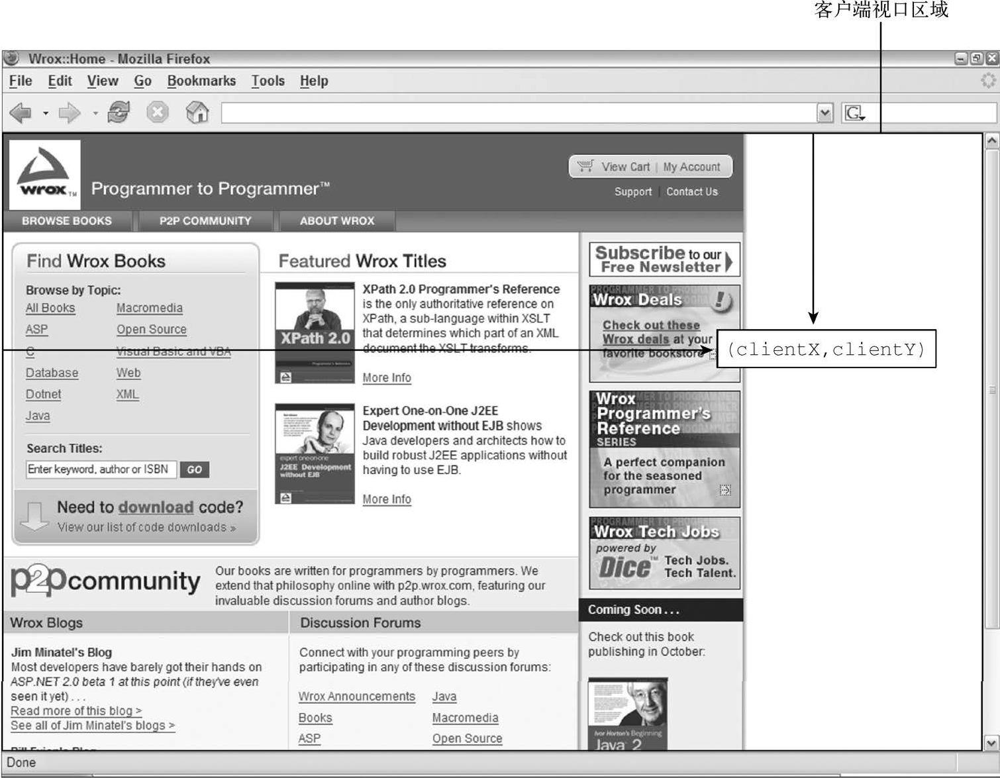

**目录：**

- [17. 事件](#17-事件)
  - [17.1. 事件流](#171-事件流)
    - [17.1.1. 事件冒泡](#1711-事件冒泡)
    - [17.1.2. 事件捕获](#1712-事件捕获)
    - [17.1.3. DOM 事件流](#1713-dom-事件流)
  - [17.2. 事件处理程序](#172-事件处理程序)
    - [17.2.1. HTML 事件处理程序](#1721-html-事件处理程序)
    - [17.2.2. DOM0 事件处理程序](#1722-dom0-事件处理程序)
    - [17.2.3. DOM2 事件处理程序](#1723-dom2-事件处理程序)
    - [17.2.4. IE 事件处理程序](#1724-ie-事件处理程序)
    - [17.2.5. 跨浏览器事件处理程序](#1725-跨浏览器事件处理程序)
  - [17.3. 事件对象](#173-事件对象)
    - [17.3.1. DOM 事件对象](#1731-dom-事件对象)
    - [17.3.2. IE 事件对象](#1732-ie-事件对象)
    - [17.3.3. 跨浏览器事件对象](#1733-跨浏览器事件对象)
  - [17.4. 事件类型](#174-事件类型)
    - [17.4.1. 用户界面事件](#1741-用户界面事件)
    - [17.4.2. 焦点事件](#1742-焦点事件)
    - [17.4.3. 鼠标和滚轮事件](#1743-鼠标和滚轮事件)

# 17. 事件

本章内容

- 理解事件流
- 使用事件处理程序
- 了解不同类型的事件

JavaScript 与 HTML 的交互是通过事件实现的，事件代表文档或浏览器窗口中某个有意义的时刻。可以使用仅在事件发生时执行的监听器（也叫处理程序）订阅事件。在传统软件工程领域，这个模型叫“观察者模式”，其能够做到页面行为（在 JavaScript 中定义）与页面展示（在 HTML 和 CSS 中定义）的分离。

事件最早是在 IE3 和 Netscape Navigator 2 中出现的，当时的用意是把某些表单处理工作从服务器转移到浏览器上来。到了 IE4 和 Netscape Navigator 3 发布的时候，这两家浏览器都提供了类似但又不同的 API，而且持续了好几代。DOM2 开始尝试以符合逻辑的方式来标准化 DOM 事件 API。目前所有现代浏览器都实现了 DOM2 Events 的核心部分。IE8 是最后一个使用专有事件系统的主流浏览器。

浏览器的事件系统非常复杂。即使所有主流浏览器都实现了 DOM2 Events，规范也没有涵盖所有的事件类型。BOM 也支持事件，这些事件与 DOM 事件之间的关系由于长期以来缺乏文档，经常容易被混淆（HTML5 已经致力于明确这些关系）。而 DOM3 新增的事件 API 又让这些问题进一步复杂化了。根据具体的需求不同，使用事件可能会相对简单，也可能会非常复杂。但无论如何，理解其中的核心概念还是最重要的。

## 17.1. 事件流

在第四代 Web 浏览器（IE4 和 Netscape Communicator 4）开始开发时，开发团队碰到了一个有意思的问题：页面哪个部分拥有特定的事件呢？要理解这个问题，可以在一张纸上画几个同心圆。把手指放到圆心上，则手指不仅是在一个圆圈里，而且是在所有的圆圈里。两家浏览器的开发团队都是以同样的方式看待浏览器事件的。当你点击一个按钮时，实际上不光点击了这个按钮，还点击了它的容器以及整个页面。

事件流描述了页面接收事件的顺序。结果非常有意思，IE 和 Netscape 开发团队提出了几乎完全相反的事件流方案。IE 将支持事件冒泡流，而 Netscape Communicator 将支持事件捕获流。

### 17.1.1. 事件冒泡

IE 事件流被称为 **事件冒泡**，这是因为事件被定义为从最具体的元素（文档树中最深的节点）开始触发，然后向上传播至没有那么具体的元素（文档）。比如有如下 HTML 页面：

```html
<!DOCTYPE html>
<html>
  <head>
    <title>Event Bubbling Example</title>
  </head>
  <body>
    <div id="myDiv">Click Me</div>
  </body>
</html>
```

在点击页面中的`<div>`元素后，click 事件会以如下顺序发生：

(1) `<div>`
(2) `<body>`
(3) `<html>`
(4) document

也就是说，`<div>`元素，即被点击的元素，最先触发 click 事件。然后，click 事件沿 DOM 树一路向上，在经过的每个节点上依次触发，直至到达 document 对象。下图形象地展示了这个过程。


所有现代浏览器都支持事件冒泡，只是在实现方式上会有一些变化。IE5.5 及早期版本会跳过`<html>`元素（从`<body>`直接到 document）。现代浏览器中的事件会一直冒泡到 window 对象。

### 17.1.2. 事件捕获

Netscape Communicator 团队提出了另一种名为 **事件捕获** 的事件流。事件捕获的意思是最不具体的节点应该最先收到事件，而最具体的节点应该最后收到事件。事件捕获实际上是为了在事件到达最终目标前拦截事件。如果前面的例子使用事件捕获，则点击`<div>`元素会以下列顺序触发 click 事件：

(1) document
(2) `<html>`
(3) `<body>`
(4) `<div>`

在事件捕获中，click 事件首先由 document 元素捕获，然后沿 DOM 树依次向下传播，直至到达实际的目标元素`<div>`。这个过程如下图所示。


虽然这是 Netscape Communicator 唯一的事件流模型，但事件捕获得到了所有现代浏览器的支持。实际上，所有浏览器都是从 window 对象开始捕获事件，而 DOM2 Events 规范规定的是从 document 开始。

由于旧版本浏览器不支持，因此实际当中几乎不会使用事件捕获。通常建议使用事件冒泡，特殊情况下可以使用事件捕获。

### 17.1.3. DOM 事件流

DOM2 Events 规范规定事件流分为 3 个阶段：事件捕获、到达目标和事件冒泡。事件捕获最先发生，为提前拦截事件提供了可能。然后，实际的目标元素接收到事件。最后一个阶段是冒泡，最迟要在这个阶段响应事件。仍以前面那个简单的 HTML 为例，点击`<div>`元素会以如下图所示的顺序触发事件。


在 DOM 事件流中，实际的目标（`<div>`元素）在捕获阶段不会接收到事件。这是因为捕获阶段从 document 到`<html>`再到`<body>`就结束了。下一阶段，即会在`<div>`元素上触发事件的“到达目标”阶段，通常在事件处理时被认为是冒泡阶段的一部分（稍后讨论）。然后，冒泡阶段开始，事件反向传播至文档。

大多数支持 DOM 事件流的浏览器实现了一个小小的拓展。虽然 DOM2 Events 规范明确捕获阶段不命中事件目标，但现代浏览器都会在捕获阶段在事件目标上触发事件。最终结果是在事件目标上有两个机会来处理事件。

注意 所有现代浏览器都支持 DOM 事件流，只有 IE8 及更早版本不支持。

## 17.2. 事件处理程序

事件意味着用户或浏览器执行的某种动作。比如，单击（click）、加载（load）、鼠标悬停（mouseover）。为响应事件而调用的函数被称为 **事件处理程序**（或 **事件监听器**）。事件处理程序的名字以"on"开头，因此 click 事件的处理程序叫作 onclick，而 load 事件的处理程序叫作 onload。有很多方式可以指定事件处理程序。

### 17.2.1. HTML 事件处理程序

特定元素支持的每个事件都可以使用事件处理程序的名字以 HTML 属性的形式来指定。此时属性的值必须是能够执行的 JavaScript 代码。例如，要在按钮被点击时执行某些 JavaScript 代码，可以使用以下 HTML 属性：

```html
<input type="button" value="Click Me" onclick="console.log('Clicked')" />
```

点击这个按钮后，控制台会输出一条消息。这种交互能力是通过为 onclick 属性指定 JavaScript 代码值来实现的。注意，因为属性的值是 JavaScript 代码，所以不能在未经转义的情况下使用 HTML 语法字符，比如和号（&）、双引号（"）、小于号（<）和大于号（>）。此时，为了避免使用 HTML 实体，可以使用单引号代替双引号。如果确实需要使用双引号，则要把代码改成下面这样：

```html
<input type="button" value="Click Me" onclick='console.log("Clicked")' />
```

在 HTML 中定义的事件处理程序可以包含精确的动作指令，也可以调用在页面其他地方定义的脚本，比如：

```html
<script>
  const showMessage = function () {
    console.log('Hello world!');
  };
</script>
<input type="button" value="Click Me" onclick="showMessage()" />
```

在这个例子中，单击按钮会调用 showMessage()函数。showMessage()函数是在单独的`<script>`元素中定义的，而且也可以在外部文件中定义。作为事件处理程序执行的代码可以访问全局作用域中的一切。

以这种方式指定的事件处理程序有一些特殊的地方。首先，会创建一个函数来封装属性的值。这个函数有一个特殊的局部变量 event，其中保存的就是 event 对象（本章后面会讨论）：

```html
<!-- 输出 'click' -->
<input type="button" value="Click Me" onclick="console.log(event.type)" />
```

有了这个对象，就不用开发者另外定义其他变量，也不用从包装函数的参数列表中去取了。

在这个函数中，this 值相当于事件的目标元素，如下面的例子所示：

```html
<!-- 输出 'Click Me' -->
<input type="button" value="Click Me" onclick="console.log(this.value)" />
```

这个动态创建的包装函数还有一个特别有意思的地方，就是其作用域链被扩展了。在这个函数中，document 和元素自身的成员都可以被当成局部变量来访问。这是通过使用 with 实现的：

```javascript
function() {
  with(document) {
    with(this) {
      // 属性值
    }
  }
}
```

这意味着事件处理程序可以更方便地访问自己的属性。下面的代码与前面的示例功能一样：

```html
<!-- 输出 'Click Me' -->
<input type="button" value="Click Me" onclick="console.log(value)" />
```

如果这个元素是一个表单输入框，则作用域链中还会包含表单元素，事件处理程序对应的函数等价于如下这样：

```javascript
function() {
  with(document) {
    with(this.form) {
      with(this) {
        // 属性值
      }
    }
  }
}
```

本质上，经过这样的扩展，事件处理程序的代码就可以不必引用表单元素，而直接访问同一表单中的其他成员了。下面的例子就展示了这种成员访问模式：

```html
<form method="post">
  <input type="text" name="username" value="" />
  <input
    type="button"
    value="Echo Username"
    onclick="console.log(username.value)"
  />
</form>
```

点击这个例子中的按钮会显示出文本框中包含的文本。注意，事件处理程序中的代码直接引用了 username。

在 HTML 中指定事件处理程序有一些问题。第一个问题是时机问题。有可能 HTML 元素已经显示在页面上，用户都与其交互了，而事件处理程序的代码还无法执行。比如在前面的例子中，如果 showMessage()函数是在页面后面，在按钮中代码的后面定义的，那么当用户在 showMessage()函数被定义之前点击按钮时，就会发生错误。为此，大多数 HTML 事件处理程序会封装在 try/catch 块中，以便在这种情况下静默失败，如下面的例子所示：

```html
<input
  type="button"
  value="Click Me"
  onclick="try{showMessage();}catch(error) {}"
/>
```

这样，如果在 showMessage()函数被定义之前点击了按钮，就不会发生 JavaScript 错误了，这是因为错误在浏览器收到之前已经被拦截了。

另一个问题是对事件处理程序作用域链的扩展在不同浏览器中可能导致不同的结果。不同 JavaScript 引擎中标识符解析的规则存在差异，因此访问无限定的对象成员可能导致错误。

使用 HTML 指定事件处理程序的最后一个问题是 HTML 与 JavaScript 强耦合。如果需要修改事件处理程序，则必须在两个地方，即 HTML 和 JavaScript 中，修改代码。这也是很多开发者不使用 HTML 事件处理程序，而使用 JavaScript 指定事件处理程序的主要原因。

### 17.2.2. DOM0 事件处理程序

在 JavaScript 中指定事件处理程序的传统方式是把一个函数赋值给（DOM 元素的）一个事件处理程序属性。这也是在第四代 Web 浏览器中开始支持的事件处理程序赋值方法，直到现在所有现代浏览器仍然都支持此方法，主要原因是简单。要使用 JavaScript 指定事件处理程序，必须先取得要操作对象的引用。

每个元素（包括 window 和 document）都有通常小写的事件处理程序属性，比如 onclick。只要把这个属性赋值为一个函数即可：

```javascript
const btn = document.getElementById('myBtn'));
btn.onclick = function () {
  console.log('Clicked');
};
```

这里先从文档中取得按钮，然后给它的 onclick 事件处理程序赋值一个函数。注意，前面的代码在运行之后才会给事件处理程序赋值。因此如果在页面中上面的代码出现在按钮之后，则有可能出现用户点击按钮没有反应的情况。

像这样使用 DOM0 方式为事件处理程序赋值时，所赋函数被视为元素的方法。因此，事件处理程序会在元素的作用域中运行，即 this 等于元素。下面的例子演示了使用 this 引用元素本身：

```javascript
const btn = document.getElementById('myBtn');
btn.onclick = function () {
  // 'myBtn'
  console.log(this.id);
};
```

点击按钮，这段代码会显示元素的 ID。这个 ID 是通过 this.id 获取的。不仅仅是 id，在事件处理程序里通过 this 可以访问元素的任何属性和方法。以这种方式添加事件处理程序是注册在事件流的冒泡阶段的。

通过将事件处理程序属性的值设置为 null，可以移除通过 DOM0 方式添加的事件处理程序，如下面的例子所示：

```javascript
// 移除事件处理程序
btn.onclick = null;
```

把事件处理程序设置为 null，再点击按钮就不会执行任何操作了。

注意 如果事件处理程序是在 HTML 中指定的，则 onclick 属性的值是一个包装相应 HTML 事件处理程序属性值的函数。这些事件处理程序也可以通过在 JavaScript 中将相应属性设置为 null 来移除。

### 17.2.3. DOM2 事件处理程序

DOM2 Events 为事件处理程序的赋值和移除定义了两个方法：addEventListener()和 removeEventListener()。这两个方法暴露在所有 DOM 节点上，它们接收 3 个参数：事件名、事件处理函数和一个布尔值，true 表示在捕获阶段调用事件处理程序，false（默认值）表示在冒泡阶段调用事
件处理程序。

仍以给按钮添加 click 事件处理程序为例，可以这样写：

```javascript
const btn = document.getElementById('myBtn');
btn.addEventListener(
  'click',
  () => {
    console.log(this.id);
  },
  false,
);
```

以上代码为按钮添加了会在事件冒泡阶段触发的 onclick 事件处理程序（因为最后一个参数值为 false）。与 DOM0 方式类似，这个事件处理程序同样在被附加到的元素的作用域中运行。使用 DOM2 方式的主要优势是可以为同一个事件添加多个事件处理程序。来看下面的例子：

```javascript
const btn = document.getElementById('myBtn');
btn.addEventListener(
  'click',
  () => {
    console.log(this.id);
  },
  false,
);
btn.addEventListener(
  'click',
  () => {
    console.log('Hello world!');
  },
  false,
);
```

这里给按钮添加了两个事件处理程序。多个事件处理程序以添加顺序来触发，因此前面的代码会先打印元素 ID，然后显示消息 “Hello world!”。

通过 addEventListener()添加的事件处理程序只能使用 removeEventListener()并传入与添加时同样的参数来移除。这意味着使用 addEventListener()添加的匿名函数无法移除，如下面的例子所示：

```javascript
const btn = document.getElementById('myBtn');
btn.addEventListener(
  'click',
  () => {
    console.log(this.id);
  },
  false,
);

// 其他代码
btn.removeEventListener(
  'click',
  function () {
    // 没有效果！
    console.log(this.id);
  },
  false,
);
```

这个例子通过 addEventListener()添加了一个匿名函数作为事件处理程序。然后，又以看起来相同的参数调用了 removeEventListener()。但实际上，第二个参数与传给 addEventListener()的完全不是一回事。传给 removeEventListener()的事件处理函数必须与传给 addEventListener()的是同一个，如下面的例子所示：

```javascript
const btn = document.getElementById('myBtn');

const handler = function () {
  console.log(this.id);
};

btn.addEventListener('click', handler, false);

// 其他代码
// 有效果！
btn.removeEventListener('click', handler, false);
```

这个例子有效，因为调用 addEventListener()和 removeEventListener()时传入的是同一个函数。

大多数情况下，事件处理程序会被添加到事件流的冒泡阶段，主要原因是跨浏览器兼容性好。把事件处理程序注册到捕获阶段通常用于在事件到达其指定目标之前拦截事件。如果不需要拦截，则不要使用事件捕获。

### 17.2.4. IE 事件处理程序

IE 实现了与 DOM 类似的方法，即 attachEvent()和 detachEvent()。这两个方法接收两个同样的参数：事件处理程序的名字和事件处理函数。因为 IE8 及更早版本只支持事件冒泡，所以使用 attachEvent()添加的事件处理程序会添加到冒泡阶段。

要使用 attachEvent()给按钮添加 click 事件处理程序，可以使用以下代码：

```javascript
var btn = document.getElementById('myBtn');
btn.attachEvent('onclick', function () {
  console.log('Clicked');
});
```

注意，attachEvent()的第一个参数是 'onclick'，而不是 DOM 的 addEventListener()方法的 'click'。

在 IE 中使用 attachEvent()与使用 DOM0 方式的主要区别是事件处理程序的作用域。使用 DOM0 方式时，事件处理程序中的 this 值等于目标元素。而使用 attachEvent()时，事件处理程序是在全局作用域中运行的，因此 this 等于 window。来看下面使用 attachEvent()的例子：

```javascript
var btn = document.getElementById('myBtn');

btn.attachEvent('onclick', function () {
  // true
  console.log(this === window);
});
```

理解这些差异对编写跨浏览器代码是非常重要的。

与使用 addEventListener()一样，使用 attachEvent()方法也可以给一个元素添加多个事件处理程序。比如下面的例子：

```javascript
var btn = document.getElementById('myBtn');
btn.attachEvent('onclick', function () {
  console.log('Clicked');
});
btn.attachEvent('onclick', function () {
  console.log('Hello world!');
});
```

这里调用了两次 attachEvent()，分别给同一个按钮添加了两个不同的事件处理程序。不过，与 DOM 方法不同，这里的事件处理程序会以添加它们的顺序反向触发。换句话说，在点击例子中的按钮后，控制台中会先打印出"Hello world!"，然后再打印出"Clicked"。

使用 attachEvent()添加的事件处理程序将使用 detachEvent()来移除，只要提供相同的参数。与使用 DOM 方法类似，作为事件处理程序添加的匿名函数也无法移除。但只要传给 detachEvent()方法相同的函数引用，就可以移除。下面的例子演示了附加和剥离事件：

```javascript
var btn = document.getElementById('myBtn');

var handler = function () {
  console.log('Clicked');
};

btn.attachEvent('onclick', handler);

// 其他代码
btn.detachEvent('onclick', handler);
```

这里先把事件处理程序保存到变量 handler，之后又将其传给 detachEvent()来移除事件处理程序。

### 17.2.5. 跨浏览器事件处理程序

为了以跨浏览器兼容的方式处理事件，很多开发者会选择使用一个 JavaScript 库，其中抽象了不同浏览器的差异。有些开发者也可能会自己编写代码，以便使用最合适的事件处理手段。自己编写跨浏览器事件处理代码也很简单，主要依赖能力检测。要确保事件处理代码具有最大兼容性，只需要让代码在冒泡阶段运行即可。

为此，需要先创建一个 addHandler()方法。这个方法的任务是根据需要分别使用 DOM0 方式、DOM2 方式或 IE 方式来添加事件处理程序。这个方法会在 EventUtil 对象（本章示例使用的对象）上添加一个方法，以实现跨浏览器事件处理。添加的这个 addHandler()方法接收 3 个参数：目标元素、事件名和事件处理函数。

有了 addHandler()，还要写一个也接收同样的 3 个参数的 removeHandler()。这个方法的任务是移除之前添加的事件处理程序，不管是通过何种方式添加的，默认为 DOM0 方式。

以下就是包含这两个方法的 EventUtil 对象：

```javascript
var EventUtil = {
  addHandler: function (element, type, handler) {
    if (element.addEventListener) {
      element.addEventListener(type, handler, false);
    } else if (element.attachEvent) {
      element.attachEvent('on' + type, handler);
    } else {
      element['on' + type] = handler;
    }
  },
  removeHandler: function (element, type, handler) {
    if (element.removeEventListener) {
      element.removeEventListener(type, handler, false);
    } else if (element.detachEvent) {
      element.detachEvent('on' + type, handler);
    } else {
      element['on' + type] = null;
    }
  },
};
```

两个方法都是首先检测传入元素上是否存在 DOM2 方式。如果有 DOM2 方式，就使用该方式，传入事件类型和事件处理函数，以及表示冒泡阶段的第三个参数 false。否则，如果存在 IE 方式，则使用该方式。注意这时候必须在事件类型前加上"on"，才能保证在 IE8 及更早版本中有效。最后是使用 DOM0 方式（在现代浏览器中不会到这一步）。注意使用 DOM0 方式时使用了中括号计算属性名，并将事件处理程序或 null 赋给了这个属性。

可以像下面这样使用 EventUtil 对象：

```javascript
const btn = document.getElementById('myBtn');

const handler = function () {
  console.log('Clicked');
};

EventUtil.addHandler(btn, 'click', handler);

// 其他代码
EventUtil.removeHandler(btn, 'click', handler);
```

这里的 addHandler()和 removeHandler()方法并没有解决所有跨浏览器一致性问题，比如 IE 的作用域问题、多个事件处理程序执行顺序问题等。不过，这两个方法已经实现了跨浏览器添加和移除事件处理程序。另外也要注意，DOM0 只支持给一个事件添加一个处理程序。好在 DOM0 浏览器已经很少有人使用了，所以影响应该不大。

## 17.3. 事件对象

在 DOM 中发生事件时，所有相关信息都会被收集并存储在一个名为 event 的对象中。这个对象包含了一些基本信息，比如导致事件的元素、发生的事件类型，以及可能与特定事件相关的任何其他数据。例如，鼠标操作导致的事件会生成鼠标位置信息，而键盘操作导致的事件会生成与被按下的键有关的信息。所有浏览器都支持这个 event 对象，尽管支持方式不同。

### 17.3.1. DOM 事件对象

在 DOM 合规的浏览器中，event 对象是传给事件处理程序的唯一参数。不管以哪种方式（DOM0 或 DOM2）指定事件处理程序，都会传入这个 event 对象。下面的例子展示了在两种方式下都可以使用事件对象：

```javascript
const btn = document.getElementById('myBtn');

btn.onclick = function (event) {
  // 'click'
  console.log(event.type);
};

btn.addEventListener(
  'click',
  (event) => {
    // 'click'
    console.log(event.type);
  },
  false,
);
```

这个例子中的两个事件处理程序都会在控制台打出 event.type 属性包含的事件类型。这个属性中始终包含被触发事件的类型，如"click"（与传给 addEventListener()和 removeEventListener()方法的事件名一致）。

在通过 HTML 属性指定的事件处理程序中，同样可以使用变量 event 引用事件对象。下面的例子中演示了如何使用这个变量：

```html
<input type="button" value="Click Me" onclick="console.log(event.type)" />
```

以这种方式提供 event 对象，可以让 HTML 属性中的代码实现与 JavaScript 函数同样的功能。

如前所述，事件对象包含与特定事件相关的属性和方法。不同的事件生成的事件对象也会包含不同的属性和方法。不过，所有事件对象都会包含下表列出的这些公共属性和方法。

| 属性/方法                  | 类 型        | 读/写 | 说 明                                                                                             |
| -------------------------- | ------------ | ----- | ------------------------------------------------------------------------------------------------- |
| bubbles                    | 布尔值       | 只读  | 表示事件是否冒泡                                                                                  |
| cancelable                 | 布尔值       | 只读  | 表示是否可以取消事件的默认行为                                                                    |
| currentTarget              | 元素         | 只读  | 当前事件处理程序所在的元素                                                                        |
| defaultPrevented           | 布尔值       | 只读  | true 表示已经调用 preventDefault()方法（DOM3 Events 中新增）                                      |
| detail                     | 整数         | 只读  | 事件相关的其他信息                                                                                |
| eventPhase                 | 整数         | 只读  | 表示调用事件处理程序的阶段：1 代表捕获阶段，2 代表到达目标，3 代表冒泡阶段                        |
| preventDefault()           | 函数         | 只读  | 用于取消事件的默认行为。只有 cancelable 为 true 才可以调用这个方法                                |
| stopImmediatePropagation() | 函数         | 只读  | 用于取消所有后续事件捕获或事件冒泡，并阻止调用任何后续事件处理程序（DOM3 Events 中新增）          |
| stopPropagation()          | 函数         | 只读  | 用于取消所有后续事件捕获或事件冒泡。只有 bubbles 为 true 才可以调用这个方法                       |
| target                     | 元素         | 只读  | 事件目标                                                                                          |
| trusted                    | 布尔值       | 只读  | true 表示事件是由浏览器生成的。false 表示事件是开发者通过 JavaScript 创建的（DOM3 Events 中新增） |
| type                       | 字符串       | 只读  | 被触发的事件类型                                                                                  |
| View                       | AbstractView | 只读  | 与事件相关的抽象视图。等于事件所发生的 window 对象                                                |

在事件处理程序内部，this 对象始终等于 currentTarget 的值，而 target 只包含事件的实际目标。如果事件处理程序直接添加在了意图的目标，则 this、currentTarget 和 target 的值是一样的。下面的例子展示了这两个属性都等于 this 的情形：

```javascript
const btn = document.getElementById('myBtn');

btn.onclick = function (event) {
  // true
  console.log(event.currentTarget === this);

  // true
  console.log(event.target === this);
};
```

上面的代码检测了 currentTarget 和 target 的值是否等于 this。因为 click 事件的目标是按钮，所以这 3 个值是相等的。如果这个事件处理程序是添加到按钮的父节点（如 document.body）上，那么它们的值就不一样了。比如下面的例子在 document.body 上添加了单击处理程序：

```javascript
document.body.onclick = function (event) {
  // true
  console.log(event.currentTarget === document.body);

  // true
  console.log(this === document.body);

  // true
  console.log(event.target === document.getElementById('myBtn'));
};
```

这种情况下点击按钮，this 和 currentTarget 都等于 document.body，这是因为它是注册事件处理程序的元素。而 target 属性等于按钮本身，这是因为那才是 click 事件真正的目标。由于按钮本身并没有注册事件处理程序，因此 click 事件冒泡到 document.body，从而触发了在它上面注册的处理程序。

type 属性在一个处理程序处理多个事件时很有用。比如下面的处理程序中就使用了 event.type：

```javascript
const btn = document.getElementById('myBtn');
const handler = function (event) {
  switch (event.type) {
    case 'click':
      console.log('Clicked');
      break;
    case 'mouseover':
      event.target.style.backgroundColor = 'red';
      break;
    case 'mouseout':
      event.target.style.backgroundColor = '';
      break;
  }
};
btn.onclick = handler;
btn.onmouseover = handler;
btn.onmouseout = handler;
```

在这个例子中，函数 handler 被用于处理 3 种不同的事件：click、mouseover 和 mouseout。当按钮被点击时，应该在控制台打印一条消息，如前面的例子所示。而把鼠标放到按钮上，会导致按钮背景变成红色，接着把鼠标从按钮上移开，背景颜色应该又恢复成默认值。这个函数使用 event.type 属性确定了事件类型，从而可以做出不同的响应。

preventDefault()方法用于阻止特定事件的默认动作。比如，链接的默认行为就是在被单击时导航到 href 属性指定的 URL。如果想阻止这个导航行为，可以在 onclick 事件处理程序中取消，如下面的例子所示：

```javascript
const link = document.getElementById('myLink');

link.onclick = function (event) {
  event.preventDefault();
};
```

任何可以通过 preventDefault()取消默认行为的事件，其事件对象的 cancelable 属性都会设置为 true。

stopPropagation()方法用于立即阻止事件流在 DOM 结构中传播，取消后续的事件捕获或冒泡。例如，直接添加到按钮的事件处理程序中调用 stopPropagation()，可以阻止 document.body 上注册的事件处理程序执行。比如：

```javascript
const btn = document.getElementById('myBtn');

btn.onclick = function (event) {
  console.log('Clicked');
  event.stopPropagation();
};

document.body.onclick = function (event) {
  console.log('Body clicked');
};
```

如果这个例子中不调用 stopPropagation()，那么点击按钮就会打印两条消息。但这里由于 click 事件不会传播到 document.body，因此 onclick 事件处理程序永远不会执行。

eventPhase 属性可用于确定事件流当前所处的阶段。如果事件处理程序在捕获阶段被调用，则 eventPhase 等于 1；如果事件处理程序在目标上被调用，则 eventPhase 等于 2；如果事件处理程序在冒泡阶段被调用，则 eventPhase 等于 3。不过要注意的是，虽然“到达目标”是在冒泡阶段发生的，但其 eventPhase 仍然等于 2。下面的例子展示了 eventPhase 在不同阶段的值：

```javascript
let btn = document.getElementById('myBtn');

btn.onclick = function (event) {
  // 2
  console.log(event.eventPhase);
};

document.body.addEventListener(
  'click',
  (event) => {
    // 1
    console.log(event.eventPhase);
  },
  true,
);

document.body.onclick = (event) => {
  // 3
  console.log(event.eventPhase);
};
```

在这个例子中，点击按钮首先会触发注册在捕获阶段的 document.body 上的事件处理程序，显示 eventPhase 为 1。接着，会触发按钮本身的事件处理程序（尽管是注册在冒泡阶段），此时显示 eventPhase 等于 2。最后触发的是注册在冒泡阶段的 document.body 上的事件处理程序，显示 eventPhase 为 3。而当 eventPhase 等于 2 时，this、target 和 currentTarget 三者相等。

注意 event 对象只在事件处理程序执行期间存在，一旦执行完毕，就会被销毁。

### 17.3.2. IE 事件对象

与 DOM 事件对象不同， IE 事件对象可以基于事件处理程序被指定的方式以不同方式来访问。如果事件处理程序是使用 DOM0 方式指定的，则 event 对象只是 window 对象的一个属性，如下所示：

```javascript
var btn = document.getElementById('myBtn');

btn.onclick = function () {
  const event = window.event;

  // 'event'
  console.log(event.type);
};
```

这里，window.event 中保存着 event 对象，其 event.type 属性保存着事件类型（IE 的这个属性的值与 DOM 事件对象中一样）。不过，如果事件处理程序是使用 attachEvent()指定的，则 event 对象会作为唯一的参数传给处理函数，如下所示：

```javascript
var btn = document.getElementById('myBtn');

btn.attachEvent('onclick', function (event) {
  // 'click'
  console.log(event.type);
});
```

使用 attachEvent()时，event 对象仍然是 window 对象的属性（像 DOM0 方式那样），只是出于方便也将其作为参数传入。

如果是使用 HTML 属性方式指定的事件处理程序，则 event 对象同样可以通过变量 event 访问（与 DOM 模型一样）。下面是在 HTML 事件属性中使用 event.type 的例子：

```html
<input type="button" value="Click Me" onclick="console.log(event.type)" />
```

IE 事件对象也包含与导致其创建的特定事件相关的属性和方法，其中很多都与相关的 DOM 属性和方法对应。与 DOM 事件对象一样，基于触发的事件类型不同，event 对象中包含的属性和方法也不一样。不过，所有 IE 事件对象都会包含下表所列的公共属性和方法。

| 属性/方法    | 类 型  | 读/写 | 说 明                                                                                |
| ------------ | ------ | ----- | ------------------------------------------------------------------------------------ |
| cancelBubble | 布尔值 | 读/写 | 默认为 false，设置为 true 可以取消冒泡（与 DOM 的 stopPropagation()方法相同）        |
| returnValue  | 布尔值 | 读/写 | 默认为 true，设置为 false 可以取消事件默认行为（与 DOM 的 preventDefault()方法相同） |
| srcElement   | 元素   | 只读  | 事件目标（与 DOM 的 target 属性相同）                                                |
| type         | 字符串 | 只读  | 触发的事件类型                                                                       |

由于事件处理程序的作用域取决于指定它的方式，因此 this 值并不总是等于事件目标。为此，更好的方式是使用事件对象的 srcElement 属性代替 this。下面的例子表明，不同事件对象上的 srcElement 属性中保存的都是事件目标：

```javascript
var btn = document.getElementById('myBtn');

// true
btn.onclick = function () {
  console.log(window.event.srcElement === this);
};

btn.attachEvent('onclick', function (event) {
  // false
  console.log(event.srcElement === this);
});
```

在第一个以 DOM0 方式指定的事件处理程序中，srcElement 属性等于 this，而在第二个事件处理程序中（运行在全局作用域下），两个值就不相等了。

returnValue 属性等价于 DOM 的 preventDefault()方法，都是用于取消给定事件默认的行为。只不过在这里要把 returnValue 设置为 false 才是阻止默认动作。下面是一个设置该属性的例子：

```javascript
var link = document.getElementById('myLink');

link.onclick = function () {
  window.event.returnValue = false;
};
```

在这个例子中，returnValue 在 onclick 事件处理程序中被设置为 false，阻止了链接的默认行为。与 DOM 不同，没有办法通过 JavaScript 确定事件是否可以被取消。

cancelBubble 属性与 DOMstopPropagation()方法用途一样，都可以阻止事件冒泡。因为 IE8 及更早版本不支持捕获阶段，所以只会取消冒泡。stopPropagation()则既取消捕获也取消冒泡。下面是一个取消冒泡的例子：

```javascript
var btn = document.getElementById('myBtn');

btn.onclick = function () {
  console.log('Clicked');
  window.event.cancelBubble = true;
};

document.body.onclick = function () {
  console.log('Body clicked');
};
```

通过在按钮的 onclick 事件处理程序中将 cancelBubble 设置为 true，可以阻止事件冒泡到 document.body，也就阻止了调用注册在它上面的事件处理程序。于是，点击按钮只会输出一条消息。

### 17.3.3. 跨浏览器事件对象

虽然 DOM 和 IE 的事件对象并不相同，但它们有足够的相似性可以实现跨浏览器方案。DOM 事件对象中包含 IE 事件对象的所有信息和能力，只是形式不同。这些共性可让两种事件模型之间的映射成为可能。本章前面的 EventUtil 对象可以像下面这样再添加一些方法：

```javascript
var EventUtil = {
  addHandler: function (element, type, handler) {
    // 为节省版面，删除了之前的代码
  },
  getEvent: function (event) {
    return event ? event : window.event;
  },
  getTarget: function (event) {
    return event.target || event.srcElement;
  },
  preventDefault: function (event) {
    if (event.preventDefault) {
      event.preventDefault();
    } else {
      event.returnValue = false;
    }
  },
  removeHandler: function (element, type, handler) {
    // 为节省版面，删除了之前的代码
  },
  stopPropagation: function (event) {
    if (event.stopPropagation) {
      event.stopPropagation();
    } else {
      event.cancelBubble = true;
    }
  },
};
```

这里一共给 EventUtil 增加了 4 个新方法。首先是 getEvent()，其返回对 event 对象的引用。
IE 中事件对象的位置不同，而使用这个方法可以不用管事件处理程序是如何指定的，都可以获取到
event 对象。使用这个方法的前提是，事件处理程序必须接收 event 对象，并把它传给这个方法。下
面是使用 EventUtil 中这个方法统一获取 event 对象的一个例子：

```javascript
btn.onclick = function (event) {
  event = EventUtil.getEvent(event);
};
```

在 DOM 合规的浏览器中，event 对象会直接传入并返回。而在 IE 中，event 对象可能并没有被定义（因为使用了 attachEvent()），因此返回 window.event。这样就可以确保无论使用什么浏览器，都可以获取到事件对象。

第二个方法是 getTarget()，其返回事件目标。在这个方法中，首先检测 event 对象是否存在 target 属性。如果存在就返回这个值；否则，就返回 event.srcElement 属性。下面是使用这个方法的示例：

```javascript
btn.onclick = function (event) {
  event = EventUtil.getEvent(event);
  const target = EventUtil.getTarget(event);
};
```

第三个方法是 preventDefault()，其用于阻止事件的默认行为。在传入的 event 对象上，如果有 preventDefault()方法，就调用这个方法；否则，就将 event.returnValue 设置为 false。下面是使用这个方法的例子：

```javascript
const link = document.getElementById('myLink');

link.onclick = function (event) {
  event = EventUtil.getEvent(event);
  EventUtil.preventDefault(event);
};
```

以上代码能在所有主流浏览器中阻止单击链接后跳转到其他页面。这里首先通过 EventUtil.getEvent()获取事件对象，然后又把它传给了 EventUtil.preventDefault()以阻止默认行为。

第四个方法 stopPropagation()以类似的方式运行。同样先检测用于停止事件流的 DOM 方法，如果没有再使用 cancelBubble 属性。下面是使用这个通用 stopPropagation()方法的示例：

```javascript
let btn = document.getElementById('myBtn');

btn.onclick = function (event) {
  console.log('Clicked');
  event = EventUtil.getEvent(event);
  EventUtil.stopPropagation(event);
};

document.body.onclick = function (event) {
  console.log('Body clicked');
};
```

同样，先通过 EventUtil.getEvent()获取事件对象，然后又把它传给了 EventUtil.stopPropagation()。不过，这个方法在浏览器上可能会停止事件冒泡，也可能会既停止事件冒泡也停止事件捕获。

## 17.4. 事件类型

Web 浏览器中可以发生很多种事件。如前所述，所发生事件的类型决定了事件对象中会保存什么信息。DOM3 Events 定义了如下事件类型。

- 用户界面事件（UIEvent）：涉及与 BOM 交互的通用浏览器事件。
- 焦点事件（FocusEvent）：在元素获得和失去焦点时触发。
- 鼠标事件（MouseEvent）：使用鼠标在页面上执行某些操作时触发。
- 滚轮事件（WheelEvent）：使用鼠标滚轮（或类似设备）时触发。
- 输入事件（InputEvent）：向文档中输入文本时触发。
- 键盘事件（KeyboardEvent）：使用键盘在页面上执行某些操作时触发。
- 合成事件（CompositionEvent）：在使用某种 IME（Input Method Editor，输入法编辑器）输入字符时触发。

除了这些事件类型之外，HTML5 还定义了另一组事件，而浏览器通常在 DOM 和 BOM 上实现专有事件。这些专有事件基本上都是根据开发者需求而不是按照规范增加的，因此不同浏览器的实现可能不同。

DOM3 Events 在 DOM2 Events 基础上重新定义了事件，并增加了新的事件类型。所有主流浏览器都支持 DOM2 Events 和 DOM3 Events。

### 17.4.1. 用户界面事件

用户界面事件或 UI 事件不一定跟用户操作有关。这类事件在 DOM 规范出现之前就已经以某种形式存在了，保留它们是为了向后兼容。UI 事件主要有以下几种。

- DOMActivate：元素被用户通过鼠标或键盘操作激活时触发（比 click 或 keydown 更通用）。这个事件在 DOM3 Events 中已经废弃。因为浏览器实现之间存在差异，所以不要使用它。
- load：在 window 上当页面加载完成后触发，在窗套（`<frameset>`）上当所有窗格（`<frame>`）都加载完成后触发，在``元素上当图片加载完成后触发，在`<object>`元素上当相应对象加载完成后触发。
- unload：在 window 上当页面完全卸载后触发，在窗套上当所有窗格都卸载完成后触发，在`<object>`元素上当相应对象卸载完成后触发。
- abort：在`<object>`元素上当相应对象加载完成前被用户提前终止下载时触发。
- error：在 window 上当 JavaScript 报错时触发，在``元素上当无法加载指定图片时触发，在`<object>`元素上当无法加载相应对象时触发，在窗套上当一个或多个窗格无法完成加载时触发。
- select：在文本框（`<input>`或 textarea）上当用户选择了一个或多个字符时触发。
- resize：在 window 或窗格上当窗口或窗格被缩放时触发。
- scroll：当用户滚动包含滚动条的元素时在元素上触发。`<body>`元素包含已加载页面的滚动条。

大多数 HTML 事件与 window 对象和表单控件有关。

除了 DOMActivate，这些事件在 DOM2 Events 中都被归为 HTML Events（DOMActivate 在 DOM2 中仍旧是 UI 事件）。

1. **load 事件**

load 事件可能是 JavaScript 中最常用的事件。在 window 对象上，load 事件会在整个页面（包括所有外部资源如图片、JavaScript 文件和 CSS 文件）加载完成后触发。可以通过两种方式指定 load 事件处理程序。第一种是 JavaScript 方式，如下所示：

```javascript
window.addEventListener('load', (event) => {
  console.log('Loaded!');
});
```

这是使用 addEventListener()方法来指定事件处理程序。与其他事件一样，事件处理程序会接收到一个 event 对象。这个 event 对象并没有提供关于这种类型事件的额外信息，虽然在 DOM 合规的浏览器中，event.target 会被设置为 document，但在 IE8 之前的版本中，不会设置这个对象的
srcElement 属性。

第二种指定 load 事件处理程序的方式是向`<body>`元素添加 onload 属性，如下所示：

```html
<!DOCTYPE html>
<html>
  <head>
    <title>Load Event Example</title>
  </head>
  <body onload="console.log('Loaded!')"></body>
</html>
```

一般来说，任何在 window 上发生的事件，都可以通过给`<body>`元素上对应的属性赋值来指定，这是因为 HTML 中没有 window 元素。这实际上是为了保证向后兼容的一个策略，但在所有浏览器中都能得到很好的支持。实际开发中要尽量使用 JavaScript 方式。

注意 根据 DOM2 Events，load 事件应该在 document 而非 window 上触发。可是为了向后兼容，所有浏览器都在 window 上实现了 load 事件。

图片上也会触发 load 事件，包括 DOM 中的图片和非 DOM 中的图片。可以在 HTML 中直接给``元素的 onload 属性指定事件处理程序，比如：

```html

```

这个例子会在图片加载完成后输出一条消息。同样，使用 JavaScript 也可以为图片指定事件处理程序：

```javascript
const image = document.getElementById('myImage');
image.addEventListener('load', (event) => {
  console.log(event.target.src);
});
```

这里使用 JavaScript 为图片指定了 load 事件处理程序。处理程序会接收到 event 对象，虽然这个对象上没有多少有用的信息。这个事件的目标是``元素，因此可以直接从 event.target.src 属性中取得图片地址并打印出来。

在通过 JavaScript 创建新``元素时，也可以给这个元素指定一个在加载完成后执行的事件处理程序。在这里，关键是要在赋值 src 属性前指定事件处理程序，如下所示：

```javascript
window.addEventListener('load', () => {
  const image = document.createElement('img');
  image.addEventListener('load', (event) => {
    console.log(event.target.src);
  });
  document.body.appendChild(image);
  image.src = 'smile.gif';
});
```

这个例子首先为 window 指定了一个 load 事件处理程序。因为示例涉及向 DOM 中添加新元素，所以必须确保页面已经加载完成。如果在页面加载完成之前操作 document.body，则会导致错误。然后，代码创建了一个新的``元素，并为这个元素设置了 load 事件处理程序。最后，才把这个元素添加到文档中并指定了其 src 属性。注意，下载图片并不一定要把``元素添加到文档，只要给它设置了 src 属性就会立即开始下载。

同样的技术也适用于 DOM0 的 Image 对象。在 DOM 出现之前，客户端都使用 Image 对象预先加载图片。可以像使用前面（通过 createElement()方法创建）的``元素一样使用 Image 对象，只是不能把后者添加到 DOM 树。下面的例子使用新 Image 对象实现了图片预加载：

```javascript
window.addEventListener('load', () => {
  let image = new Image();
  image.addEventListener('load', (event) => {
    console.log('Image loaded!');
  });
  image.src = 'smile.gif';
});
```

这里调用 Image 构造函数创建了一个新图片，并给它设置了事件处理程序。有些浏览器会把 Image 对象实现为``元素，但并非所有浏览器都如此。所以最好把它们看成是两个东西。

注意 在 IE8 及早期版本中，如果图片没有添加到 DOM 文档中，则 load 事件发生时不会生成 event 对象。对未被添加到文档中的``元素以及 Image 对象来说都是这样。IE9 修复了这个问题。

还有一些元素也以非标准的方式支持 load 事件。`<script>`元素会在 JavaScript 文件加载完成后触发 load 事件，从而可以动态检测。与图片不同，要下载 JavaScript 文件必须同时指定 src 属性并把`<script>`元素添加到文档中。因此指定事件处理程序和指定 src 属性的顺序在这里并不重要。下面的代码展示了如何给动态创建的`<script>`元素指定事件处理程序：

```javascript
window.addEventListener('load', () => {
  const script = document.createElement('script');
  script.addEventListener('load', (event) => {
    console.log('Loaded');
  });
  script.src = 'example.js';
  document.body.appendChild(script);
});
```

这里 event 对象的 target 属性在大多数浏览器中是`<script>`节点。IE8 及更早版本不支持`<script>`元素触发 load 事件。

IE 和 Opera 支持`<link>`元素触发 load 事件，因而支持动态检测样式表是否加载完成。下面的代码展示了如何设置这样的事件处理程序：

```javascript
window.addEventListener('load', () => {
  const link = document.createElement('link');
  link.type = 'text/css';
  link.rel = 'stylesheet';
  link.addEventListener('load', (event) => {
    console.log('css loaded');
  });
  link.href = 'example.css';
  document.getElementsByTagName('head')[0].appendChild(link);
});
```

与`<script>`节点一样，在指定 href 属性并把`<link>`节点添加到文档之前不会下载样式表。

2. unload 事件

与 load 事件相对的是 unload 事件，unload 事件会在文档卸载完成后触发。unload 事件一般是在从一个页面导航到另一个页面时触发，最常用于清理引用，以避免内存泄漏。与 load 事件类似，unload 事件处理程序也有两种指定方式。第一种是 JavaScript 方式，如下所示：

```javascript
window.addEventListener('unload', (event) => {
  console.log('Unloaded!');
});
```

这个事件生成的 event 对象在 DOM 合规的浏览器中只有 target 属性（值为 document）。IE8 及更早版本在这个事件上不提供 srcElement 属性。

第二种方式与 load 事件类似，就是给`<body>`元素添加 onunload 属性：

```html
<!DOCTYPE html>
<html>
  <head>
    <title>Unload Event Example</title>
  </head>
  <body onunload="console.log('Unloaded!')"></body>
</html>
```

无论使用何种方式，都要注意事件处理程序中的代码。因为 unload 事件是在页面卸载完成后触发的，所以不能使用页面加载后才有的对象。此时要访问 DOM 或修改页面外观都会导致错误。

注意 根据 DOM2 Events，unload 事件应该在`<body>`而非 window 上触发。可是为了向后兼容，所有浏览器都在 window 上实现了 unload 事件。

3. **resize 事件**

当浏览器窗口被缩放到新高度或宽度时，会触发 resize 事件。这个事件在 window 上触发，因此可以通过 JavaScript 在 window 上或者为`<body>`元素添加 onresize 属性来指定事件处理程序。优先使用 JavaScript 方式：

```javascript
window.addEventListener('resize', (event) => {
  console.log('Resized');
});
```

类似于其他在 window 上发生的事件，此时会生成 event 对象，且这个对象的 target 属性在 DOM 合规的浏览器中是 document。而 IE8 及更早版本中并没有提供可用的属性。

不同浏览器在决定何时触发 resize 事件上存在重要差异。IE、Safari、Chrome 和 Opera 会在窗口缩放超过 1 像素时触发 resize 事件，然后随着用户缩放浏览器窗口不断触发。Firefox 早期版本则只在用户停止缩放浏览器窗口时触发 resize 事件。无论如何，都应该避免在这个事件处理程序中执行过多计算。否则可能由于执行过于频繁而导致浏览器响应明确变慢。

注意 浏览器窗口在最大化和最小化时也会触发 resize 事件。

4. **scroll 事件**

虽然 scroll 事件发生在 window 上，但实际上反映的是页面中相应元素的变化。在混杂模式下，可以通过`<body>`元素检测 scrollLeft 和 scrollTop 属性的变化。而在标准模式下，这些变化在除早期版的 Safari 之外的所有浏览器中都发生在`<html>`元素上（早期版的 Safari 在`<body>`上跟踪滚动位置）。下面的代码演示了如何处理这些差异：

```javascript
window.addEventListener('scroll', (event) => {
  if (document.compatMode == 'CSS1Compat') {
    console.log(document.documentElement.scrollTop);
  } else {
    console.log(document.body.scrollTop);
  }
});
```

以上事件处理程序会在页面滚动时输出垂直方向上滚动的距离，而且适用于不同渲染模式。因为 Safari 3.1 之前不支持 document.compatMode，所以早期版本会走第二个分支。

类似于 resize，scroll 事件也会随着文档滚动而重复触发，因此最好保持事件处理程序的代码尽可能简单。

### 17.4.2. 焦点事件

焦点事件在页面元素获得或失去焦点时触发。这些事件可以与 document.hasFocus()和 document.activeElement 一起为开发者提供用户在页面中导航的信息。焦点事件有以下 6 种。

- blur：当元素失去焦点时触发。这个事件不冒泡，所有浏览器都支持。
- DOMFocusIn：当元素获得焦点时触发。这个事件是 focus 的冒泡版。Opera 是唯一支持这个事件的主流浏览器。DOM3 Events 废弃了 DOMFocusIn，推荐 focusin。
- DOMFocusOut：当元素失去焦点时触发。这个事件是 blur 的通用版。Opera 是唯一支持这个事件的主流浏览器。DOM3 Events 废弃了 DOMFocusOut，推荐 focusout。
- focus：当元素获得焦点时触发。这个事件不冒泡，所有浏览器都支持。
- focusin：当元素获得焦点时触发。这个事件是 focus 的冒泡版。
- focusout：当元素失去焦点时触发。这个事件是 blur 的通用版。

焦点事件中的两个主要事件是 focus 和 blur，这两个事件在 JavaScript 早期就得到了浏览器支持。它们最大的问题是不冒泡。这导致 IE 后来又增加了 focusin 和 focusout，Opera 又增加了 DOMFocusIn 和 DOMFocusOut。IE 新增的这两个事件已经被 DOM3 Events 标准化。

当焦点从页面中的一个元素移到另一个元素上时，会依次发生如下事件。

(1) focuscout 在失去焦点的元素上触发。
(2) focusin 在获得焦点的元素上触发。
(3) blur 在失去焦点的元素上触发。
(4) DOMFocusOut 在失去焦点的元素上触发。
(5) focus 在获得焦点的元素上触发。
(6) DOMFocusIn 在获得焦点的元素上触发。

其中，blur、DOMFocusOut 和 focusout 的事件目标是失去焦点的元素，而 focus、DOMFocusIn 和 focusin 的事件目标是获得焦点的元素。

### 17.4.3. 鼠标和滚轮事件

**鼠标事件** 是 Web 开发中最常用的一组事件，这是因为鼠标是用户的主要定位设备。DOM3 Events 定义了 9 种鼠标事件。

- click：在用户单击鼠标主键（通常是左键）或按键盘回车键时触发。这主要是基于无障碍的考虑，让键盘和鼠标都可以触发 onclick 事件处理程序。
- dblclick：在用户双击鼠标主键（通常是左键）时触发。这个事件不是在 DOM2 Events 中定义的，但得到了很好的支持，DOM3 Events 将其进行了标准化。
- mousedown：在用户按下任意鼠标键时触发。这个事件不能通过键盘触发。
- mouseenter：在用户把鼠标光标从元素外部移到元素内部时触发。这个事件不冒泡，也不会在光标经过后代元素时触发。mouseenter 事件不是在 DOM2 Events 中定义的，而是 DOM3 Events 中新增的事件。
- mouseleave：在用户把鼠标光标从元素内部移到元素外部时触发。这个事件不冒泡，也不会在光标经过后代元素时触发。mouseleave 事件不是在 DOM2 Events 中定义的，而是 DOM3 Events 中新增的事件。
- mousemove：在鼠标光标在元素上移动时反复触发。这个事件不能通过键盘触发。
- mouseout：在用户把鼠标光标从一个元素移到另一个元素上时触发。移到的元素可以是原始元素的外部元素，也可以是原始元素的子元素。这个事件不能通过键盘触发。
- mouseover：在用户把鼠标光标从元素外部移到元素内部时触发。这个事件不能通过键盘触发。
- mouseup：在用户释放鼠标键时触发。这个事件不能通过键盘触发。

页面中的所有元素都支持鼠标事件。除了 mouseenter 和 mouseleave，所有鼠标事件都会冒泡，都可以被取消，而这会影响浏览器的默认行为。

由于事件之间存在关系，因此取消鼠标事件的默认行为也会影响其他事件。比如，click 事件触发的前提是 mousedown 事件触发后，紧接着又在同一个元素上触发了 mouseup 事件。如果 mousedown 和 mouseup 中的任意一个事件被取消，那么 click 事件就不会触发。类似地，两次连续的 click 事件会导致 dblclick 事件触发。只要有任何逻辑阻止了这两个 click 事件发生（比如取消其中一个 click 事件或者取消 mousedown 或 mouseup 事件中的任一个），dblclick 事件就不会发生。这 4 个事件永远会按照如下顺序触发：

(1) mousedown
(2) mouseup
(3) click
(4) mousedown
(5) mouseup
(6) click
(7) dblclick

click 和 dblclick 在触发前都依赖其他事件触发，mousedown 和 mouseup 则不会受其他事件影响。

IE8 及更早版本的实现中有个问题，这会导致双击事件跳过第二次 mousedown 和 click 事件。相应的顺序变成了：

(1) mousedown
(2) mouseup
(3) click
(4) mouseup
(5) dblclick

鼠标事件在 DOM3 Events 中对应的类型是"MouseEvent"，而不是"MouseEvents"。

鼠标事件还有一个名为滚轮事件的子类别。滚轮事件只有一个事件 mousewheel，反映的是鼠标滚轮或带滚轮的类似设备上滚轮的交互。

1. **客户端坐标**

鼠标事件都是在浏览器视口中的某个位置上发生的。这些信息被保存在 event 对象的 clientX 和 clientY 属性中。这两个属性表示事件发生时鼠标光标在视口中的坐标，所有浏览器都支持。下图展示了视口中的 **客户端坐标**。



可以通过下面的方式获取鼠标事件的客户端坐标：

```javascript
const div = document.getElementById('myDiv');
div.addEventListener('click', (event) => {
  console.log(`Client coordinates: ${event.clientX}, ${event.clientY}`);
});
```

这个例子为`<div>`元素指定了一个 onclick 事件处理程序。当元素被点击时，会显示事件发生时鼠标光标在客户端视口中的坐标。注意客户端坐标不考虑页面滚动，因此这两个值并不代表鼠标在页面上的位置。

2. **页面坐标**

客户端坐标是事件发生时鼠标光标在客户端视口中的坐标，而页面坐标是事件发生时鼠标光标在页面上的坐标，通过 event 对象的 pageX 和 pageY 可以获取。这两个属性表示鼠标光标在页面上的位置，因此反映的是光标到页面而非视口左边与上边的距离。

可以像下面这样取得鼠标事件的页面坐标：

```javascript
const div = document.getElementById('myDiv');
div.addEventListener('click', (event) => {
  console.log(`Page coordinates: ${event.pageX}, ${event.pageY}`);
});
```

在页面没有滚动时，pageX 和 pageY 与 clientX 和 clientY 的值相同。

IE8 及更早版本没有在 event 对象上暴露页面坐标。不过，可以通过客户端坐标和滚动信息计算出来。滚动信息可以从 document.body（混杂模式）或 document.documentElement（标准模式）的 scrollLeft 和 scrollTop 属性获取。计算过程如下所示：

```javascript
const div = document.getElementById('myDiv');
div.addEventListener('click', (event) => {
  const pageX = event.pageX;
  const pageY = event.pageY;
  if (pageX === undefined) {
    pageX =
      event.clientX +
      (document.body.scrollLeft || document.documentElement.scrollLeft);
  }
  if (pageY === undefined) {
    pageY =
      event.clientY +
      (document.body.scrollTop || document.documentElement.scrollTop);
  }
  console.log(`Page coordinates: ${pageX}, ${pageY}`);
});
```

