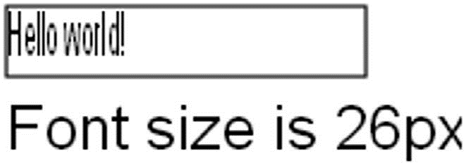
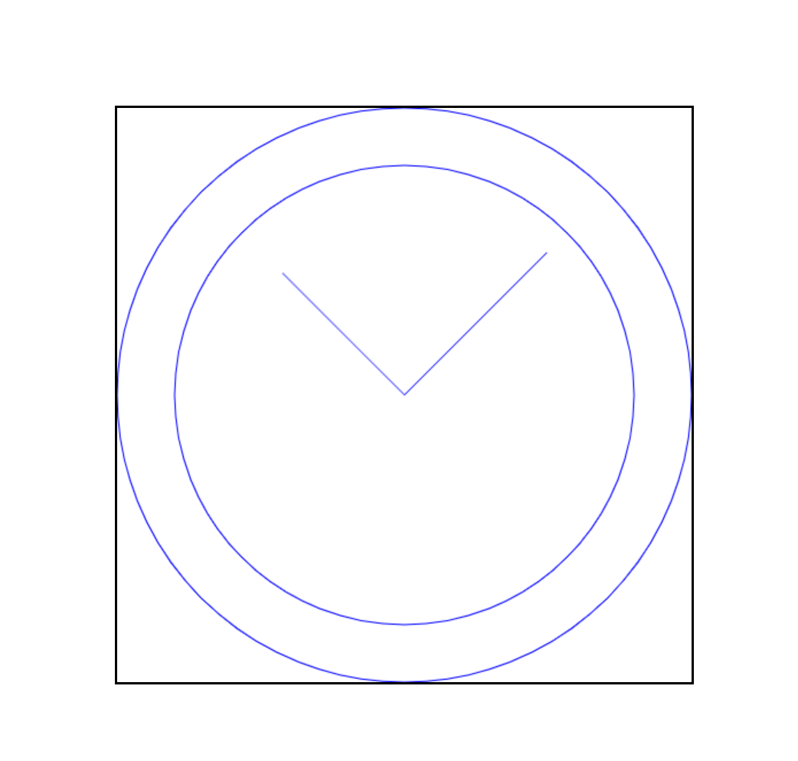
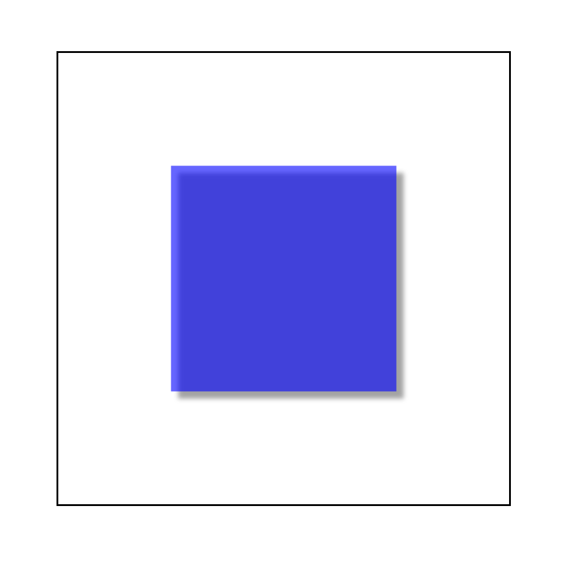
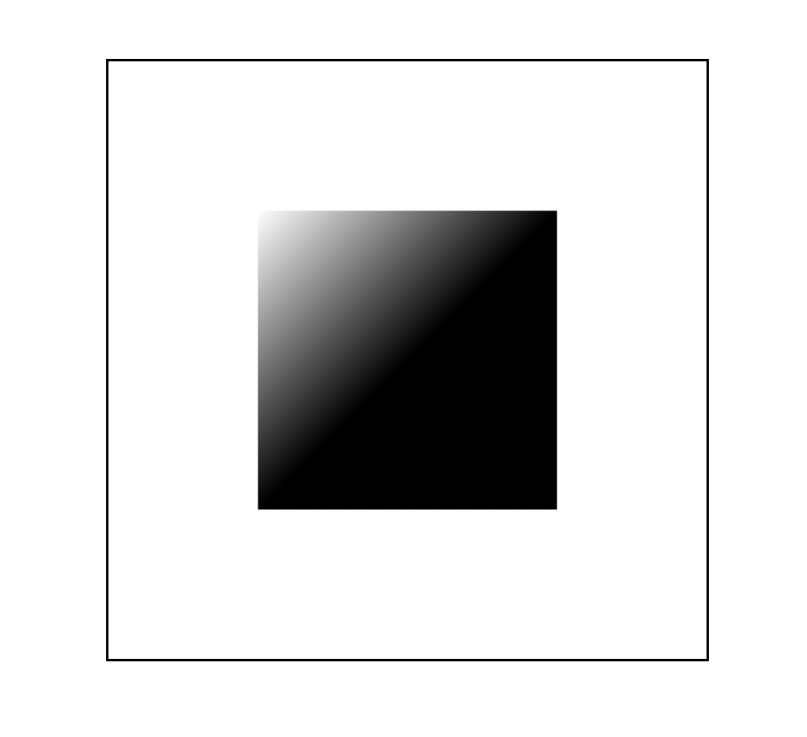
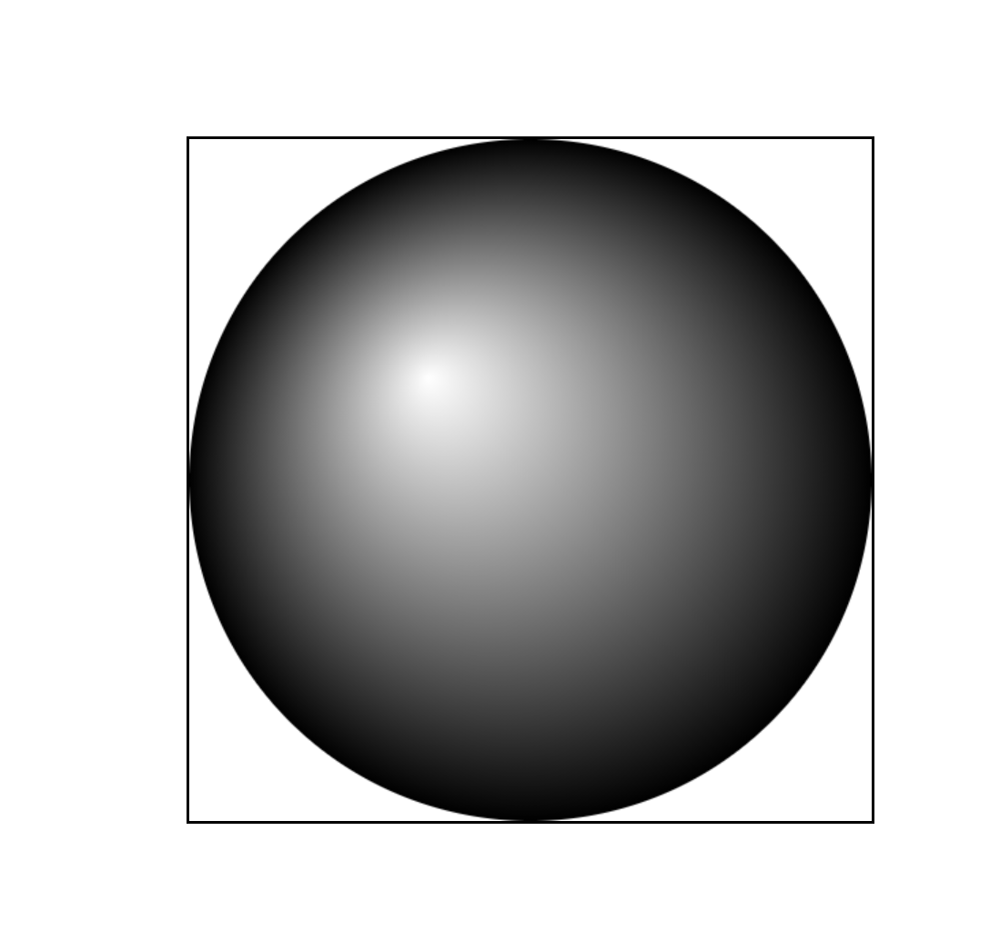
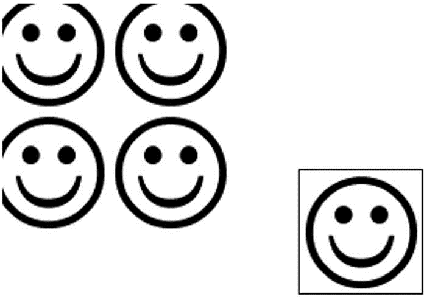
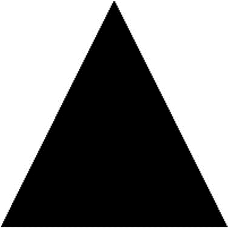

- [1.1. requestAnimationFrame](#11-requestanimationframe)
  - [1.1.1. 早期定时动画](#111-早期定时动画)
  - [1.1.2. 事件间隔问题](#112-事件间隔问题)
  - [1.1.3. requestAnimationFrame](#113-requestanimationframe)
  - [1.1.4. cancelAnimationFrame](#114-cancelanimationframe)
  - [1.1.5. 通过 requestAnimationFrame 节流](#115-通过-requestanimationframe-节流)
- [1.2. 基本的画布功能](#12-基本的画布功能)
- [1.3. 2D 绘图上下文](#13-2d-绘图上下文)
  - [1.3.1. 填充与描边](#131-填充与描边)
  - [1.3.2. 绘制矩形](#132-绘制矩形)
  - [1.3.3. 绘制路径](#133-绘制路径)
  - [1.3.4. 绘制文本](#134-绘制文本)
  - [1.3.5. 变换](#135-变换)
  - [1.3.6. 绘制图像](#136-绘制图像)
  - [1.3.7. 阴影](#137-阴影)
  - [1.3.8. 渐变](#138-渐变)
  - [1.3.9. 图案](#139-图案)
  - [1.3.10. 图像数据](#1310-图像数据)
  - [1.3.11. 合成](#1311-合成)
- [1.4. WebGL](#14-webgl)
  - [1.4.1. WebGL 上下文](#141-webgl-上下文)
  - [1.4.2. WebGL 基础](#142-webgl-基础)
  - [1.4.3. WebGL1 与 WebGL2](#143-webgl1-与-webgl2)


本章内容

- requestAnimationFrame
- 理解 `<canvas>` 元素
- 绘制简单 2D 图形
- 使用 WebGL 绘制 3D 图形

图形和动画已经日益成为浏览器中现代 Web 应用程序的必备功能，但实现起来仍然比较困难。视觉上复杂的功能要求性能调优和硬件加速，不能拖慢浏览器。目前已经有一套日趋完善的 API 和工具可以用来开发此类功能。

毋庸置疑，`<canvas>` 是 HTML5 最受欢迎的新特性。这个元素会占据一块页面区域，让 JavaScript 可以动态在上面绘制图片。`<canvas>` 最早是苹果公司提出并准备用在控制面板中的，随着其他浏览器的迅速跟进，HTML5 将其纳入标准。目前所有主流浏览器都在某种程度上支持 `<canvas>` 元素。

与浏览器环境中的其他部分一样，`<canvas>`自身提供了一些 API，但并非所有浏览器都支持这些 API，其中包括支持基础绘图能力的 2D 上下文和被称为 WebGL 的 3D 上下文。支持的浏览器的最新版本现在都支持 2D 上下文和 WebGL。

注意：为简洁考虑，本章约定使用以下代码进行 DOM 元素的查询：

```javascript
// EXAMPLE: $('#drawing')
var $ = document.querySelector.bind(document);
```

## 1.1. requestAnimationFrame

很长时间以来，计时器和定时执行都是 JavaScript 动画最先进的工具。虽然 CSS 过渡和动画方便了 Web 开发者实现某些动画，但 JavaScript 动画领域多年来进展甚微。Firefox 4 率先在浏览器中为 JavaScript 动画增加了一个名为 mozRequestAnimationFrame()方法的 API。这个方法会告诉浏览器要执行动画了，于是浏览器可以通过最优方式确定重绘的时序。自从出现之后，这个 API 被广泛采用，现在作为 requestAnimationFrame()方法已经得到各大浏览器的支持。

### 1.1.1. 早期定时动画

以前，在 JavaScript 中创建动画基本上就是使用 setInterval()来控制动画的执行。下面的例子展示了使用 setInterval()的基本模式：

```javascript
(function () {
  function updateAnimations() {
    doAnimation1();
    doAnimation2();
    // 其他任务
  }
  setInterval(updateAnimations, 100);
})();
```

作为一个小型动画库的标配，这个 updateAnimations()方法会周期性运行注册的动画任务，并反映出每个任务的变化（例如，同时更新滚动新闻和进度条）。如果没有动画需要更新，则这个方法既可以什么也不做，直接退出，也可以停止动画循环，等待其他需要更新的动画。

这种定时动画的问题在于无法准确知晓循环之间的延时。定时间隔必须足够短，这样才能让不同的动画类型都能平滑顺畅，但又要足够长，以便产生浏览器可以渲染出来的变化。一般计算机显示器的屏幕刷新率都是 60Hz，基本上意味着每秒需要重绘 60 次。大多数浏览器会限制重绘频率，使其不超出屏幕的刷新率，这是因为超过刷新率，用户也感知不到。

因此，实现平滑动画最佳的重绘间隔为 1000 毫秒/60，大约 17 毫秒。以这个速度重绘可以实现最平滑的动画，因为这已经是浏览器的极限了。如果同时运行多个动画，可能需要加以限流，以免 17 毫秒的重绘间隔过快，导致动画过早运行完。

虽然使用 setInterval()的定时动画比使用多个 setTimeout()实现循环效率更高，但也不是没有问题。无论 setInterval()还是 setTimeout()都是不能保证时间精度的。作为第二个参数的延时只能保证何时会把代码添加到浏览器的任务队列，不能保证添加到队列就会立即运行。如果队列前面还有其他任务，那么就要等这些任务执行完再执行。简单来讲，这里毫秒延时并不是说何时这些代码会执行，而只是说到时候会把回调加到任务队列。如果添加到队列后，主线程还被其他任务占用，比如正在处理用户操作，那么回调就不会马上执行。

### 1.1.2. 事件间隔问题

知道何时绘制下一帧是创造平滑动画的关键。直到几年前，都没有办法确切保证何时能让浏览器把下一帧绘制出来。随着`<canvas>`的流行和 HTML5 游戏的兴起，开发者发现 setInterval()和 setTimeout()的不精确是个大问题。

浏览器自身计时器的精度让这个问题雪上加霜。浏览器的计时器精度不足毫秒。以下是几个浏览器计时器的精度情况：

- IE8 及更早版本的计时器精度为 15.625 毫秒；
- IE9 及更晚版本的计时器精度为 4 毫秒；
- Firefox 和 Safari 的计时器精度为约 10 毫秒；
- Chrome 的计时器精度为 4 毫秒。

IE9 之前版本的计时器精度是 15.625 毫秒，意味着 0 ～ 15 范围内的任何值最终要么是 0，要么是 15，不可能是别的数。IE9 把计时器精度改进为 4 毫秒，但这对于动画而言还是不够精确。Chrome 计时器精度是 4 毫秒，而 Firefox 和 Safari 是 10 毫秒。更麻烦的是，浏览器又开始对切换到后台或不活跃标签页中的计时器执行限流。因此即使将时间间隔设定为最优，也免不了只能得到近似的结果。

### 1.1.3. requestAnimationFrame

Mozilla 的 Robert O’Callahan 一直在思考这个问题，并提出了一个独特的方案。他指出，浏览器知道 CSS 过渡和动画应该什么时候开始，并据此计算出正确的时间间隔，到时间就去刷新用户界面。但对于 JavaScript 动画，浏览器不知道动画什么时候开始。他给出的方案是创造一个名为 mozRequestAnimationFrame()的新方法，用以通知浏览器某些 JavaScript 代码要执行动画了。这样浏览器就可以在运行某些代码后进行适当的优化。目前所有浏览器都支持这个方法不带前缀的版本，即 requestAnimationFrame()。

requestAnimationFrame()方法接收一个参数，此参数是一个要在重绘屏幕前调用的函数。这个函数就是修改 DOM 样式以反映下一次重绘有什么变化的地方。为了实现动画循环，可以把多个 requestAnimationFrame()调用串联起来，就像以前使用 setTimeout()时一样：

```javascript
const updateProgress = function updateProgress() {
  var div = $('#status');
  div.style.width = parseInt(div.style.width, 10) + 5 + '%';

  if (div.style.left != '100%') {
    requestAnimationFrame(updateProgress);
  }
};

requestAnimationFrame(updateProgress);
```

因为 requestAnimationFrame()只会调用一次传入的函数，所以每次更新用户界面时需要再手动调用它一次。同样，也需要控制动画何时停止。结果就会得到非常平滑的动画。

目前为止，requestAnimationFrame()已经解决了浏览器不知道 JavaScript 动画何时开始的问题，以及最佳间隔是多少的问题，但是，不知道自己的代码何时实际执行的问题呢？这个方案同样也给出了解决方法。

传给 requestAnimationFrame()的函数实际上可以接收一个参数，此参数是一个 DOMHighResTimeStamp 的实例（比如 performance.now()返回的值），表示下次重绘的时间。这一点非常重要：requestAnimationFrame()实际上把重绘任务安排在了未来一个已知的时间点上，而且通过这个参数告诉了开发者。基于这个参数，就可以更好地决定如何调优动画了。

### 1.1.4. cancelAnimationFrame

与 setTimeout()类似，requestAnimationFrame()也返回一个请求 ID，可以用于通过另一个方法 cancelAnimationFrame()来取消重绘任务。下面的例子展示了刚把一个任务加入队列又立即将其取消：

```javascript
const requestID = window.requestAnimationFrame(() => {
  console.log('Repaint!');
});
window.cancelAnimationFrame(requestID);
```

### 1.1.5. 通过 requestAnimationFrame 节流

requestAnimationFrame 这个名字有时候会让人误解，因为看不出来它跟排期任务有关。支持这个方法的浏览器实际上会暴露出作为钩子的回调队列。所谓钩子（hook），就是浏览器在执行下一次重绘之前的一个点。这个回调队列是一个可修改的函数列表，包含应该在重绘之前调用的函数。每次调用 requestAnimationFrame()都会在队列上推入一个回调函数，队列的长度没有限制。

这个回调队列的行为不一定跟动画有关。不过，通过 requestAnimationFrame()递归地向队列中加入回调函数，可以保证每次重绘最多只调用一次回调函数。这是一个非常好的节流工具。在频繁执行影响页面外观的代码时（比如滚动事件监听器），可以利用这个回调队列进行节流。

先来看一个原生实现，其中的滚动事件监听器每次触发都会调用名为 expensiveOperation()（耗时操作）的函数。当向下滚动网页时，这个事件很快就会被触发并执行成百上千次：

```javascript
const expensiveOperation = function expensiveOperation() {
  console.log('Invoked at', Date.now());
};

window.addEventListener('scroll', () => {
  expensiveOperation();
});
```

如果想把事件处理程序的调用限制在每次重绘前发生，那么可以像这样下面把它封装到 requestAnimationFrame()调用中：

```javascript
const expensiveOperation = function expensiveOperation() {
  console.log('Invoked at', Date.now());
};

window.addEventListener('scroll', () => {
  window.requestAnimationFrame(expensiveOperation);
});
```

这样会把所有回调的执行集中在重绘钩子，但不会过滤掉每次重绘的多余调用。此时，定义一个标志变量，由回调设置其开关状态，就可以将多余的调用屏蔽：

```javascript
let enqueued = false;

const expensiveOperation = function expensiveOperation() {
  console.log('Invoked at', Date.now());
  enqueued = false;
};

window.addEventListener('scroll', () => {
  if (!enqueued) {
    enqueued = true;
    window.requestAnimationFrame(expensiveOperation);
  }
});
```

因为重绘是非常频繁的操作，所以这还算不上真正的节流。更好的办法是配合使用一个计时器来限制操作执行的频率。这样，计时器可以限制实际的操作执行间隔，而 requestAnimationFrame 控制在浏览器的哪个渲染周期中执行。下面的例子可以将回调限制为不超过 50 毫秒执行一次：

```javascript
let enabled = true;

const expensiveOperation = function expensiveOperation() {
  console.log('Invoked at', Date.now());
};

window.addEventListener('scroll', () => {
  if (enabled) {
    enabled = false;
    window.requestAnimationFrame(expensiveOperation);
    window.setTimeout(() => (enabled = true), 50);
  }
});
```

## 1.2. 基本的画布功能

创建`<canvas>`元素时至少要设置其 width 和 height 属性，这样才能告诉浏览器在多大面积上绘图。出现在开始和结束标签之间的内容是后备数据，会在浏览器不支持`<canvas>`元素时显示。比如：

```html
<canvas id="drawing" width="200" height="200">A drawing of something.</canvas>
```

与其他元素一样，width 和 height 属性也可以在 DOM 节点上设置，因此可以随时修改。整个元素还可以通过 CSS 添加样式，并且元素在添加样式或实际绘制内容前是不可见的。在用 css 添加画布尺寸时，使用的是逻辑像素，会被转换为物理像素，所以最好使用 width 和 height 添加画布尺寸。

要在画布上绘制图形，首先要取得绘图上下文。使用 getContext()方法可以获取对绘图上下文的引用。对于平面图形，需要给这个方法传入参数"2d"，表示要获取 2D 上下文对象：

```javascript
const drawing = $('#drawing');

// 确保浏览器支持 <canvas>
if (drawing.getContext) {
  const context = drawing.getContext('2d');
  // 其他代码
}
```

使用`<canvas>`元素时，最好先测试一下 getContext()方法是否存在。有些浏览器对 HTML 规范中没有的元素会创建默认 HTML 元素对象。这就意味着即使 drawing 包含一个有效的元素引用，getContext()方法也未必存在。

可以使用 toDataURL()方法导出`<canvas>`元素上的图像。这个方法接收一个参数：要生成图像的 MIME 类型（与用来创建图形的上下文无关）。例如，要从画布上导出一张 PNG 格式的图片，可以这样做：

```javascript
const drawing = $('#drawing');

// 确保浏览器支持<canvas>
if (drawing.getContext) {
  // 取得图像的数据URI
  const imgURI = drawing.toDataURL('image/png');

  // 显示图片
  const image = document.createElement('img');
  image.src = imgURI;
  document.body.appendChild(image);
}
```

浏览器默认将图像编码为 PNG 格式，除非另行指定。Firefox 和 Opera 还支持传入"image/jpeg"进行 JPEG 编码。因为这个方法是后来才增加到规范中的，所以支持的浏览器也是在后面的版本实现的，包括 IE9、Firefox 3.5 和 Opera 10。

注意 如果画布中的图像是其他域绘制过来的，toDataURL()方法就会抛出错误。相关内容本章后面会讨论。

## 1.3. 2D 绘图上下文

2D 绘图上下文提供了绘制 2D 图形的方法，包括矩形、弧形和路径。2D 上下文的坐标原点(0, 0)在`<canvas>`元素的左上角。所有坐标值都相对于该点计算，因此 x 坐标向右增长，y 坐标向下增长。默认情况下，width 和 height 表示两个方向上像素的最大值。

### 1.3.1. 填充与描边

2D 上下文有两个基本绘制操作：填充和描边。填充以指定样式（颜色、渐变或图像）自动填充形状，而描边只为图形边界着色。大多数 2D 上下文操作有填充和描边的变体，显示效果取决于两个属性：fillStyle 和 strokeStyle。

这两个属性可以是字符串、渐变对象或图案对象，默认值都为"#000000"。字符串表示颜色值，可以是 CSS 支持的任意格式：名称、十六进制代码、rgb、rgba、hsl 或 hsla。比如：

```javascript
const drawing = $('#drawing');

// 确保浏览器支持<canvas>
if (drawing.getContext) {
  const context = drawing.getContext('2d');
  context.strokeStyle = 'red';
  context.fillStyle = '#0000ff';
}
```

这里把 strokeStyle 设置为"red"（CSS 颜色名称），把 fillStyle 设置为"#0000ff"（蓝色）。所有与描边和填充相关的操作都会使用这两种样式，除非再次修改。这两个属性也可以是渐变或图案，本章后面会讨论。

### 1.3.2. 绘制矩形

矩形是唯一一个可以直接在 2D 绘图上下文中绘制的形状。与绘制矩形相关的方法有 3 个：fillRect()、strokeRect()和 clearRect()。这些方法都接收 4 个参数：矩形 x 坐标、矩形 y 坐标、矩形宽度和矩形高度。这几个参数的单位都是像素。

fillRect()方法用于以指定颜色在画布上绘制并填充矩形。填充的颜色使用 fillStyle 属性指定。来看下面的例子：

```javascript
const drawing = $('#drawing');

if (drawing.getContext) {
  const context = drawing.getContext('2d');

  // 绘制红色矩形
  context.fillStyle = '#ff0000';
  context.fillRect(100, 100, 200, 200);

  // 绘制半透明蓝色矩形
  context.fillStyle = 'rgba(0,0,255,0.5)';
  context.fillRect(200, 200, 200, 200);
}
```

以上代码先将 fillStyle 设置为红色并在坐标点(100, 100)绘制了一个宽高均为 200 像素的矩形。接着，使用 rgba()格式将 fillStyle 设置为半透明蓝色，并绘制了另一个与第一个部分重叠的矩形。结果就是可以透过蓝色矩形看到红色矩形（见下图）。

.png>)

strokeRect()方法使用通过 strokeStyle 属性指定的颜色绘制矩形轮廓。下面是一个例子：

```javascript
const drawing = $('#drawing');

// 确保浏览器支持<canvas>
if (drawing.getContext) {
  const context = drawing.getContext('2d');

  // 绘制红色轮廓的矩形
  context.strokeStyle = '#ff0000';
  context.strokeRect(100, 100, 200, 200);

  // 绘制半透明蓝色轮廓的矩形
  context.strokeStyle = 'rgba(0,0,255,0.5)';
  context.strokeRect(200, 200, 200, 200);
}
```

以上代码同样绘制了两个重叠的矩形，不过只有轮廓，而不是实心的（见下图）。

.png>)

注意 描边宽度由 lineWidth 属性控制，它可以是任意整数值。类似地，lineCap 属性控制线条端点的形状［"butt"（平头）、"round"（出圆头）或"square"（出方头）］，而 lineJoin 属性控制线条交点的形状［"round"（圆转）、"bevel"（取平）或"miter"（出尖）］。

使用 clearRect()方法可以擦除画布中某个区域。该方法用于把绘图上下文中的某个区域变透明。通过先绘制形状再擦除指定区域，可以创建出有趣的效果，比如从已有矩形中开个孔。来看下面的例子：

```javascript
const drawing = $('#drawing');

// 确保浏览器支持<canvas>
if (drawing.getContext) {
  const context = drawing.getContext('2d');

  // 绘制红色矩形
  context.fillStyle = '#ff0000';
  context.fillRect(100, 100, 200, 200);

  // 绘制半透明蓝色矩形
  context.fillStyle = 'rgba(0,0,255,0.5)';
  context.fillRect(200, 200, 200, 200);

  // 在前两个矩形重叠的区域擦除一个矩形区域
  context.clearRect(125, 125, 50, 50);
}
```

以上代码在两个矩形重叠的区域上擦除了一个小矩形，见下图。

.png>)

### 1.3.3. 绘制路径

2D 绘图上下文支持很多在画布上绘制路径的方法。通过路径可以创建复杂的形状和线条。要绘制路径，必须首先调用 beginPath()方法以表示要开始绘制新路径。然后，再调用下列方法来绘制路径。

- arc(x, y, radius, startAngle, endAngle, counterclockwise)：以坐标(x, y)为圆心，以 radius 为半径绘制一条弧线，起始角度为 startAngle，结束角度为 endAngle（都是弧度）。最后一个参数 counterclockwise 表示是否逆时针计算起始角度和结束角度（默认为顺时针）。
- arcTo(x1, y1, x2, y2, radius)：以给定半径 radius，经由(x1, y1)绘制一条从上一点到(x2, y2)的弧线。
- bezierCurveTo(c1x, c1y, c2x, c2y, x, y)：以(c1x, c1y)和(c2x, c2y)为控制点，绘制一条从上一点到(x, y)的弧线（三次贝塞尔曲线）。
- lineTo(x, y)：绘制一条从上一点到(x, y)的直线。
- moveTo(x, y)：不绘制线条，只把绘制光标移动到(x, y)。
- quadraticCurveTo(cx, cy, x, y)：以(cx, cy)为控制点，绘制一条从上一点到(x, y)的弧线（二次贝塞尔曲线）。
- rect(x, y, width, height)：以给定宽度和高度在坐标点(x, y)绘制一个矩形。这个方法与 strokeRect()和 fillRect()的区别在于，它创建的是一条路径，而不是独立的图形。

创建路径之后，可以使用 closePath()方法绘制一条返回起点的线。如果路径已经完成，则既可以指定 fillStyle 属性并调用 fill()方法来填充路径，也可以指定 strokeStyle 属性并调用 stroke()方法来描画路径，还可以调用 clip()方法基于已有路径创建一个新剪切区域。

下面这个例子使用前面提到的方法绘制了一个不带数字的表盘：

```javascript
const drawing = $('#drawing');

// 确保浏览器支持<canvas>
if (drawing.getContext) {
  const context = drawing.getContext('2d');

  // 绘制外圆
  context.arc(250, 250, 250, 0, 2 * Math.PI);

  // 绘制内圆
  context.moveTo(450, 250);
  context.arc(250, 250, 200, 0, 2 * Math.PI);

  // 绘制时针
  context.moveTo(100, 250);

  context.lineTo(250, 250);

  // 绘制分针
  context.lineTo(250, 75);

  // 描画路径
  context.strokeStyle = 'blue';
  context.stroke();
}
```

这个例子使用 arc()绘制了两个圆形，一个外圆和一个内圆，以构成表盘的边框。外圆半径 250 像素，原点为(250, 250)，也就是画布的中心。要绘制完整的圆形，必须从 0 弧度绘制到 2π 弧度（使用数学常量 Math.PI）。而在绘制内圆之前，必须先把路径移动到内圆上的一点，以避免绘制出多余的线条。第二次调用 arc()时使用了稍小一些的半径，以呈现边框效果。然后，再组合运用 moveTo()和 lineTo()分别绘制分针和时针。最后一步是调用 stroke()，得到如下图所示的图像。


路径是 2D 上下文的主要绘制机制，为绘制结果提供了很多控制。因为路径经常被使用，所以也有一个 isPointInPath()方法，接收 x 轴和 y 轴坐标作为参数。这个方法用于确定指定的点是否在路径上，可以在关闭路径前随时调用，比如：

```javascript
if (context.isPointInPath(250, 250)) {
  console.log('Point (250, 250) is in the path.');
}
```

2D 上下文的路径 API 非常可靠，可用于创建涉及各种填充样式、描述样式等的复杂图像。

### 1.3.4. 绘制文本

文本和图像混合也是常见的绘制需求，因此 2D 绘图上下文还提供了绘制文本的方法，即 fillText()和 strokeText()。这两个方法都接收 4 个参数：要绘制的字符串、x 坐标、y 坐标和可选的最大像素宽度。而且，这两个方法最终绘制的结果都取决于以下 3 个属性。

- font：以 CSS 语法指定的字体样式、大小、字体族等，比如"10px Arial"。
- textAlign：指定文本的对齐方式，可能的值包括"start"、"end"、"left"、"right"和"center"。推荐使用"start"和"end"，不使用"left"和"right"，因为前者无论在从左到右书写的语言还是从右到左书写的语言中含义都更明确。
- textBaseLine：指定文本的基线， 可能的值包括"top" 、"hanging" 、"middle" 、"alphabetic"、"ideographic"和"bottom"。

这些属性都有相应的默认值，因此没必要每次绘制文本时都设置它们。fillText()方法使用 fillStyle 属性绘制文本，而 strokeText()方法使用 strokeStyle 属性。通常，fillText()方法是使用最多的，因为它模拟了在网页中渲染文本。例如，下面的例子会在前一节示例的表盘顶部绘制数
字“12”：

```javascript
context.font = 'bold 22px Arial';
context.textAlign = 'center';
context.textBaseline = 'middle';
context.fillText('12', 250, 65);
```

结果就得到了如下图所示的图像。


因为把 textAlign 设置为了"center"，把 textBaseline 设置为了"middle"，所以(250, 65)表示文本水平和垂直中心点的坐标。如果 textAlign 是"start"，那么 x 坐标在从左到右书写的语言中表示文本的左侧坐标，而"end"会让 x 坐标在从左到右书写的语言中表示文本的右侧坐标。例如：

```javascript
// 正常
context.font = 'bold 22px Arial';
context.textAlign = 'center';
context.textBaseline = 'middle';
context.fillText('12', 250, 65);

// 与开头对齐
context.textAlign = 'start';
context.fillText('12', 250, 80);

// 与末尾对齐
context.textAlign = 'end';
context.fillText('12', 250, 95);
```

字符串"12"被绘制了 3 次，每次使用的坐标都一样，但 textAlign 值不同。为了让每个字符串不至于重叠，每次绘制的 y 坐标都会设置得大一些。结果就是如下图所示的图像。


因为表盘中垂直的线条是居中的，所以文本的对齐方式就一目了然了。类似地，通过修改 textBaseline 属性，可以改变文本的垂直对齐方式。比如，设置为"top"意味着 y 坐标表示文本顶部，"bottom"表示文本底部，"hanging"、"alphabetic"和"ideographic"分别引用字体中特定的基准点。

由于绘制文本很复杂，特别是想把文本绘制到特定区域的时候，因此 2D 上下文提供了用于辅助确定文本大小的 measureText()方法。这个方法接收一个参数，即要绘制的文本，然后返回一个 TextMetrics 对象。这个返回的对象目前只有一个属性 width，不过将来应该会增加更多度量指标。

measureText()方法使用 font、textAlign 和 textBaseline 属性当前的值计算绘制指定文本后的大小。例如，假设要把文本"Hello world!"放到一个 140 像素宽的矩形中，可以使用以下代码，从 100 像素的字体大小开始计算，不断递减，直到文本大小合适：

```javascript
let fontSize = 100;
context.font = fontSize + 'px Arial';
while (context.measureText('Hello world!').width > 140) {
  fontSize--;
  context.font = fontSize + 'px Arial';
}
context.fillText('Hello world!', 10, 10);
context.fillText('Font size is ' + fontSize + 'px', 10, 50);
```

fillText()和 strokeText()方法还有第四个参数，即文本的最大宽度。这个参数是可选的（Firefox 4 是第一个实现它的浏览器），如果调用 fillText()和 strokeText()时提供了此参数，但要绘制的字符串超出了最大宽度限制，则文本会以正确的字符高度绘制，这时字符会被水平压缩，以达到限定宽度。下图展示了这个参数的效果。



绘制文本是一项比较复杂的操作，因此支持`<canvas>`元素的浏览器不一定全部实现了相关的文本绘制 API。

### 1.3.5. 变换

上下文变换可以操作绘制在画布上的图像。2D 绘图上下文支持所有常见的绘制变换。在创建绘制上下文时，会以默认值初始化变换矩阵，从而让绘制操作如实应用到绘制结果上。对绘制上下文应用变换，可以导致以不同的变换矩阵应用绘制操作，从而产生不同的结果。

以下方法可用于改变绘制上下文的变换矩阵。

- rotate(angle)：围绕原点把图像旋转 angle 弧度。
- scale(scaleX, scaleY)：通过在 x 轴乘以 scaleX、在 y 轴乘以 scaleY 来缩放图像。scaleX 和 scaleY 的默认值都是 1.0。
- translate(x, y)：把原点移动到(x, y)。执行这个操作后，坐标(0, 0)就会变成(x, y)。
- transform(m1_1, m1_2, m2_1, m2_2, dx, dy)：像下面这样通过矩阵乘法直接修改矩阵。

```
m1_1 m1_2 dx
m2_1 m2_2 dy
0 0 1
```

- setTransform(m1_1, m1_2, m2_1, m2_2, dx, dy)：把矩阵重置为默认值，再以传入的参数调用 transform()。

变换可以简单，也可以复杂。例如，在前面绘制表盘的例子中，如果把坐标原点移动到表盘中心，那再绘制表针就非常简单了：

```javascript
const drawing = $('#drawing');

// 确保浏览器支持<canvas>
if (drawing.getContext) {
  const context = drawing.getContext('2d');

  // 将原点移动到时钟中心 (250, 250)
  context.translate(250, 250);

  // 绘制外圆
  context.arc(0, 0, 250, 0, 2 * Math.PI);

  // 绘制内圆
  context.moveTo(200, 0);
  context.arc(0, 0, 200, 0, 2 * Math.PI);

  // 绘制时针
  context.moveTo(0, 0);
  context.lineTo(-150, 0);

  // 绘制分针
  context.moveTo(0, 0);
  context.lineTo(0, -175);

  // 描边
  context.strokeStyle = 'blue';
  context.stroke();
}
```

把原点移动到(250, 250)，也就是表盘的中心后，要绘制表针只需简单的数学计算即可。这是因为所有计算都是基于(0, 0)，而不是(250, 250)了。当然，也可以使用 rotate()方法来转动表针：

```javascript
const drawing = $('#drawing');

// 确保浏览器支持<canvas>
if (drawing.getContext) {
  const context = drawing.getContext('2d');

  // 将原点移动到时钟中心 (250, 250)
  context.translate(250, 250);

  // 绘制外圆
  context.arc(0, 0, 250, 0, 2 * Math.PI);

  // 绘制内圆
  context.moveTo(200, 0);
  context.arc(0, 0, 200, 0, 2 * Math.PI);

  // 将画布顺时针旋转 90 度
  context.rotate(Math.PI / 4);

  // 绘制时针
  context.moveTo(0, 0);
  context.lineTo(-150, 0);

  // 绘制分针
  context.moveTo(0, 0);
  context.lineTo(0, -175);

  // 描边
  context.strokeStyle = 'blue';
  context.stroke();
}
```

因为原点已经移动到表盘中心，所以旋转就是以该点为圆心的。这相当于把表针一头固定在表盘中心，然后向右拨了一个弧度。结果如下图所示。



所有这些变换，包括 fillStyle 和 strokeStyle 属性，会一直保留在上下文中，直到再次修改它们。虽然没有办法明确地将所有值都重置为默认值，但有两个方法可以帮我们跟踪变化。如果想着什么时候再回到当前的属性和变换状态，可以调用 save()方法。调用这个方法后，所有这一时刻的设置会被放到一个暂存栈中。保存之后，可以继续修改上下文。而在需要恢复之前的上下文时，可以调用 restore()方法。这个方法会从暂存栈中取出并恢复之前保存的设置。多次调用 save()方法可以在暂存栈中存储多套设置，然后通过 restore()可以系统地恢复。下面来看一个例子：

```javascript
context.fillStyle = '#ff0000';
context.save();
context.fillStyle = '#00ff00';
context.translate(100, 100);
context.save();
context.fillStyle = '#0000ff';
context.fillRect(0, 0, 100, 200);
context.restore();

// 在(100, 100)绘制绿色矩形
context.fillRect(10, 10, 100, 200);
context.restore();

// 在(0, 0)绘制红色矩形
context.fillRect(0, 0, 100, 200);
```

以上代码先将 fillStyle 设置为红色，然后调用 save()。接着，将 fillStyle 修改为绿色，坐标移动到(100, 100)，并再次调用 save()，保存设置。随后，将 fillStyle 属性设置为蓝色并绘制一个矩形。因为此时坐标被移动了，所以绘制矩形的坐标实际上是(100, 100)。在调用 restore()之后，fillStyle 恢复为绿色，因此这一次绘制的矩形是绿色的。而绘制矩形的坐标是(110, 110)，因为变换仍在起作用。再次调用 restore()之后，变换被移除，fillStyle 也恢复为红色。绘制最后一个矩形的坐标变成了(0, 0)。

注意，save()方法只保存应用到绘图上下文的设置和变换，不保存绘图上下文的内容。

### 1.3.6. 绘制图像

2D 绘图上下文内置支持操作图像。如果想把现有图像绘制到画布上，可以使用 drawImage()方法。这个方法可以接收 3 组不同的参数，并产生不同的结果。最简单的调用是传入一个 HTML 的``元素，以及表示绘制目标的 x 和 y 坐标，结果是把图像绘制到指定位置。比如：

```javascript
const image = document.images[0];
context.drawImage(image, 10, 10);
```

以上代码获取了文本中的第一个图像，然后在画布上的坐标(10, 10)处将它绘制了出来。绘制出来的图像与原来的图像一样大。如果想改变所绘制图像的大小，可以再传入另外两个参数：目标宽度和目标高度。这里的缩放只影响绘制的图像，不影响上下文的变换矩阵。比如下面的例子：

```javascript
context.drawImage(image, 50, 10, 20, 30);
```

执行之后，图像会缩放到 20 像素宽、30 像素高。

还可以只把图像绘制到上下文中的一个区域。此时，需要给 drawImage()提供 9 个参数：要绘制的图像、源图像 x 坐标、源图像 y 坐标、源图像宽度、源图像高度、目标区域 x 坐标、目标区域 y 坐标、目标区域宽度和目标区域高度。这个重载后的 drawImage()方法可以实现最大限度的控制，比如：

```javascript
context.drawImage(image, 0, 10, 50, 50, 0, 100, 40, 60);
```

最终，原始图像中只有一部分会绘制到画布上。这一部分从(0, 10)开始，50 像素宽、50 像素高。而绘制到画布上时，会从(0, 100)开始，变成 40 像素宽、60 像素高。

第一个参数除了可以是 HTML 的``元素，还可以是另一个`<canvas>`元素，这样就会把另一个画布的内容绘制到当前画布上。

结合其他一些方法，drawImage()方法可以方便地实现常见的图像操作。操作的结果可以使用 toDataURL()方法获取。不过有一种情况例外：如果绘制的图像来自其他域而非当前页面，则不能获取其数据。此时，调用 toDataURL()将抛出错误。比如，如果来自www.example.com 的页面上绘制的是来自www.wrox.com的图像，则上下文就是“脏的”，获取数据时会抛出错误。

### 1.3.7. 阴影

2D 上下文可以根据以下属性的值自动为已有形状或路径生成阴影。

- shadowColor：CSS 颜色值，表示要绘制的阴影颜色，默认为黑色。
- shadowOffsetX：阴影相对于形状或路径的 x 坐标的偏移量，默认为 0。
- shadowOffsetY：阴影相对于形状或路径的 y 坐标的偏移量，默认为 0。
- shadowBlur：像素，表示阴影的模糊量。默认值为 0，表示不模糊。

这些属性都可以通过 context 对象读写。只要在绘制图形或路径前给这些属性设置好适当的值，阴影就会自动生成。比如：

```javascript
const context = drawing.getContext('2d');

// 设置阴影
context.shadowOffsetX = 5;
context.shadowOffsetY = 5;
context.shadowBlur = 4;
context.shadowColor = 'rgba(0, 0, 0, 0.5)';

// 绘制蓝色矩形
context.fillStyle = 'rgba(0,0,255,1)';
context.fillRect(30, 30, 50, 50);
```



### 1.3.8. 渐变

渐变通过 CanvasGradient 的实例表示，在 2D 上下文中创建和修改都非常简单。要创建一个新的线性渐变，可以调用上下文的 createLinearGradient()方法。这个方法接收 4 个参数：起点 x 坐标、起点 y 坐标、终点 x 坐标和终点 y 坐标。调用之后，该方法会以指定大小创建一个新的 CanvasGradient 对象并返回实例。

有了 gradient 对象后，接下来要使用 addColorStop()方法为渐变指定色标。这个方法接收两个参数：色标位置和 CSS 颜色字符串。色标位置通过 0 ～ 1 范围内的值表示，0 是第一种颜色，1 是最后一种颜色。比如：

```javascript
const gradient = context.createLinearGradient(125, 125, 375, 375);
gradient.addColorStop(0, 'white');
gradient.addColorStop(1, 'black');
```

这个 gradient 对象现在表示的就是在画布上从(125, 125)到(375, 375)绘制一个渐变。渐变的起点颜色为白色，终点颜色为黑色。可以把这个对象赋给 fillStyle 或 strokeStyle 属性，从而以渐变填充或描画绘制的图形：

```javascript
// 绘制渐变矩形
context.fillStyle = gradient;
context.fillRect(125, 125, 250, 250);
```

为了让渐变覆盖整个矩形，而不只是其中一部分，两者的坐标必须搭配合适。以上代码将得到如下图所示的结果。



径向渐变（或放射性渐变）要使用 createRadialGradient()方法来创建。这个方法接收 6 个参数，分别对应两个圆形圆心的坐标和半径。前 3 个参数指定起点圆形中心的 x、y 坐标和半径，后 3 个参数指定终点圆形中心的 x、y 坐标和半径。在创建径向渐变时，可以把两个圆形想象成一个圆柱体的两个圆形表面。把一个表面定义得小一点，另一个定义得大一点，就会得到一个圆锥体。然后，通过移动两个圆形的圆心，就可以旋转这个圆锥体。

要创建起点圆心在形状中心并向外扩散的径向渐变，需要将两个圆形设置为同心圆。代码如下：

```javascript
// 将原点设置为圆心
context.translate(250, 250);

// 创建放射性渐变
const gradient = context.createRadialGradient(-75, -75, 0, 0, 0, 250);
gradient.addColorStop(0, 'white');
gradient.addColorStop(1, 'black');

// 创建圆形
context.arc(0, 0, 250, 0, 2 * Math.PI);

// 填充
context.fillStyle = gradient;
context.fill();
```

运行以上代码会得到如下图所示的效果。



因为创建起来要复杂一些，所以径向渐变比较难处理。不过，通常情况下，起点和终点的圆形都是同心圆，只要定义好圆心坐标，剩下的就是调整各自半径的问题了。

### 1.3.9. 图案

图案是用于填充和描画图形的重复图像。要创建新图案，可以调用 createPattern()方法并传入两个参数：一个 HTML ``元素和一个表示该如何重复图像的字符串。第二个参数的值与 CSS 的 background-repeat 属性是一样的，包括"repeat"、"repeat-x"、"repeat-y"和"no-repeat"。比如：

```javascript
const image = document.images[0],
  pattern = context.createPattern(image, 'repeat');

// 绘制矩形
context.fillStyle = pattern;
context.fillRect(10, 10, 150, 150);
```

记住，跟渐变一样，图案的起点实际上是画布的原点(0, 0)。将填充样式设置为图案，表示在指定位置而不是开始绘制的位置显示图案。以上代码执行的结果如下图所示。



传给 createPattern()方法的第一个参数也可以是`<video>`元素或者另一个`<canvas>`元素。

### 1.3.10. 图像数据

2D 上下文中比较强大的一种能力是可以使用 getImageData()方法获取原始图像数据。这个方法接收 4 个参数：要取得数据中第一个像素的左上角坐标和要取得的像素宽度及高度。例如，要从(10, 5)开始取得 50 像素宽、50 像素高的区域对应的数据，可以这样写：

```javascript
const imageData = context.getImageData(10, 5, 50, 50);
```

返回的对象是一个 ImageData 的实例。每个 ImageData 对象都包含 3 个属性：width、height 和 data，其中，data 属性是包含图像的原始像素信息的数组。每个像素在 data 数组中都由 4 个值表示，分别代表红、绿、蓝和透明度值。换句话说，第一个像素的信息包含在第 0 到第 3 个值中，比如：

```javascript
const data = imageData.data;
const red = data[0];
const green = data[1];
const blue = data[2];
const alpha = data[3];
```

这个数组中的每个值都在 0~255 范围内（包括 0 和 255）。对原始图像数据进行访问可以更灵活地操作图像。例如，通过更改图像数据可以创建一个简单的灰阶过滤器：

```javascript
const drawing = $("#drawing");

// 确保浏览器支持<canvas>
if (drawing.getContext) {
const context = drawing.getContext("2d");
const image = document.images[0];

// 绘制图像
context.drawImage(image, 0, 0);

// 取得图像数据
imageData = context.getImageData(0, 0, image.width, image.height);
const data = imageData.data;

for (let i=0, i < data.length, i+=4) {
const red = data[i];
const green = data[i+1];
const blue = data[i+2];
const alpha = data[i+3];

// 取得RGB 平均值
const average = Math.floor((red + green + blue) / 3);

// 设置颜色，不管透明度
data[i] = average;
data[i+1] = average;
data[i+2] = average;
}

// 将修改后的数据写回ImageData 并应用到画布上显示出来
imageData.data = data;
context.putImageData(imageData, 0, 0);
}
```

这个例子首先在画布上绘制了一个图像，然后又取得了其图像数据。for 循环遍历了图像数据中的每个像素，注意每次循环都要给 i 加上 4。每次循环中取得红、绿、蓝的颜色值，计算出它们的平均值。然后再把原来的值修改为这个平均值，实际上相当于过滤掉了颜色信息，只留下类似亮度的灰度信息。之后将 data 数组重写回 imageData 对象。最后调用 putImageData()方法，把图像数据再绘制到画布上。结果就得到了原始图像的黑白版。

当然，灰阶过滤只是基于原始像素值可以实现的其中一种操作。要了解基于原始图像数据还可以实现哪些操作，可以参考 Ilmari Heikkinen 的文章“Making Image Filters with Canvas”。

### 1.3.11. 合成

2D 上下文中绘制的所有内容都会应用两个属性：globalAlpha 和 globalComposition Operation，其中，globalAlpha 属性是一个范围在 0~1 的值（包括 0 和 1），用于指定所有绘制内容的透明度，默认值为 0。如果所有后来的绘制都需要使用同样的透明度，那么可以将 globalAlpha 设置为适当的值，执行绘制，然后再把 globalAlpha 设置为 0。比如：

```javascript
// 绘制红色矩形
context.fillStyle = '#ff0000';
context.fillRect(10, 10, 50, 50);

// 修改全局透明度
context.globalAlpha = 0.5;

// 绘制蓝色矩形
context.fillStyle = 'rgba(0,0,255,1)';
context.fillRect(30, 30, 50, 50);

// 重置
context.globalAlpha = 0;
```

在这个例子中，蓝色矩形是绘制在红色矩形上面的。因为在绘制蓝色矩形前 globalAlpha 被设置成了 0.5，所以蓝色矩形就变成半透明了，从而可以透过它看到下面的红色矩形。globalCompositionOperation 属性表示新绘制的形状如何与上下文中已有的形状融合。这个属性是一个字符串，可以取下列值。

- source-over：默认值，新图形绘制在原有图形上面。
- source-in：新图形只绘制出与原有图形重叠的部分，画布上其余部分全部透明。
- source-out：新图形只绘制出不与原有图形重叠的部分，画布上其余部分全部透明。
- source-atop：新图形只绘制出与原有图形重叠的部分，原有图形不受影响。
- destination-over：新图形绘制在原有图形下面，重叠部分只有原图形透明像素下的部分可见。
- destination-in：新图形绘制在原有图形下面，画布上只剩下二者重叠的部分，其余部分完全透明。
- destination-out：新图形与原有图形重叠的部分完全透明，原图形其余部分不受影响。
- destination-atop：新图形绘制在原有图形下面，原有图形与新图形不重叠的部分完全透明。
- lighter：新图形与原有图形重叠部分的像素值相加，使该部分变亮。
- copy：新图形将擦除并完全取代原有图形。
- xor：新图形与原有图形重叠部分的像素执行“异或”计算。

以上合成选项的含义很难用语言来表达清楚，只用黑白图像也体现不出所有合成的效果。下面来看一个例子：

```javascript
// 绘制红色矩形
context.fillStyle = '#ff0000';
context.fillRect(10, 10, 50, 50);

// 设置合成方式
context.globalCompositeOperation = 'destination-over';

// 绘制蓝色矩形
context.fillStyle = 'rgba(0,0,255,1)';
context.fillRect(30, 30, 50, 50);
```

虽然后绘制的蓝色矩形通常会出现在红色矩形上面，但将 globalCompositeOperation 属性的值修改为"destination-over"意味着红色矩形会出现在蓝色矩形上面。

使用 globalCompositeOperation 属性时，一定记得要在不同浏览器上进行测试。不同浏览器在实现这些选项时可能存在差异。这些操作在 Safari 和 Chrome 中仍然有些问题，可以参考 MDN 文档上的 CanvasRenderingContext2D.globalCompositeOperation，比较它们与 IE 或 Firefox 渲染的差异。

## 1.4. WebGL

WebGL 是画布的 3D 上下文。与其他 Web 技术不同，WebGL 不是 W3C 制定的标准，而是 KhronosGroup 的标准。根据官网描述，“Khronos Group 是非营利性、会员资助的联盟，专注于多平台和设备下并行计算、图形和动态媒体的无专利费开放标准”。Khronos Group 也制定了其他图形 API，包括作为浏览器中 WebGL 基础的 OpenGL ES 2.0。

OpenGL 这种 3D 图形语言很复杂，本书不会涉及过多相关概念。不过，要使用 WebGL 最好熟悉 OpenGL ES 2.0，因为很多概念可以照搬过来。

本节假设读者了解 OpenGL ES 2.0 的基本概念，并简单介绍 OpenGL ES 2.0 在 WebGL 中实现的部分。要了解关于 OpenGL 的更多信息，可以访问 OpenGL 网站。另外，推荐一个 WebGL 教程网站：Learn WebGL。

注意 定型数组是在 WebGL 中执行操作的重要数据结构。第 6 章中讨论了定型数组。

### 1.4.1. WebGL 上下文

在完全支持的浏览器中，WebGL 2.0 上下文的名字叫"webgl2"，WebGL 1.0 上下文的名字叫"webgl1"。如果浏览器不支持 WebGL，则尝试访问 WebGL 上下文会返回 null。在使用上下文之前，应该先检测返回值是否存在：

```javascript
const drawing = $('#drawing');

// 确保浏览器支持<canvas>
if (drawing.getContext) {
  const gl = drawing.getContext('webgl');
  if (gl) {
    // 使用WebGL
  }
}
```

这里把 WebGL context 对象命名为 gl。大多数 WebGL 应用和例子遵循这个约定，因为 OpenGL ES 2.0 方法和值通常以"gl"开头。这样可以让 JavaScript 代码看起来更接近 OpenGL 程序。

### 1.4.2. WebGL 基础

取得 WebGL 上下文后，就可以开始 3D 绘图了。如前所述，因为 WebGL 是 OpenGL ES 2.0 的 Web 版，所以本节讨论的概念实际上是 JavaScript 所实现的 OpenGL 概念。

可以在调用 getContext()取得 WebGL 上下文时指定一些选项。这些选项通过一个参数对象传入，选项就是参数对象的一个或多个属性。

- alpha：布尔值，表示是否为上下文创建透明通道缓冲区，默认为 true。
- depth：布尔值，表示是否使用 16 位深缓冲区，默认为 true。
- stencil：布尔值，表示是否使用 8 位模板缓冲区，默认为 false。
- antialias：布尔值，表示是否使用默认机制执行抗锯齿操作，默认为 true。
- premultipliedAlpha：布尔值，表示绘图缓冲区是否预乘透明度值，默认为 true。
- preserveDrawingBuffer：布尔值，表示绘图完成后是否保留绘图缓冲区，默认为 false。

建议在充分了解这个选项的作用后再自行修改，因为这可能会影响性能。

可以像下面这样传入 options 对象：

```javascript
const drawing = $('#drawing');

// 确保浏览器支持<canvas>
if (drawing.getContext) {
  const gl = drawing.getContext('webgl', {alpha: false});
  if (gl) {
    // 使用WebGL
  }
}
```

这些上下文选项大部分适合开发高级功能。多数情况下，默认值就可以满足要求。如果调用 getContext()不能创建 WebGL 上下文，某些浏览器就会抛出错误。为此，最好把这个方法调用包装在 try/catch 块中：

```javascript
const drawing = $('#drawing');

// 确保浏览器支持<canvas>
if (drawing.getContext) {
  try {
    const gl = drawing.getContext('webgl');
  } catch (ex) {
    // 什么也不做
  }
  if (gl) {
    // 使用WebGL
  } else {
    console.log('WebGL context could not be created.');
  }
}
```

1. **常量**

如果你熟悉 OpenGL，那么可能知道用于操作的各种常量。这些常量在 OpenGL 中的名字以 GL*开头。在 WebGL 中，context 对象上的常量则不包含 GL*前缀。例如，GL_COLOR_BUFFER_BIT 常量在 WebGL 中要这样访问 gl.COLOR_BUFFER_BIT。WebGL 以这种方式支持大部分 OpenGL 常量（少数常量不支持）。

2. **方法命名**

OpenGL（同时也是 WebGL）中的很多方法会包含相关的数据类型信息。接收不同类型和不同数量参数的方法，会通过方法名的后缀体现这些信息。表示参数数量的数字（1~4）在先，表示数据类型的字符串（“f”表示浮点数，“i”表示整数）在后。比如，gl.uniform4f()的意思是需要 4 个浮点数值参数，而 gl.uniform3i()表示需要 3 个整数值参数。

还有很多方法接收数组，这类方法用字母“v”（vector）来表示。因此，gl.uniform3iv()就是要接收一个包含 3 个值的数组参数。在编写 WebGL 代码时，要记住这些约定。

3. **准备绘图**

准备使用 WebGL 上下文之前，通常需要先指定一种实心颜色清除`<canvas>`。为此，要调用 clearColor()方法并传入 4 个参数，分别表示红、绿、蓝和透明度值。每个参数必须是 0~1 范围内的值，表示各个组件在最终颜色的强度。比如：

```javascript
// 黑色
gl.clearColor(0, 0, 0, 1);
gl.clear(gl.COLOR_BUFFER_BIT);
```

以上代码把清理颜色缓冲区的值设置为黑色，然后调用 clear()方法，这个方法相当于 OpenGL 中的 glClear()方法。参数 gl.COLOR_BUFFER_BIT 告诉 WebGL 使用之前定义的颜色填充画布。通常，所有绘图操作之前都需要先清除绘制区域。

4. **视口与坐标**

绘图前还要定义 WebGL 视口。默认情况下，视口使用整个`<canvas>`区域。要改变视口，可以调用 viewport()方法并传入视口相对于`<canvas>`元素的 x、y 坐标及宽度和高度。例如，以下代码表示要使用整个`<canvas>`元素：

```javascript
gl.viewport(0, 0, drawing.width, drawing.height);
```

这个视口的坐标系统与网页中通常的坐标系统不一样。视口的 x 和 y 坐标起点(0, 0)表示`<canvas>`元素的左下角，向上、向右增长可以用点(width–1, height–1)定义（见下图）。


知道如何定义视口就可以只使用<canvas>元素的一部分来绘图。比如下面的例子：

```javascript
// 视口是<canvas> 左下角四分之一区域
gl.viewport(0, 0, drawing.width / 2, drawing.height / 2);

// 视口是<canvas> 左上角四分之一区域
gl.viewport(0, drawing.height / 2, drawing.width / 2, drawing.height / 2);

// 视口是<canvas> 右下角四分之一区域
gl.viewport(drawing.width / 2, 0, drawing.width / 2, drawing.height / 2);
```

定义视口的坐标系统与视口中的坐标系统不一样。在视口中，坐标原点(0, 0)是视口的中心点。左下角是(–1, –1)，右上角是(1, 1)，如下图所示。


如果绘图时使用了视口外部的坐标，则绘制结果会被视口剪切。例如，要绘制的形状有一个顶点在(1, 2)，则视口右侧的图形会被切掉。

5. **缓冲区**

在 JavaScript 中，顶点信息保存在定型数组中。要使用这些信息，必须先把它们转换为 WebGL 缓冲区。创建缓冲区要调用 gl.createBuffer()方法，并使用 gl.bindBuffer()方法将缓冲区绑定到 WebGL 上下文。绑定之后，就可以用数据填充缓冲区了。比如：

```javascript
const buffer = gl.createBuffer();
gl.bindBuffer(gl.ARRAY_BUFFER, buffer);
gl.bufferData(gl.ARRAY_BUFFER, new Float32Array([0, 0.5, 1]), gl.STATIC_DRAW);
```

调用 gl.bindBuffer()将 buffer 设置为上下文的当前缓冲区。然后，所有缓冲区操作都在 buffer 上直接执行。因此，调用 gl.bufferData()虽然没有包含对 buffer 的直接引用，但仍然是在它上面执行的。上面最后一行代码使用一个 Float32Array（通常把所有顶点信息保存在 Float32Array 中）初始化了 buffer。如果想输出缓冲区内容，那么可以调用 drawElements()方法并传入 gl.ELEMENT_ARRAY_BUFFER。

gl.bufferData()方法的最后一个参数表示如何使用缓冲区。这个参数可以是以下常量值。

- gl.STATIC_DRAW：数据加载一次，可以在多次绘制中使用。
- gl.STREAM_DRAW：数据加载一次，只能在几次绘制中使用。
- gl.DYNAMIC_DRAW：数据可以重复修改，在多次绘制中使用。

除非是很有经验的 OpenGL 程序员，否则我们会对大多数缓冲区使用 gl.STATIC_DRAW。

缓冲区会一直驻留在内存中，直到页面卸载。如果不再需要缓冲区，那么最好调用 gl.deleteBuffer()方法释放其占用的内存：gl.deleteBuffer(buffer);

6. **错误**

与 JavaScript 多数情况下不同的是，在 WebGL 操作中通常不会抛出错误。必须在调用可能失败的方法后，调用 gl.getError()方法。这个方法返回一个常量，表示发生的错误类型。下面列出了这些常量。

- gl.NO_ERROR：上一次操作没有发生错误（0 值）。
- gl.INVALID_ENUM：上一次操作没有传入 WebGL 预定义的常量。
- gl.INVALID_VALUE：上一次操作需要无符号数值，但是传入了负数。
- gl.INVALID_OPERATION：上一次操作在当前状态下无法完成。
- gl.OUT_OF_MEMORY：上一次操作因内存不足而无法完成。
- gl.CONTEXT_LOST_WEBGL：上一次操作因外部事件（如设备掉电）而丢失了 WebGL 上下文。

每次调用 gl.getError()方法会返回一个错误值。第一次调用之后，再调用 gl.getError()可能会返回另一个错误值。如果有多个错误，则可以重复这个过程，直到 gl.getError()返回 gl.NO_ERROR。如果执行了多次操作，那么可以通过循环调用 getError()：

```javascript
const errorCode = gl.getError();
while (errorCode) {
  console.log('Error occurred: ' + errorCode);
  errorCode = gl.getError();
}
```

如果 WebGL 代码没有产出想要的输出结果，那么可以调用几次 getError()，这样有可能帮你找到问题所在。

7. **着色器**

着色器是 OpenGL 中的另一个概念。WebGL 中有两种着色器：**顶点着色器** 和 **片段（或像素）着色器**。顶点着色器用于把 3D 顶点转换为可以渲染的 2D 点。片段着色器用于计算绘制一个像素的正确颜色。WebGL 着色器的独特之处在于，它们不是 JavaScript 实现的，而是使用一种与 C 或 JavaScript 完全不同的语言 **GLSL(OpenGL Shading Language)** 写的。

- **编写着色器**

GLSL 是一种类似于 C 的语言，专门用于编写 OpenGL 着色器。因为 WebGL 是 OpenGL ES 2 的实现，所以 OpenGL 中的着色器可以直接在 WebGL 中使用。这样也可以让桌面应用更方便地移植到 Web 上。

每个着色器都有一个 main()方法，在绘制期间会重复执行。给着色器传递数据的方式有两种：attribute 和 uniform。attribute 用于将顶点传入顶点着色器，而 uniform 用于将常量值传入任何着色器。attribute 和 uniform 是在 main()函数外部定义的。在值类型关键字之后是数据类型，然后是变量名。下面是一个简单的顶点着色器的例子：

```glsl
// OpenGL 着色器语言
// 着色器，摘自Bartek Drozdz 的文章“Get started with WebGL—draw a square”
attribute vec2 aVertexPosition;

void main() {
  gl_Position = vec4(aVertexPosition, 0.0, 1.0);
}
```

这个顶点着色器定义了一个名为 aVertexPosition 的 attribute。这个 attribute 是一个包含两项的数组（数据类型为 vec2），代表 x 和 y 坐标。即使只传入了两个坐标，顶点着色器返回的值也会包含 4 个元素，保存在变量 gl_Position 中。这个着色器创建了一个新的包含 4 项的数组（vec4），缺少的坐标会补充上，实际上是把 2D 坐标转换为了 3D 坐标。

片段着色器与顶点着色器类似，只不过是通过 uniform 传入数据。下面是一个片段着色器的例子：

```glsl
// OpenGL 着色器语言
// 着色器，摘自Bartek Drozdz 的文章“Get started with WebGL—draw a square”
uniform vec4 uColor;

void main() {
  gl_FragColor = uColor;
}
```

片段着色器必须返回一个值，保存到变量 gl_FragColor 中，这个值表示绘制时使用的颜色。这个着色器定义了一个 uniform，包含颜色的 4 个组件（vec4），保存在 uColor 中。从代码上看，这个着色器只是把传入的值赋给了 gl_FragColor。uColor 的值在着色器内不能改变。

注意 OpenGL 着色器语言比示例中的代码要复杂，详细介绍需要整本书的篇幅。因此，本节只是从使用 WebGL 的角度对这门语言做个极其简单的介绍。要了解更多信息，可以参考 Randi J. Rost 的著作《OpenGL 着色语言》。

- **创建着色器程序**

浏览器并不理解原生 GLSL 代码，因此 GLSL 代码的字符串必须经过编译并链接到一个着色器程序中。为便于使用，通常可以使用带有自定义 type 属性的`<script>`元素把着色器代码包含在网页中。

如果 type 属性无效，则浏览器不会解析`<script>`的内容，但这并不妨碍读写其中的内容：

```html
<script type="x-webgl/x-vertex-shader" id="vertexShader">
  attribute vec2 aVertexPosition;

  void main() {
    gl_Position = vec4(aVertexPosition, 0.0, 1.0);
  }
</script>

<script type="x-webgl/x-fragment-shader" id="fragmentShader">
  uniform vec4 uColor;

  void main() {
    gl_FragColor = uColor;
  }
</script>
```

然后可以使用 text 属性提取`<script>`元素的内容：

```javascript
const vertexGlsl = $('#vertexShader').text;
const fragmentGlsl = $('#fragmentShader').text;
```

更复杂的 WebGL 应用可以动态加载着色器。重点在于要使用着色器，必须先拿到 GLSL 代码的字符串。

有了 GLSL 字符串，下一步是创建 shader 对象。为此，需要调用 gl.createShader()方法，并传入想要创建的着色器类型（ gl.VERTEX_SHADER 或 gl.FRAGMENT_SHADER ）。然后， 调用 gl.shaderSource()方法把 GLSL 代码应用到着色器，再调用 gl.compileShader()编译着色器。下面是一个例子：

```javascript
const vertexShader = gl.createShader(gl.VERTEX_SHADER);
gl.shaderSource(vertexShader, vertexGlsl);
gl.compileShader(vertexShader);
const fragmentShader = gl.createShader(gl.FRAGMENT_SHADER);
gl.shaderSource(fragmentShader, fragmentGlsl);
gl.compileShader(fragmentShader);
```

这里的代码创建了两个着色器，并把它们保存在 vertexShader 和 fragmentShader 中。然后，可以通过以下代码把这两个对象链接到着色器程序：

```javascript
const program = gl.createProgram();
gl.attachShader(program, vertexShader);
gl.attachShader(program, fragmentShader);
gl.linkProgram(program);
```

第一行代码创建了一个程序，然后 attachShader()用于添加着色器。调用 gl.linkProgram()将两个着色器链接到了变量 program 中。链接到程序之后，就可以通过 gl.useProgram()方法让 WebGL 上下文使用这个程序了：

```javascript
gl.useProgram(program);
```

调用 gl.useProgram()之后，所有后续的绘制操作都会使用这个程序。

- **给着色器传值**

前面定义的每个着色器都需要传入一个值，才能完成工作。要给着色器传值，必须先找到要接收值的变量。对于 uniform 变量，可以调用 gl.getUniformLocation()方法。这个方法返回一个对象，表示该 uniform 变量在内存中的位置。然后，可以使用这个位置来完成赋值。比如：

```javascript
let uColor = gl.getUniformLocation(program, 'uColor');
gl.uniform4fv(uColor, [0, 0, 0, 1]);
```

这个例子从 program 中找到 uniform 变量 uColor，然后返回了它的内存位置。第二行代码调用 gl.uniform4fv()方法给 uColor 传入了值。

给顶点着色器传值也是类似的过程。而要获得 attribute 变量的位置，可以调用 gl.getAttribLocation()方法。找到变量的内存地址后，可以像下面这样给它传入值：

```javascript
const aVertexPosition = gl.getAttribLocation(program, 'aVertexPosition');
gl.enableVertexAttribArray(aVertexPosition);
gl.vertexAttribPointer(aVertexPosition, itemSize, gl.FLOAT, false, 0, 0);
```

这里，首先取得 aVertexPosition 的内存位置，然后使用 gl.enableVertexAttribArray()来启用。最后一行代码创建了一个指向调用 gl.bindBuffer()指定的缓冲区的指针，并把它保存在 aVertexPosition 中，从而可以在后面由顶点着色器使用。

- **调试着色器和程序**

与 WebGL 中的其他操作类似，着色器操作也可能失败，而且是静默失败。如果想知道发生了什么错误，则必须手工通过 WebGL 上下文获取关于着色器或程序的信息。

对于着色器，可以调用 gl.getShaderParameter()方法取得编译之后的编译状态：

```javascript
if (!gl.getShaderParameter(vertexShader, gl.COMPILE_STATUS)) {
  console.log(gl.getShaderInfoLog(vertexShader));
}
```

这个例子检查了 vertexShader 编译的状态。如果着色器编译成功，则调用 gl.getShaderParameter()会返回 true。如果返回 false，则说明编译出错了。此时，可以使用 gl.getShaderInfoLog()并传入着色器取得错误。这个方法返回一个字符串消息，表示问题所在。gl.getShaderParameter()和 gl.getShaderInfoLog()既可以用于顶点着色器，也可以用于片段着色器。

着色器程序也可能失败，因此也有类似的方法。gl.getProgramParameter()用于检测状态。最常见的程序错误发生在链接阶段，为此可以使用以下代码来检查：

```javascript
if (!gl.getProgramParameter(program, gl.LINK_STATUS)) {
  console.log(gl.getProgramInfoLog(program));
}
```

与 gl.getShaderParameter()一样，gl.getProgramParameter()会在链接成功时返回 true，失败时返回 false。当然也有一个 gl.getProgramInfoLog()方法，可以在程序失败时获取错误信息。

这些方法主要在开发时用于辅助调试。只要没有外部依赖，在产品环境中就可以放心地删除它们。

- **GLSL 100 升级到 GLSL 300**

WebGL2 的主要变化是升级到了 GLSL 3.00 ES 着色器。这个升级暴露了很多新的着色器功能，包括 3D 纹理等在支持 OpenGL ES 3.0 的设备上都有的功能。要使用升级版的着色器，着色器代码的第一行必须是：

```glsl
#version 300 es
```

这个升级需要一些语法的变化。

- 顶点 attribute 变量要使用 in 而不是 attribute 关键字声明。- 使用 varying 关键字为顶点或片段着色器声明的变量，现在必须根据相应着色器的行为改为使用 in 或 out。
- 预定义的输出变量 gl_FragColor 没有了，片段着色器必须为颜色输出声明自己的 out 变量。
- 纹理查找函数 texture2D 和 textureCube 统一成了一个 texture 函数。

8. 绘图

WebGL 只能绘制三种形状：点、线和三角形。其他形状必须通过这三种基本形状在 3D 空间的组合来绘制。WebGL 绘图要使用 drawArrays()和 drawElements()方法，前者使用数组缓冲区，后者则操作元素数组缓冲区。

drawArrays()和 drawElements()的第一个参数都表示要绘制形状的常量。下面列出了这些常量。

- gl.POINTS：将每个顶点当成一个点来绘制。
- gl.LINES：将数组作为一系列顶点，在这些顶点间绘制直线。每个顶点既是起点也是终点，因此数组中的顶点必须是偶数个才能开始绘制。
- gl.LINE_LOOP：将数组作为一系列顶点，在这些顶点间绘制直线。从第一个顶点到第二个顶点绘制一条直线，再从第二个顶点到第三个顶点绘制一条直线，以此类推，直到绘制到最后一个顶点。此时再从最后一个顶点到第一个顶点绘制一条直线。这样就可以绘制出形状的轮廓。
- gl.LINE_STRIP：类似于 gl.LINE_LOOP，区别在于不会从最后一个顶点到第一个顶点绘制直线。
- gl.TRIANGLES：将数组作为一系列顶点，在这些顶点间绘制三角形。如不特殊指定，每个三角形都分开绘制，不共享顶点。
- gl.TRIANGLES_STRIP：类似于 gl.TRIANGLES，区别在于前 3 个顶点之后的顶点会作为第三个顶点与其前面的两个顶点构成三角形。例如，如果数组中包含顶点 A、B、C、D，那么第一个三角形使用 ABC，第二个三角形使用 BCD。
- gl.TRIANGLES_FAN：类似于 gl.TRIANGLES，区别在于前 3 个顶点之后的顶点会作为第三个顶点与其前面的顶点和第一个顶点构成三角形。例如，如果数组中包含顶点 A、B、C、D，那么第一个三角形使用 ABC，第二个三角形使用 ACD。

以上常量可以作为 gl.drawArrays()方法的第一个参数，第二个参数是数组缓冲区的起点索引，第三个参数是数组缓冲区包含的顶点集合的数量。以下代码使用 gl.drawArrays()在画布上绘制了一个三角形：

```javascript
// 假设已经使用本节前面的着色器清除了视口
// 定义3 个顶点的x 坐标和y 坐标
let vertices = new Float32Array([0, 1, 1, -1, -1, -1]),
  buffer = gl.createBuffer(),
  vertexSetSize = 2,
  vertexSetCount = vertices.length / vertexSetSize,
  uColor,
  aVertexPosition;
// 将数据放入缓冲区
gl.bindBuffer(gl.ARRAY_BUFFER, buffer);
gl.bufferData(gl.ARRAY_BUFFER, vertices, gl.STATIC_DRAW);
// 给片段着色器传入颜色
uColor = gl.getUniformLocation(program, 'uColor');
gl.uniform4fv(uColor, [0, 0, 0, 1]);
// 把顶点信息传给着色器
aVertexPosition = gl.getAttribLocation(program, 'aVertexPosition');
gl.enableVertexAttribArray(aVertexPosition);
gl.vertexAttribPointer(aVertexPosition, vertexSetSize, gl.FLOAT, false, 0, 0);
// 绘制三角形
gl.drawArrays(gl.TRIANGLES, 0, vertexSetCount);
```

这个例子定义了一个 Float32Array 变量，它包含 3 组两个点的顶点。完成计算的关键是跟踪顶点大小和数量。将 vertexSetSize 的值指定为 2，再计算出 vertexSetCount。顶点信息保存在了缓冲区。然后把颜色信息传给片段着色器。

接着给顶点着色器传入顶点集的大小，以及表示顶点坐标数值类型的 gl.FlOAT。第四个参数是一个布尔值，表示坐标不是标准的。第五个参数是步长值（stride value），表示跳过多个数组元素取得下一个值。除非真要跳过一些值，否则就向这里传入 0 即可。最后一个参数是起始偏移量，这里的 0 表示从第一个数组元素开始。

最后一步是使用 gl.drawArrays()把三角形绘制出来。通过把第一个参数指定为 gl.TRIANGLES，就可以从(0, 1)到(1, –1)再到(–1, –1)绘制一个三角形，并填充传给片段着色器的颜色。第二个参数表示缓冲区的起始偏移量，最后一个参数是要读取的顶点数量。以上绘图操作的结果如下图所示。



通过改变 gl.drawArrays()的第一个参数，可以修改绘制三角形的方式。下图展示了修改第一个参数之后的两种输出。


9. **纹理**

WebGL 纹理可以使用 DOM 中的图片。可以使用 gl.createTexture()方法创建新的纹理，然后再将图片绑定到这个纹理。如果图片还没有加载，则可以创建一个 Image 对象来动态加载。图片加载完成后才能初始化纹理，因此在图片的 load 事件之后才能使用纹理。比如：

```javascript
let image = new Image(),
  texture;
image.src = 'smile.gif';

image.onload = function () {
  texture = gl.createTexture();
  gl.bindTexture(gl.TEXTURE_2D, texture);
  gl.pixelStorei(gl.UNPACK_FLIP_Y_WEBGL, true);
  gl.texImage2D(gl.TEXTURE_2D, 0, gl.RGBA, gl.RGBA, gl.UNSIGNED_BYTE, image);
  gl.texParameteri(gl.TEXTURE_2D, gl.TEXTURE_MAG_FILTER, gl.NEAREST);
  gl.texParameteri(gl.TEXTURE_2D, gl.TEXTURE_MIN_FILTER, gl.NEAREST);

  // 除当前纹理
  gl.bindTexture(gl.TEXTURE_2D, null);
};
```

除了使用 DOM 图片，这些步骤跟在 OpenGL 中创建纹理是一样的。最大的区别在于使用 gl.pixelStorei()设置了像素存储格式。常量 gl.UNPACK_FLIP_Y_WEBGL 是 WebGL 独有的，在基于 Web 加载图片时通常要使用。原因在于 GIF、JPEG 和 PNG 图片使用的坐标系统与 WebGL 内部的坐标系统不一样。如果不使用这个标志，图片就会倒过来。

用于纹理的图片必须跟当前页面同源，或者是来自启用了跨源资源共享（CORS，Cross-OriginResource Sharing）的服务器上。

注意 纹理来源可以是图片、通过`<video>`元素加载的视频，甚至是别的`<canvas>`元素。视频同样受跨源限制。

10. **读取像素**

与 2D 上下文一样，可以从 WebGL 上下文中读取像素数据。读取像素的 readPixels()方法与 OpenGL 中的方法有同样的参数，只不过最后一个参数必须是定型数组。像素信息是从帧缓冲区读出来并放到这个定型数组中的。readPixels()方法的参数包括 x 和 y 坐标、宽度、高度、图像格式、类型和定型数组。前 4 个参数用于指定要读取像素的位置。图像格式参数几乎总是 gl.RGBA。类型参数指的是要存储在定型数组中的数据类型，有如下限制：

- 如果这个类型是 gl.UNSIGNED_BYTE，则定型数组必须是 Uint8Array；
- 如果这个类型是 gl.UNSIGNED_SHORT_5_6_5、gl.UNSIGNED_SHORT_4_4_4_4 或 gl.UNSIGNED_SHORT_5_5_5_1，则定型数组必须是 Uint16Array。

下面是一个调用 readPixels()方法的例子：

```javascript
const pixels = new Uint8Array(25 * 25);
gl.readPixels(0, 0, 25, 25, gl.RGBA, gl.UNSIGNED_BYTE, pixels);
```

以上代码读取了帧缓冲区中 25 像素 ×25 像素大小的区域，并把读到的像素信息保存在 pixels 数组中，其中每个像素的颜色在这个数组中都以 4 个值表示，分别代表红、绿、蓝和透明度值。每个数组值的取值范围是 0~255（包括 0 和 255）。别忘了先按照预期存储的数据量初始化定型数组。

在浏览器绘制更新后的 WebGL 图像之前调用 readPixels()没有问题。而在绘制完成后，帧缓冲区会恢复到其初始清除状态，此时调用 readPixels()会得到与清除状态一致的像素数据。如果想在绘制之后读取像素，则必须使用前面讨论过的 preserveDrawingBuffer 选项初始化 WebGL 上下文：

```javascript
const gl = drawing.getContext("webgl", { preserveDrawingBuffer: true; });
```

设置这个标志可以强制帧缓冲区在下一次绘制之前保持上一次绘制的状态。这个选项可能会影响性能，因此尽量不要使用。

### 1.4.3. WebGL1 与 WebGL2

WebGL1 代码几乎完全与 WebGL2 兼容。在使用 WebGL2 上下文时，唯一可能涉及修改代码以保证兼容性的就是扩展。在 WebGL2 中，很多扩展都变成了默认功能。

例如，要在 WebGL1 中使用绘制缓冲区，需要先测试相应扩展后再使用：

```javascript
const ext = gl.getExtension('WEBGL_draw_buffers');
if (!ext) {
// 没有扩展的代码
} else {
ext.drawBuffersWEBGL([...])
}
```

而在 WebGL2 中，这里的检测代码就不需要了，因为这个扩展已经直接暴露在上下文对象上了：

```javascript
gl.drawBuffers([...]);
```

以下特性都已成为 WebGL2 的标准特性：

- ANGLE_instanced_arrays
- EXT_blend_minmax
- EXT_frag_depth
- EXT_shader_texture_lod
- OES_element_index_uint
- OES_standard_derivatives
- OES_texture_float
- OES_texture_float_linear
- OES_vertex_array_object
- WEBGL_depth_texture
- WEBGL_draw_buffers
- Vertex shader texture access

注意 要了解 WebGL 更新的内容，可以参考 WebGL2Fundamentals 网站上的文章“WebGL2 from WebGL1”。
