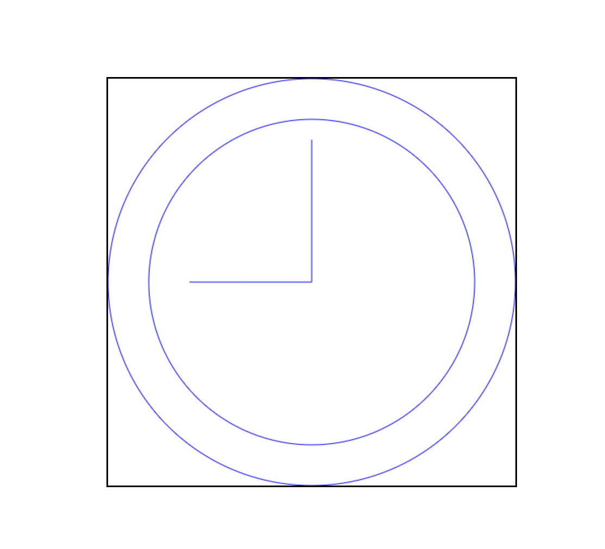
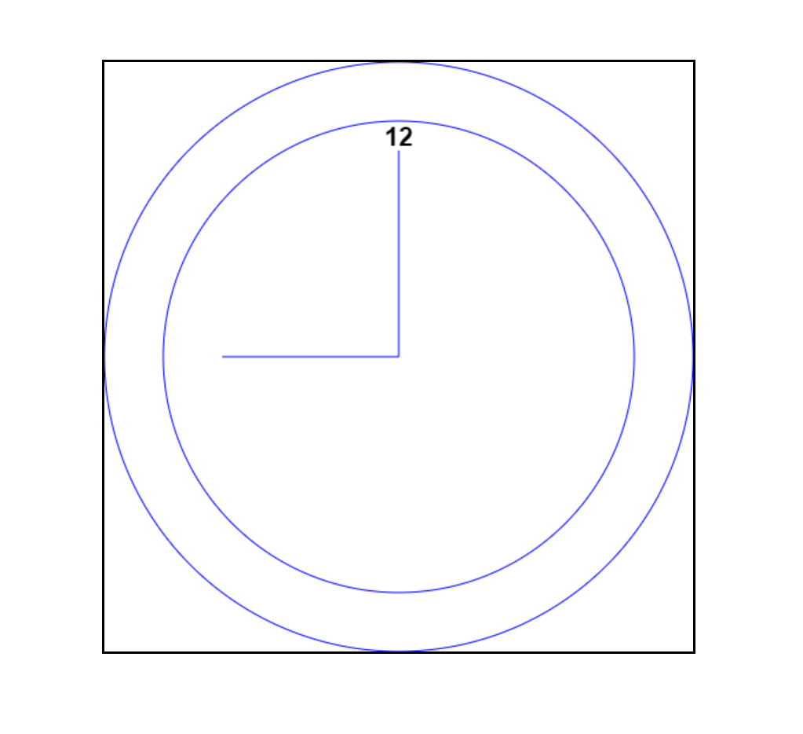
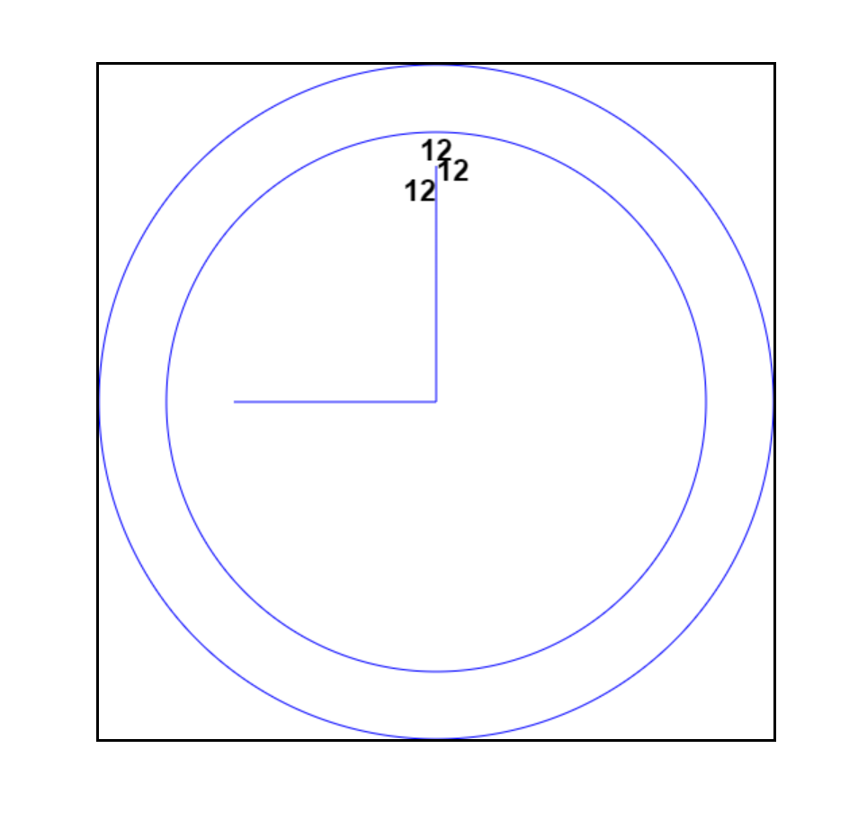

**目录：**

- [18. 动画与 Canvas 图形](#18-动画与-canvas-图形)
  - [18.1. 使用 requestAnimationFrame](#181-使用-requestanimationframe)
    - [18.1.1. 早期定时动画](#1811-早期定时动画)
    - [18.1.2. 事件间隔问题](#1812-事件间隔问题)
    - [18.1.3. requestAnimationFrame](#1813-requestanimationframe)
    - [18.1.4. cancelAnimationFrame](#1814-cancelanimationframe)
    - [18.1.5. 通过 requestAnimationFrame 节流](#1815-通过-requestanimationframe-节流)
  - [18.2. 基本的画布功能](#182-基本的画布功能)
  - [18.3. 2D 绘图上下文](#183-2d-绘图上下文)
    - [18.3.1. 填充与描边](#1831-填充与描边)
    - [18.3.2. 绘制矩形](#1832-绘制矩形)
    - [18.3.3. 绘制路径](#1833-绘制路径)
    - [18.3.4. 绘制文本](#1834-绘制文本)

# 18. 动画与 Canvas 图形

本章内容

- 使用 requestAnimationFrame
- 理解 `<canvas>` 元素
- 绘制简单 2D 图形
- 使用 WebGL 绘制 3D 图形

图形和动画已经日益成为浏览器中现代 Web 应用程序的必备功能，但实现起来仍然比较困难。视觉上复杂的功能要求性能调优和硬件加速，不能拖慢浏览器。目前已经有一套日趋完善的 API 和工具可以用来开发此类功能。

毋庸置疑，`<canvas>` 是 HTML5 最受欢迎的新特性。这个元素会占据一块页面区域，让 JavaScript 可以动态在上面绘制图片。`<canvas>` 最早是苹果公司提出并准备用在控制面板中的，随着其他浏览器的迅速跟进，HTML5 将其纳入标准。目前所有主流浏览器都在某种程度上支持 `<canvas>` 元素。

与浏览器环境中的其他部分一样，`<canvas>`自身提供了一些 API，但并非所有浏览器都支持这些 API，其中包括支持基础绘图能力的 2D 上下文和被称为 WebGL 的 3D 上下文。支持的浏览器的最新版本现在都支持 2D 上下文和 WebGL。

注意：为简洁考虑，本章约定使用以下代码进行 DOM 元素的查询：

```javascript
// EXAMPLE: $('#drawing')
var $ = document.querySelector.bind(document);
```

## 18.1. 使用 requestAnimationFrame

很长时间以来，计时器和定时执行都是 JavaScript 动画最先进的工具。虽然 CSS 过渡和动画方便了 Web 开发者实现某些动画，但 JavaScript 动画领域多年来进展甚微。Firefox 4 率先在浏览器中为 JavaScript 动画增加了一个名为 mozRequestAnimationFrame()方法的 API。这个方法会告诉浏览器要执行动画了，于是浏览器可以通过最优方式确定重绘的时序。自从出现之后，这个 API 被广泛采用，现在作为 requestAnimationFrame()方法已经得到各大浏览器的支持。

### 18.1.1. 早期定时动画

以前，在 JavaScript 中创建动画基本上就是使用 setInterval()来控制动画的执行。下面的例子展示了使用 setInterval()的基本模式：

```javascript
(function () {
  function updateAnimations() {
    doAnimation1();
    doAnimation2();
    // 其他任务
  }
  setInterval(updateAnimations, 100);
})();
```

作为一个小型动画库的标配，这个 updateAnimations()方法会周期性运行注册的动画任务，并反映出每个任务的变化（例如，同时更新滚动新闻和进度条）。如果没有动画需要更新，则这个方法既可以什么也不做，直接退出，也可以停止动画循环，等待其他需要更新的动画。

这种定时动画的问题在于无法准确知晓循环之间的延时。定时间隔必须足够短，这样才能让不同的动画类型都能平滑顺畅，但又要足够长，以便产生浏览器可以渲染出来的变化。一般计算机显示器的屏幕刷新率都是 60Hz，基本上意味着每秒需要重绘 60 次。大多数浏览器会限制重绘频率，使其不超出屏幕的刷新率，这是因为超过刷新率，用户也感知不到。

因此，实现平滑动画最佳的重绘间隔为 1000 毫秒/60，大约 17 毫秒。以这个速度重绘可以实现最平滑的动画，因为这已经是浏览器的极限了。如果同时运行多个动画，可能需要加以限流，以免 17 毫秒的重绘间隔过快，导致动画过早运行完。

虽然使用 setInterval()的定时动画比使用多个 setTimeout()实现循环效率更高，但也不是没有问题。无论 setInterval()还是 setTimeout()都是不能保证时间精度的。作为第二个参数的延时只能保证何时会把代码添加到浏览器的任务队列，不能保证添加到队列就会立即运行。如果队列前面还有其他任务，那么就要等这些任务执行完再执行。简单来讲，这里毫秒延时并不是说何时这些代码会执行，而只是说到时候会把回调加到任务队列。如果添加到队列后，主线程还被其他任务占用，比如正在处理用户操作，那么回调就不会马上执行。

### 18.1.2. 事件间隔问题

知道何时绘制下一帧是创造平滑动画的关键。直到几年前，都没有办法确切保证何时能让浏览器把下一帧绘制出来。随着`<canvas>`的流行和 HTML5 游戏的兴起，开发者发现 setInterval()和 setTimeout()的不精确是个大问题。

浏览器自身计时器的精度让这个问题雪上加霜。浏览器的计时器精度不足毫秒。以下是几个浏览器计时器的精度情况：

- IE8 及更早版本的计时器精度为 15.625 毫秒；
- IE9 及更晚版本的计时器精度为 4 毫秒；
- Firefox 和 Safari 的计时器精度为约 10 毫秒；
- Chrome 的计时器精度为 4 毫秒。

IE9 之前版本的计时器精度是 15.625 毫秒，意味着 0 ～ 15 范围内的任何值最终要么是 0，要么是 15，不可能是别的数。IE9 把计时器精度改进为 4 毫秒，但这对于动画而言还是不够精确。Chrome 计时器精度是 4 毫秒，而 Firefox 和 Safari 是 10 毫秒。更麻烦的是，浏览器又开始对切换到后台或不活跃标签页中的计时器执行限流。因此即使将时间间隔设定为最优，也免不了只能得到近似的结果。

### 18.1.3. requestAnimationFrame

Mozilla 的 Robert O’Callahan 一直在思考这个问题，并提出了一个独特的方案。他指出，浏览器知道 CSS 过渡和动画应该什么时候开始，并据此计算出正确的时间间隔，到时间就去刷新用户界面。但对于 JavaScript 动画，浏览器不知道动画什么时候开始。他给出的方案是创造一个名为 mozRequestAnimationFrame()的新方法，用以通知浏览器某些 JavaScript 代码要执行动画了。这样浏览器就可以在运行某些代码后进行适当的优化。目前所有浏览器都支持这个方法不带前缀的版本，即 requestAnimationFrame()。

requestAnimationFrame()方法接收一个参数，此参数是一个要在重绘屏幕前调用的函数。这个函数就是修改 DOM 样式以反映下一次重绘有什么变化的地方。为了实现动画循环，可以把多个 requestAnimationFrame()调用串联起来，就像以前使用 setTimeout()时一样：

```javascript
const updateProgress = function updateProgress() {
  var div = $('#status');
  div.style.width = parseInt(div.style.width, 10) + 5 + '%';

  if (div.style.left != '100%') {
    requestAnimationFrame(updateProgress);
  }
};

requestAnimationFrame(updateProgress);
```

因为 requestAnimationFrame()只会调用一次传入的函数，所以每次更新用户界面时需要再手动调用它一次。同样，也需要控制动画何时停止。结果就会得到非常平滑的动画。

目前为止，requestAnimationFrame()已经解决了浏览器不知道 JavaScript 动画何时开始的问题，以及最佳间隔是多少的问题，但是，不知道自己的代码何时实际执行的问题呢？这个方案同样也给出了解决方法。

传给 requestAnimationFrame()的函数实际上可以接收一个参数，此参数是一个 DOMHighResTimeStamp 的实例（比如 performance.now()返回的值），表示下次重绘的时间。这一点非常重要：requestAnimationFrame()实际上把重绘任务安排在了未来一个已知的时间点上，而且通过这个参数告诉了开发者。基于这个参数，就可以更好地决定如何调优动画了。

### 18.1.4. cancelAnimationFrame

与 setTimeout()类似，requestAnimationFrame()也返回一个请求 ID，可以用于通过另一个方法 cancelAnimationFrame()来取消重绘任务。下面的例子展示了刚把一个任务加入队列又立即将其取消：

```javascript
const requestID = window.requestAnimationFrame(() => {
  console.log('Repaint!');
});
window.cancelAnimationFrame(requestID);
```

### 18.1.5. 通过 requestAnimationFrame 节流

requestAnimationFrame 这个名字有时候会让人误解，因为看不出来它跟排期任务有关。支持这个方法的浏览器实际上会暴露出作为钩子的回调队列。所谓钩子（hook），就是浏览器在执行下一次重绘之前的一个点。这个回调队列是一个可修改的函数列表，包含应该在重绘之前调用的函数。每次调用 requestAnimationFrame()都会在队列上推入一个回调函数，队列的长度没有限制。

这个回调队列的行为不一定跟动画有关。不过，通过 requestAnimationFrame()递归地向队列中加入回调函数，可以保证每次重绘最多只调用一次回调函数。这是一个非常好的节流工具。在频繁执行影响页面外观的代码时（比如滚动事件监听器），可以利用这个回调队列进行节流。

先来看一个原生实现，其中的滚动事件监听器每次触发都会调用名为 expensiveOperation()（耗时操作）的函数。当向下滚动网页时，这个事件很快就会被触发并执行成百上千次：

```javascript
const expensiveOperation = function expensiveOperation() {
  console.log('Invoked at', Date.now());
};

window.addEventListener('scroll', () => {
  expensiveOperation();
});
```

如果想把事件处理程序的调用限制在每次重绘前发生，那么可以像这样下面把它封装到 requestAnimationFrame()调用中：

```javascript
const expensiveOperation = function expensiveOperation() {
  console.log('Invoked at', Date.now());
};

window.addEventListener('scroll', () => {
  window.requestAnimationFrame(expensiveOperation);
});
```

这样会把所有回调的执行集中在重绘钩子，但不会过滤掉每次重绘的多余调用。此时，定义一个标志变量，由回调设置其开关状态，就可以将多余的调用屏蔽：

```javascript
let enqueued = false;

const expensiveOperation = function expensiveOperation() {
  console.log('Invoked at', Date.now());
  enqueued = false;
};

window.addEventListener('scroll', () => {
  if (!enqueued) {
    enqueued = true;
    window.requestAnimationFrame(expensiveOperation);
  }
});
```

因为重绘是非常频繁的操作，所以这还算不上真正的节流。更好的办法是配合使用一个计时器来限制操作执行的频率。这样，计时器可以限制实际的操作执行间隔，而 requestAnimationFrame 控制在浏览器的哪个渲染周期中执行。下面的例子可以将回调限制为不超过 50 毫秒执行一次：

```javascript
let enabled = true;

const expensiveOperation = function expensiveOperation() {
  console.log('Invoked at', Date.now());
};

window.addEventListener('scroll', () => {
  if (enabled) {
    enabled = false;
    window.requestAnimationFrame(expensiveOperation);
    window.setTimeout(() => (enabled = true), 50);
  }
});
```

## 18.2. 基本的画布功能

创建`<canvas>`元素时至少要设置其 width 和 height 属性，这样才能告诉浏览器在多大面积上绘图。出现在开始和结束标签之间的内容是后备数据，会在浏览器不支持`<canvas>`元素时显示。比如：

```html
<canvas id="drawing" width="200" height="200">A drawing of something.</canvas>
```

与其他元素一样，width 和 height 属性也可以在 DOM 节点上设置，因此可以随时修改。整个元素还可以通过 CSS 添加样式，并且元素在添加样式或实际绘制内容前是不可见的。在用 css 添加画布尺寸时，使用的是逻辑像素，会被转换为物理像素，所以最好使用 width 和 height 添加画布尺寸。

要在画布上绘制图形，首先要取得绘图上下文。使用 getContext()方法可以获取对绘图上下文的引用。对于平面图形，需要给这个方法传入参数"2d"，表示要获取 2D 上下文对象：

```javascript
const drawing = $('#drawing');

// 确保浏览器支持 <canvas>
if (drawing.getContext) {
  const context = drawing.getContext('2d');
  // 其他代码
}
```

使用`<canvas>`元素时，最好先测试一下 getContext()方法是否存在。有些浏览器对 HTML 规范中没有的元素会创建默认 HTML 元素对象。这就意味着即使 drawing 包含一个有效的元素引用，getContext()方法也未必存在。

可以使用 toDataURL()方法导出`<canvas>`元素上的图像。这个方法接收一个参数：要生成图像的 MIME 类型（与用来创建图形的上下文无关）。例如，要从画布上导出一张 PNG 格式的图片，可以这样做：

```javascript
const drawing = $('#drawing');

// 确保浏览器支持<canvas>
if (drawing.getContext) {
  // 取得图像的数据URI
  const imgURI = drawing.toDataURL('image/png');

  // 显示图片
  const image = document.createElement('img');
  image.src = imgURI;
  document.body.appendChild(image);
}
```

浏览器默认将图像编码为 PNG 格式，除非另行指定。Firefox 和 Opera 还支持传入"image/jpeg"进行 JPEG 编码。因为这个方法是后来才增加到规范中的，所以支持的浏览器也是在后面的版本实现的，包括 IE9、Firefox 3.5 和 Opera 10。

注意 如果画布中的图像是其他域绘制过来的，toDataURL()方法就会抛出错误。相关内容本章后面会讨论。

## 18.3. 2D 绘图上下文

2D 绘图上下文提供了绘制 2D 图形的方法，包括矩形、弧形和路径。2D 上下文的坐标原点(0, 0)在`<canvas>`元素的左上角。所有坐标值都相对于该点计算，因此 x 坐标向右增长，y 坐标向下增长。默认情况下，width 和 height 表示两个方向上像素的最大值。

### 18.3.1. 填充与描边

2D 上下文有两个基本绘制操作：填充和描边。填充以指定样式（颜色、渐变或图像）自动填充形状，而描边只为图形边界着色。大多数 2D 上下文操作有填充和描边的变体，显示效果取决于两个属性：fillStyle 和 strokeStyle。

这两个属性可以是字符串、渐变对象或图案对象，默认值都为"#000000"。字符串表示颜色值，可以是 CSS 支持的任意格式：名称、十六进制代码、rgb、rgba、hsl 或 hsla。比如：

```javascript
const drawing = $('#drawing');

// 确保浏览器支持<canvas>
if (drawing.getContext) {
  const context = drawing.getContext('2d');
  context.strokeStyle = 'red';
  context.fillStyle = '#0000ff';
}
```

这里把 strokeStyle 设置为"red"（CSS 颜色名称），把 fillStyle 设置为"#0000ff"（蓝色）。所有与描边和填充相关的操作都会使用这两种样式，除非再次修改。这两个属性也可以是渐变或图案，本章后面会讨论。

### 18.3.2. 绘制矩形

矩形是唯一一个可以直接在 2D 绘图上下文中绘制的形状。与绘制矩形相关的方法有 3 个：fillRect()、strokeRect()和 clearRect()。这些方法都接收 4 个参数：矩形 x 坐标、矩形 y 坐标、矩形宽度和矩形高度。这几个参数的单位都是像素。

fillRect()方法用于以指定颜色在画布上绘制并填充矩形。填充的颜色使用 fillStyle 属性指定。来看下面的例子：

```javascript
const drawing = $('#drawing');

if (drawing.getContext) {
  const context = drawing.getContext('2d');

  // 绘制红色矩形
  context.fillStyle = '#ff0000';
  context.fillRect(100, 100, 200, 200);

  // 绘制半透明蓝色矩形
  context.fillStyle = 'rgba(0,0,255,0.5)';
  context.fillRect(200, 200, 200, 200);
}
```

以上代码先将 fillStyle 设置为红色并在坐标点(100, 100)绘制了一个宽高均为 200 像素的矩形。接着，使用 rgba()格式将 fillStyle 设置为半透明蓝色，并绘制了另一个与第一个部分重叠的矩形。结果就是可以透过蓝色矩形看到红色矩形（见下图）。

.png>)

strokeRect()方法使用通过 strokeStyle 属性指定的颜色绘制矩形轮廓。下面是一个例子：

```javascript
const drawing = $('#drawing');

// 确保浏览器支持<canvas>
if (drawing.getContext) {
  const context = drawing.getContext('2d');

  // 绘制红色轮廓的矩形
  context.strokeStyle = '#ff0000';
  context.strokeRect(100, 100, 200, 200);

  // 绘制半透明蓝色轮廓的矩形
  context.strokeStyle = 'rgba(0,0,255,0.5)';
  context.strokeRect(200, 200, 200, 200);
}
```

以上代码同样绘制了两个重叠的矩形，不过只有轮廓，而不是实心的（见下图）。

.png>)

注意 描边宽度由 lineWidth 属性控制，它可以是任意整数值。类似地，lineCap 属性控制线条端点的形状［"butt"（平头）、"round"（出圆头）或"square"（出方头）］，而 lineJoin 属性控制线条交点的形状［"round"（圆转）、"bevel"（取平）或"miter"（出尖）］。

使用 clearRect()方法可以擦除画布中某个区域。该方法用于把绘图上下文中的某个区域变透明。通过先绘制形状再擦除指定区域，可以创建出有趣的效果，比如从已有矩形中开个孔。来看下面的例子：

```javascript
const drawing = $('#drawing');

// 确保浏览器支持<canvas>
if (drawing.getContext) {
  const context = drawing.getContext('2d');

  // 绘制红色矩形
  context.fillStyle = '#ff0000';
  context.fillRect(100, 100, 200, 200);

  // 绘制半透明蓝色矩形
  context.fillStyle = 'rgba(0,0,255,0.5)';
  context.fillRect(200, 200, 200, 200);

  // 在前两个矩形重叠的区域擦除一个矩形区域
  context.clearRect(125, 125, 50, 50);
}
```

以上代码在两个矩形重叠的区域上擦除了一个小矩形，见下图。

.png>)

### 18.3.3. 绘制路径

2D 绘图上下文支持很多在画布上绘制路径的方法。通过路径可以创建复杂的形状和线条。要绘制路径，必须首先调用 beginPath()方法以表示要开始绘制新路径。然后，再调用下列方法来绘制路径。

- arc(x, y, radius, startAngle, endAngle, counterclockwise)：以坐标(x, y)为圆心，以 radius 为半径绘制一条弧线，起始角度为 startAngle，结束角度为 endAngle（都是弧度）。最后一个参数 counterclockwise 表示是否逆时针计算起始角度和结束角度（默认为顺时针）。
- arcTo(x1, y1, x2, y2, radius)：以给定半径 radius，经由(x1, y1)绘制一条从上一点到(x2, y2)的弧线。
- bezierCurveTo(c1x, c1y, c2x, c2y, x, y)：以(c1x, c1y)和(c2x, c2y)为控制点，绘制一条从上一点到(x, y)的弧线（三次贝塞尔曲线）。
- lineTo(x, y)：绘制一条从上一点到(x, y)的直线。
- moveTo(x, y)：不绘制线条，只把绘制光标移动到(x, y)。
- quadraticCurveTo(cx, cy, x, y)：以(cx, cy)为控制点，绘制一条从上一点到(x, y)的弧线（二次贝塞尔曲线）。
- rect(x, y, width, height)：以给定宽度和高度在坐标点(x, y)绘制一个矩形。这个方法与 strokeRect()和 fillRect()的区别在于，它创建的是一条路径，而不是独立的图形。

创建路径之后，可以使用 closePath()方法绘制一条返回起点的线。如果路径已经完成，则既可以指定 fillStyle 属性并调用 fill()方法来填充路径，也可以指定 strokeStyle 属性并调用 stroke()方法来描画路径，还可以调用 clip()方法基于已有路径创建一个新剪切区域。

下面这个例子使用前面提到的方法绘制了一个不带数字的表盘：

```javascript
const drawing = $('#drawing');

// 确保浏览器支持<canvas>
if (drawing.getContext) {
  const context = drawing.getContext('2d');

  // 绘制外圆
  context.arc(250, 250, 250, 0, 2 * Math.PI);

  // 绘制内圆
  context.moveTo(450, 250);
  context.arc(250, 250, 200, 0, 2 * Math.PI);

  // 绘制时针
  context.moveTo(100, 250);

  context.lineTo(250, 250);

  // 绘制分针
  context.lineTo(250, 75);

  // 描画路径
  context.strokeStyle = 'blue';
  context.stroke();
}
```

这个例子使用 arc()绘制了两个圆形，一个外圆和一个内圆，以构成表盘的边框。外圆半径 250 像素，原点为(250, 250)，也就是画布的中心。要绘制完整的圆形，必须从 0 弧度绘制到 2π 弧度（使用数学常量 Math.PI）。而在绘制内圆之前，必须先把路径移动到内圆上的一点，以避免绘制出多余的线条。第二次调用 arc()时使用了稍小一些的半径，以呈现边框效果。然后，再组合运用 moveTo()和 lineTo()分别绘制分针和时针。最后一步是调用 stroke()，得到如下图所示的图像。



路径是 2D 上下文的主要绘制机制，为绘制结果提供了很多控制。因为路径经常被使用，所以也有一个 isPointInPath()方法，接收 x 轴和 y 轴坐标作为参数。这个方法用于确定指定的点是否在路径上，可以在关闭路径前随时调用，比如：

```javascript
if (context.isPointInPath(250, 250)) {
  console.log('Point (250, 250) is in the path.');
}
```

2D 上下文的路径 API 非常可靠，可用于创建涉及各种填充样式、描述样式等的复杂图像。

### 18.3.4. 绘制文本

文本和图像混合也是常见的绘制需求，因此 2D 绘图上下文还提供了绘制文本的方法，即 fillText()和 strokeText()。这两个方法都接收 4 个参数：要绘制的字符串、x 坐标、y 坐标和可选的最大像素宽度。而且，这两个方法最终绘制的结果都取决于以下 3 个属性。

- font：以 CSS 语法指定的字体样式、大小、字体族等，比如"10px Arial"。
- textAlign：指定文本的对齐方式，可能的值包括"start"、"end"、"left"、"right"和"center"。推荐使用"start"和"end"，不使用"left"和"right"，因为前者无论在从左到右书写的语言还是从右到左书写的语言中含义都更明确。
- textBaseLine：指定文本的基线， 可能的值包括"top" 、"hanging" 、"middle" 、"alphabetic"、"ideographic"和"bottom"。

这些属性都有相应的默认值，因此没必要每次绘制文本时都设置它们。fillText()方法使用 fillStyle 属性绘制文本，而 strokeText()方法使用 strokeStyle 属性。通常，fillText()方法是使用最多的，因为它模拟了在网页中渲染文本。例如，下面的例子会在前一节示例的表盘顶部绘制数
字“12”：

```javascript
context.font = 'bold 22px Arial';
context.textAlign = 'center';
context.textBaseline = 'middle';
context.fillText('12', 250, 65);
```

结果就得到了如下图所示的图像。



因为把 textAlign 设置为了"center"，把 textBaseline 设置为了"middle"，所以(250, 65)表示文本水平和垂直中心点的坐标。如果 textAlign 是"start"，那么 x 坐标在从左到右书写的语言中表示文本的左侧坐标，而"end"会让 x 坐标在从左到右书写的语言中表示文本的右侧坐标。例如：

```javascript
// 正常
context.font = 'bold 22px Arial';
context.textAlign = 'center';
context.textBaseline = 'middle';
context.fillText('12', 250, 65);

// 与开头对齐
context.textAlign = 'start';
context.fillText('12', 250, 80);

// 与末尾对齐
context.textAlign = 'end';
context.fillText('12', 250, 95);
```

字符串"12"被绘制了 3 次，每次使用的坐标都一样，但 textAlign 值不同。为了让每个字符串不至于重叠，每次绘制的 y 坐标都会设置得大一些。结果就是如下图所示的图像。



因为表盘中垂直的线条是居中的，所以文本的对齐方式就一目了然了。类似地，通过修改 textBaseline 属性，可以改变文本的垂直对齐方式。比如，设置为"top"意味着 y 坐标表示文本顶部，"bottom"表示文本底部，"hanging"、"alphabetic"和"ideographic"分别引用字体中特定的基准点。

由于绘制文本很复杂，特别是想把文本绘制到特定区域的时候，因此 2D 上下文提供了用于辅助确定文本大小的 measureText()方法。这个方法接收一个参数，即要绘制的文本，然后返回一个 TextMetrics 对象。这个返回的对象目前只有一个属性 width，不过将来应该会增加更多度量指标。

measureText()方法使用 font、textAlign 和 textBaseline 属性当前的值计算绘制指定文本后的大小。例如，假设要把文本"Hello world!"放到一个 140 像素宽的矩形中，可以使用以下代码，从 100 像素的字体大小开始计算，不断递减，直到文本大小合适：

```javascript
let fontSize = 100;
context.font = fontSize + 'px Arial';
while (context.measureText('Hello world!').width > 140) {
  fontSize--;
  context.font = fontSize + 'px Arial';
}
context.fillText('Hello world!', 10, 10);
context.fillText('Font size is ' + fontSize + 'px', 10, 50);
```

fillText()和 strokeText()方法还有第四个参数，即文本的最大宽度。这个参数是可选的（Firefox 4 是第一个实现它的浏览器），如果调用 fillText()和 strokeText()时提供了此参数，但要绘制的字符串超出了最大宽度限制，则文本会以正确的字符高度绘制，这时字符会被水平压缩，以达到限定宽度。下图展示了这个参数的效果。

绘制文本是一项比较复杂的操作，因此支持`<canvas>`元素的浏览器不一定全部实现了相关的文本绘制 API。
